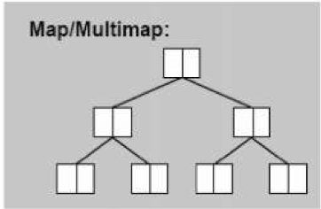

# Map(Multimap)

1.根据元素的key值进行排序<br>
2.map每个元素的key只能出现一次,multimap每个元素的key可以能出现多次<br>
3.底层是红黑树<br>
4.无法使用迭代器改变元素的key(const key),但是可以改变元素的value<br>



### 一.定义

函数|详情
--|--
map<int, int\> c|默认构造
map<int, int\> c1(c)|拷贝构造
map<int, int\> c1 = c|赋值构造
map<int, int\> c = {{1,2},{3,4}}|初始化

<br>

函数|详情
--|--
pair<int, char\> p|默认构造
pair<int, char\> p1(p)|拷贝构造
pair<int, char\> p1 = p|赋值构造
pair<int, char\> p = {1,'a'}|初始化
pair<int, char\> p =make_pair(1,'a')|移动语义赋值

<br>

### 二.操作

函数|详情
--|--
c.insert({6, 15})|插入
c.emplace(6,15)|构造并插入
c.erase(6)|删除key
c.clear()|清空
c.size()|返回元素个数
c.empty()|判断容器是否为空
c[6] 或 c.at(6)|返回指定key的元素
c.count(1)|元素key出现个数
c1.swap(c2)|c1与c2交换
c.find(2)|返回key为2的迭代器
c.lower_bound(2)|返回大于或等于2的第一个key的迭代器
c.upper_bound(2)|返回大于2的第一个key素的迭代器


```cpp
map<int,char> map = {{1,'a'},{2,'b'},{3,'c'}};
cout<<"map.count(1):"<<map.count(1)<<endl; //1
cout<<"map.empty():"<<map.empty()<<endl; //0
cout<<"map.find(2):"<<map.find(2)->second<<endl; //b
cout<<"map.lower_bound(2):"<<map.lower_bound(2)->second<<endl; //b
cout<<"map.upper_bound(2):"<<map.upper_bound(2)->second<<endl; //c
```

<br>

### 三.源码分析

>1.map结构

```cpp
//pair定义
template <class _T1, class _T2>
struct pair {
  typedef _T1 first_type;
  typedef _T2 second_type;
   //pair的两个成员变量,其属性是public
  _T1 first;
  _T2 second;
  //以下是构造函数
  pair() : first(_T1()), second(_T2()) {}
  pair(const _T1& __a, const _T2& __b) : first(__a), second(__b) {}
};

//map定义
template <class _Key, class _Tp, class _Compare, class _Alloc>
class map {
public:
  typedef _Key                  key_type;//键值key类型
  typedef _Tp                   data_type;//数据(实值)value类型
  typedef _Tp                   mapped_type;
  typedef pair<const _Key, _Tp> value_type;//元素型别,包含(键值/实值),const保证键值key不被修改
  typedef _Compare              key_compare;//键值key比较函数

private:
	//底层机制是RB-Tree
  typedef _Rb_tree<key_type, value_type, _Select1st<value_type>, key_compare, _Alloc> _Rep_type;
  _Rep_type _M_t;
public:
  //指针/引用迭代器保持原样
  typedef typename _Rep_type::pointer pointer;
  typedef typename _Rep_type::const_pointer const_pointer;
  typedef typename _Rep_type::reference reference;
  typedef typename _Rep_type::const_reference const_reference;
  typedef typename _Rep_type::iterator iterator;
  typedef typename _Rep_type::const_iterator const_iterator;
  typedef typename _Rep_type::reverse_iterator reverse_iterator;
  typedef typename _Rep_type::const_reverse_iterator const_reverse_iterator;
  typedef typename _Rep_type::size_type size_type;
  typedef typename _Rep_type::difference_type difference_type;
  typedef typename _Rep_type::allocator_type allocator_type;
}
```

>2.map成员函数

```cpp
//判断是否为空
bool empty() const { return _M_t.empty(); }

//节点数量
size_type size() const { return _M_t.size(); }

//插入元素节点,调用RB-Tree的insert_unique(__x),不能插入相同键值的元素
pair<iterator,bool> insert(const value_type& __x) { return _M_t.insert_unique(__x); }
    
//在指定位置擦除元素
void erase(iterator __position) { _M_t.erase(__position); }
```

>3.multimap成员函数

```cpp
//插入元素节点,调用RB-Tree的insert-equal(),插入元素的键值key允许重复
iterator insert(const value_type& __x) { return _M_t.insert_equal(__x); }
```
