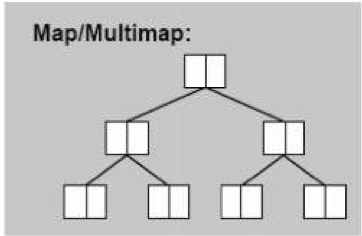

# Map(Multimap)

1.根据元素的key值进行排序<br>
2.map每个元素的key只能出现一次,multimap每个元素的key可以能出现多次<br>
3.底层是红黑树<br>
4.无法使用迭代器改变元素的key(const key),但是可以改变元素的value<br>



### 一.定义

函数|详情
--|--
map<int, int\> c|默认构造
map<int, int\> c1(c)|拷贝构造
map<int, int\> c1 = c|赋值构造
map<int, int\> c = {{1,2},{3,4}}|初始化

<br>

### 二.操作

函数|详情
--|--
c.insert({6, 15})|插入
c.erase(6)|删除
c.clear()|清空
c.size()|返回元素个数
c.empty()|判断容器是否为空
c[6] 或 c.at(6)|返回指定位置元素
c.count(1)|元素key出现个数

<br>

### 三.源码分析

```
template <typename _Key, typename _Tp, typename _Compare = std::less<_Key>,typename _Alloc = std::allocator<std::pair<const _Key, _Tp> > >
class map {
    public:
      typedef _Key					key_type; // Key
      typedef std::pair<const _Key, _Tp>		value_type; //(key+value的数据包)
      typedef _Compare			key_compare; // key的比较函数
      typedef _Alloc				allocator_type; // 分配器
    private:
      typedef _Rb_tree<key_type, value_type, _Select1st<value_type>,key_compare, _Pair_alloc_type> _Rep_type;
      _Rep_type _M_t;//红黑树
    public:
      //读写迭代器
      typedef typename _Rep_type::iterator		 iterator;
      //插入元素(Multimap为_M_insert_equal)
      std::pair<iterator, bool> insert(const value_type& __x){
        return _M_t._M_insert_unique(__x);
      }
}
```
