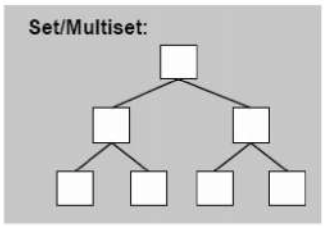
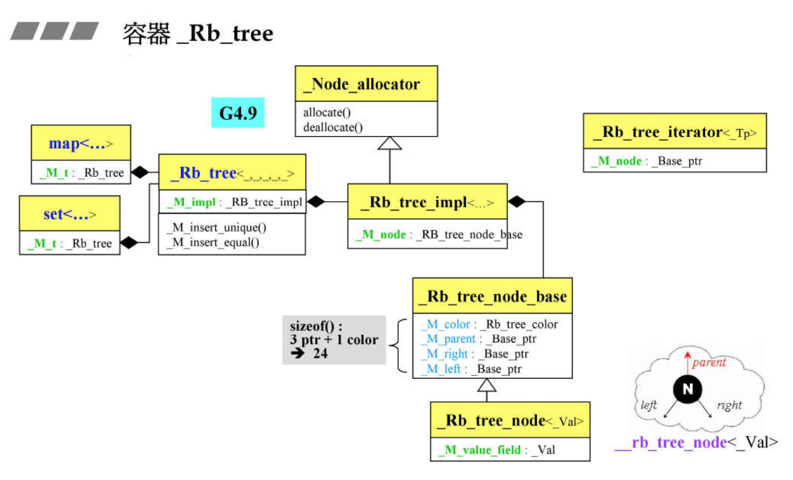

# Set(Multiset)

1.根据元素的value值进行排序<br>
2.set每个元素只能出现一次,multiset每个元素可以出现多次<br>
3.底层是红黑树<br>
4.无法使用迭代器改变set/multiset改变元素值



### 一.定义

函数|详情
--|--
set<int\> c|默认构造
set<int\> c1 = {1,2,3,7,6,4,5}|初始化列表
set<int\> c2(arr,arr+5)|数组转换
set<int\> c3 = c1|赋值拷贝

<br>

### 二.操作

函数|详情
--|--
c.insert(10)|插入
c.emplace(1)|如果不存在元素1 则插入1,如果存在则什么也不做
c.erase(10)|指定元素删除
c.clear()|容器清空
c.empty()|判断是否为null
c.size()|元素个数
c.max_size()|容器最大容量
c.find(40)|查看是否含有该元素,返回迭代器
c.count(1)|元素出现个数

<br>

### 三.源码分析



```
template<typename _Key, typename _Compare = std::less<_Key>,typename _Alloc = std::allocator<_Key> >
class set{
  public:
      typedef _Key     key_type;          // Key
      typedef _Key     value_type;        //(key+value的数据包)
      typedef _Compare key_compare;       // key的比较函数
      typedef _Alloc   allocator_type;    // 分配器
  private:
      typedef _Rb_tree<key_type, value_type, _Identity<value_type>,key_compare, _Key_alloc_type> _Rep_type;
      _Rep_type _M_t;//红黑树
  public:
      //只读迭代器
      typedef typename _Rep_type::const_iterator	 iterator;
      //插入元素(Multiset为_M_insert_equal)
      std::pair<iterator, bool> insert(const value_type& __x){
          std::pair<typename _Rep_type::iterator, bool> __p = _M_t._M_insert_unique(__x);
          return std::pair<iterator, bool>(__p.first, __p.second);
      }
}
```
