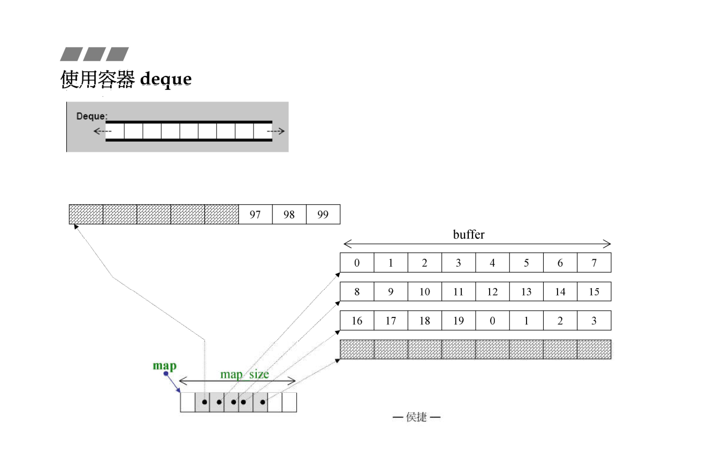
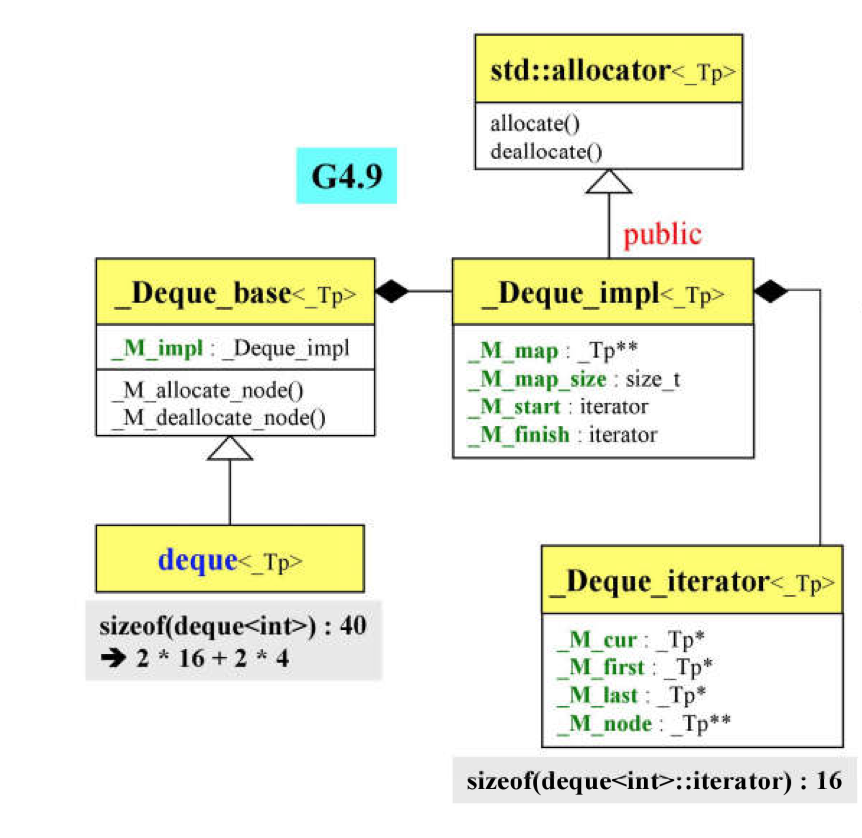
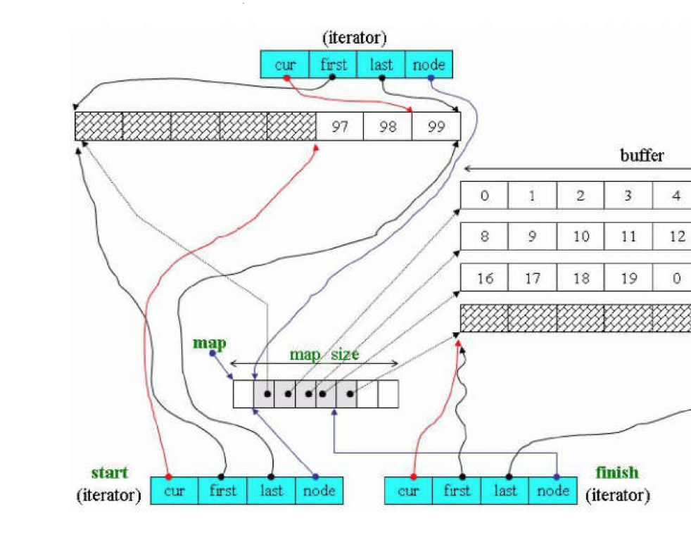

# Deque

1.动态数组,随机访问,且每次扩张的原来的二倍,两边扩充<br>
2.可向头部与尾部添加或移除元素<br>
3.元素排列顺序与插入顺序有关



### 一.定义

函数|详情
--|--
deque<int\> c|默认构造
deque<int\> c1(c)|拷贝构造
deque<int\> c1 = c|赋值拷贝
deque<int\> c (5,6)|指定元素个数与默认值
deque<int\> c = {1,2,3}|初始化

<br>

### 二.操作

函数|详情
--|--
c.push_front(0)|向头插入
c.push_back(6)|向尾插入
c.insert(c.begin()+3, 10)|其他位置插入
c.pop_front()|头弹出
c.pop_back()|尾弹出
c.erase(c.begin()+3)|移除其他位置元素
c.clear()|清空
c.front()|返回头元素
c.back()|返回尾元素
c.at(1) 或 c[1]|返回指定位置元素
c.size()|返回元素个数
c.empty()|判断容器是否为空

<br>

### 三.源码分析

>1.deque基本结构



```
template<typename _Tp, typename _Alloc>
class _Deque_base{
    struct _Deque_impl : public _Tp_alloc_type{
          _Tp** _M_map; //表示内存的指针的连续内存
          size_t _M_map_size; //表示_M_map的内存大小
          iterator _M_start;//表示_M_map指向内存起始点的迭代器
          iterator _M_finish;//表示_M_map指向内存结束点的迭代器
      }
}
```



```
template<typename _Tp, typename _Ref, typename _Ptr>
struct _Deque_iterator{
    _Tp* _M_cur; //指向当前元素
    _Tp* _M_first; //指向当前buffer内的第一个元素
    _Tp* _M_last; //指向当前buffer的最后一个元素
    _Tp** _M_node; //指向当前buffer的指针
}
```

>2.buffer内元素个数

```
#ifndef _GLIBCXX_DEQUE_BUF_SIZE
  #define _GLIBCXX_DEQUE_BUF_SIZE 512
#endif

inline size_t __deque_buf_size(size_t __size){
  return (__size < _GLIBCXX_DEQUE_BUF_SIZE
        ? size_t(_GLIBCXX_DEQUE_BUF_SIZE / __size) : size_t(1));
}


如果是deque<int>,那么每个buffer所含元素的个数就128
如果是deque<double>,那么每个buffer的所含元素个数就是64
如果>=512,那么每个buffer的所含元素个数就是1(class/array/struct)
```

>3.插入元素

```
iterator deque<_Tp, _Alloc>::insert(const_iterator __position, value_type&& __x){
    return emplace(__position, std::move(__x));
}

iterator emplace(const_iterator __position, _Args&&... __args){
    if (__position._M_cur == this->_M_impl._M_start._M_cur){
         //插入的位置在最前端
         emplace_front(std::forward<_Args>(__args)...);
         return this->_M_impl._M_start;
    } else if (__position._M_cur == this->_M_impl._M_finish._M_cur){
         //插入的位置在最尾端
         emplace_back(std::forward<_Args>(__args)...);
         iterator __tmp = this->_M_impl._M_finish;
         --__tmp;//迭代器指向的是最尾端的下一个位置，为了兼容左闭右开原则
         return __tmp;
    } else {
          //插入的位置在其他位置
         return _M_insert_aux(__position._M_const_cast(),
         std::forward<_Args>(__args)...);
    }
}


iterator _M_insert_aux(iterator __pos, _Args&&... __args){
	   value_type __x_copy(std::forward<_Args>(__args)...); // XXX copy
     difference_type __index = __pos - this->_M_impl._M_start;//返回距起始端距离
     if (static_cast<size_type>(__index) < size() / 2){
        //若果插入点在整体内存的前半段,插入后整体内存前移
        push_front(_GLIBCXX_MOVE(front()));
        ...
        _GLIBCXX_MOVE3(__front2, __pos1, __front1);
      } else {
        //若果插入点在整体内存的后半段,插入后整体内存后移
        push_back(_GLIBCXX_MOVE(back()));
        ...
        _GLIBCXX_MOVE_BACKWARD3(__pos, __back2, __back1);
      }
      *__pos = _GLIBCXX_MOVE(__x_copy); //复制元素
      return __pos;
}
```

>4.模拟连续空间

```
reference operator*() const _GLIBCXX_NOEXCEPT{
    return *_M_cur;
}

pointer operator->() const _GLIBCXX_NOEXCEPT{
    return _M_cur;
}

_Self& operator++() _GLIBCXX_NOEXCEPT{
    ++_M_cur;
   //如果++到达该节点尾端，跳至下一个节点
   if (_M_cur == _M_last){
       _M_set_node(_M_node + 1);
       _M_cur = _M_first;
   }
   return *this;
}

_Self operator++(int) _GLIBCXX_NOEXCEPT{
    _Self __tmp = *this;
    ++*this;
    return __tmp;
}

_Self& operator--() _GLIBCXX_NOEXCEPT{
    //如果--后到达头端，跳至前一个节点
    if (_M_cur == _M_first){
      _M_set_node(_M_node - 1);
      _M_cur = _M_last;
    }
    --_M_cur;
    return *this;
}

_Self operator--(int) _GLIBCXX_NOEXCEPT{
    _Self __tmp = *this;
    --*this;
    return __tmp;
}

reference operator[](difference_type __n) const _GLIBCXX_NOEXCEPT{
  return *(*this + __n);
}

//切换至正确buffer
void _M_set_node(_Map_pointer __new_node) _GLIBCXX_NOEXCEPT{
   _M_node = __new_node;
   _M_first = *__new_node;
   _M_last = _M_first + difference_type(_S_buffer_size());
}
```
