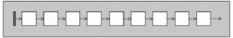
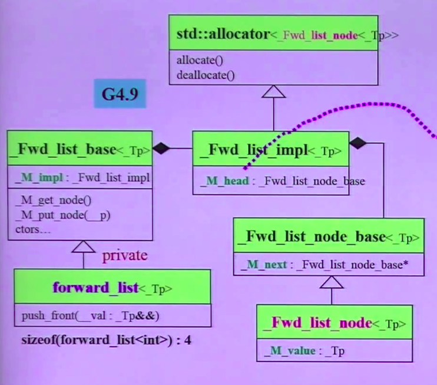
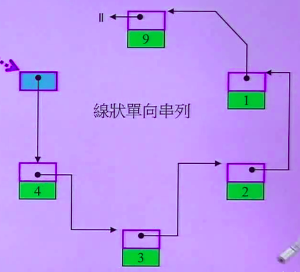

# Forward List

1.单向链表，顺序访问<br>
2.只能从头部插入元素<br>
3.元素排列顺序与插入顺序有关<br>
4.比Deque所需空间小



### 一.定义

函数|详情
--|--
forward_list<int> l|默认构造
forward_list<int> l1(l)|拷贝构造
forward_list<int> l1 = l|拷贝赋值
forward_list<int> l3(5,2)|指定大小与默认值
forward_list<int> l4(l1.begin(),l1.end())|指定赋值区域

<br>

### 二.操作

函数|详情
--|--
l.push_front(0)|前段插入0
l.insert_after(l.begin(), 0)|在指定位置后面插入一组数据
l.insert_after(l.begin(), 11)|在指定位置之后插入元素
l.pop_front()|弹出第一个元素
l.erase_after(l.begin(),l.end())|删除指定位置
l.clear()|清空
l.front()|返回第一个元素
l.empty()|返回forward_list是否为空
l.max_size()|forward_list的最大容量
l.sort()|排序
l.unique()|删除重复元素

<br>

### 三.源码分析



```
struct _Fwd_list_node_base{
    _Fwd_list_node_base* _M_next = nullptr; //指向下一个节点
}

template<typename _Tp, typename _Alloc>
struct _Fwd_list_base{
    protected:
      struct _Fwd_list_impl : public _Node_alloc_type {
	       _Fwd_list_node_base _M_head; //指向头结点(蓝色元素)
      }
}
```


