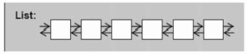
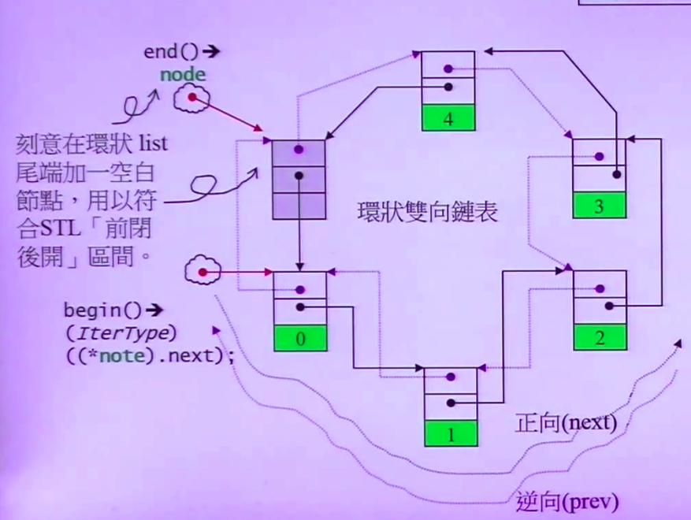

# List

1.双向链表，顺序访问<br>
2.任何位置插入或移除元素快<br>
3.元素排列顺序与插入顺序有关



### 一.定义

函数|详情
--|--
list<int\> l|默认构造
list<int\> l1(l)|拷贝构造
list<int\> l1 = l|赋值拷贝
list<int\> l(5,2)|指定元素个数及与默认值
list<int\> l = {1,2,3}|初始化

<br>

### 二.操作

函数|详情
--|--
l.push_front(1)|向头插入
l.push_back(1)|向尾插入
l.insert(l.begin(),2)|其他位置插入(只能++与--)
l.pop_front()|头弹出
l.pop_back()|尾弹出
l.erase(l.begin())|移除其他位置元素
l.clear()|清空
l.front()|返回头元素
l.back()|返回尾元素
l.size()|返回元素个数
l.empty()|判断容器是否为空
l.unique()|去重
l.reverse()|反转
l.sort()|排序

<br>

### 三.源码分析

>1.list结构


```
struct _List_node_base{
    _List_node_base* _M_next; //指向下一个节点
    _List_node_base* _M_prev; //指向前一个节点
}

struct _List_node : public _List_node_base{
    _Tp _M_data; //节点数据
    _Tp* _M_valptr() {
      return std::__addressof(_M_data);
    }
    _Tp const* _M_valptr() const {
      return std::__addressof(_M_data);
    }
};
```



```
//空白节点为头节点
iterator begin() _GLIBCXX_NOEXCEPT {
  return iterator(this->_M_impl._M_node._M_next);
}

iterator end() _GLIBCXX_NOEXCEPT {
  return iterator(this->_M_impl._M_node);
}

//其他操作
reference operator*() const {
    return (*node).data;
}

pointer operator->() const {
    return &(operator*());
}

_Self& operator++() {
    node = (link_type)((*node).next);
	  return *this;
}

_Self operator++(int) {
	self __tmp = *this;
	++*this;
	return __tmp;
}
```
