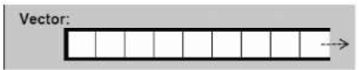
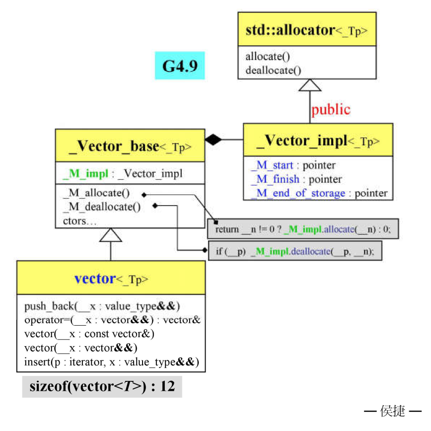
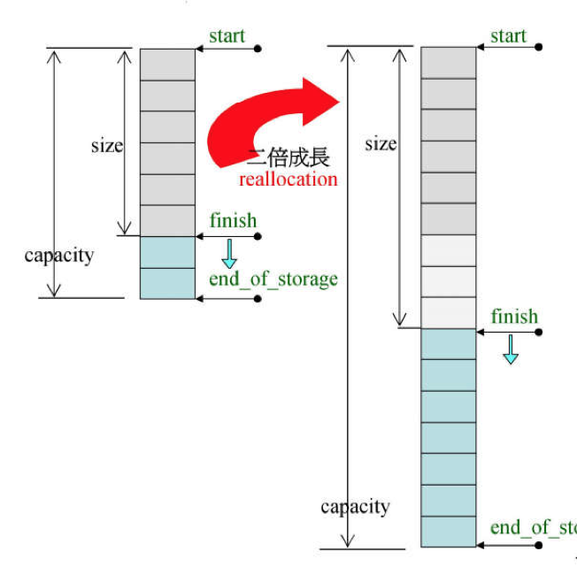

# Vector

1.动态数组，随机访问,且每次扩张的原来的二倍<br>
2.尾部添加或移除元素快，其他位置插入或移除元素慢<br>
3.元素排列顺序与插入顺序有关



<br>

### 一.定义

函数|详情
--|--
vector<int\> v|默认构造
vector<int\> v1(v)|拷贝构造
vector<int\> v1 = v|赋值拷贝
vector<int\> v(5,10)|指定元素个数及默认值
vector<int\> v = {1,2,3}|初始化

<br>

### 二.操作

函数|详情
--|--
v.push_back(1)|向尾插入
v.insert(v.begin(),3)|其他位置插入
v.pop_back()|尾弹出
v.erase(v.begin()+1)|移除其他位置元素
v.clear()|清空
v.front()|返回头元素
v.back()|返回尾元素
v[1] 或 v.at(1)|返回指定位置元素
v.size()|返回元素个数
v.empty()|判断容器是否为空

<br>

### 三.源码分析

>1.vector结构



```
template<typename _Tp, typename _Alloc>
struct _Vector_base{
    struct _Vector_impl : public _Tp_alloc_type{
          pointer _M_start; //指向数组元素开始
          pointer _M_finish;//指向数组元素结束
          pointer _M_end_of_storage; //指向数组的结尾
     }_M_impl;
    //申请内存        
    pointer _M_allocate(size_t __n){
          typedef __gnu_cxx::__alloc_traits<_Tp_alloc_type> _Tr;
          return __n != 0 ? _Tr::allocate(_M_impl, __n) : 0;
    }
    //释放内存
    void _M_deallocate(pointer __p, size_t __n){
          typedef __gnu_cxx::__alloc_traits<_Tp_alloc_type> _Tr;
          if (__p)
              _Tr::deallocate(_M_impl, __p, __n);
     }
}
```



>2.push_back

```
void push_back(const value_type& __x){
    if (this->_M_impl._M_finish != this->_M_impl._M_end_of_storage){
        //如果内存够用，直接插入
        _Alloc_traits::construct(this->_M_impl, this->_M_impl._M_finish,__x);
        ++this->_M_impl._M_finish;
    } else {
        //如果内存不够用
      　_M_emplace_back_aux(__x);
    }
}

void  _M_emplace_back_aux(_Args&&... __args){
    //申请一段新的内存,将新的start指针指向新内存的起始位置，初始化finish指针
    pointer __new_start(this->_M_allocate(__len));
    pointer __new_finish(__new_start);
    //移动数据并将finish指针指向新内存的尾端
    __new_finish  = std::__uninitialized_move_if_noexcept_a (this->_M_impl._M_start,this->_M_impl._M_finish,__new_start, _M_get_Tp_allocator());
    ++__new_finish;
    //销毁旧内存
    std::_Destroy(this->_M_impl._M_start, this->_M_impl._M_finish,_M_get_Tp_allocator());
    _M_deallocate(this->_M_impl._M_start, this->_M_impl._M_end_of_storage - this->_M_impl._M_start);
    this->_M_impl._M_start = __new_start;
    this->_M_impl._M_finish = __new_finish;
    this->_M_impl._M_end_of_storage = __new_start + __len;
}
```

>3.其他函数

```
//返回它的start指针
iterator begin() _GLIBCXX_NOEXCEPT  {
  return iterator(this->_M_impl._M_start);
}

//返回finish指针
const_iterator end() const _GLIBCXX_NOEXCEPT {
  return const_iterator(this->_M_impl._M_finish);
}

//返回start-finish
size_type capacity() const _GLIBCXX_NOEXCEPT {
  return size_type(this->_M_impl._M_end_of_storage - this->_M_impl._M_start);
}
```
