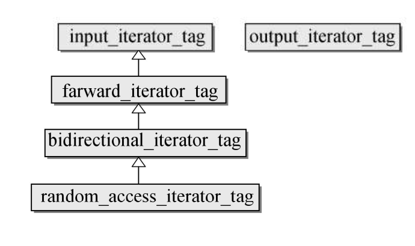

# Iterator

### 一.迭代器的种类

1.单向迭代器:只能以累加操作符向前迭代(forward_list,unordered_set/map,unordered_multiset/map)<br>
2.双向迭代器:可以以累加或累减操作符向前或向后迭代(list,set,map,multiset,multimap)<br>
3.随机访问迭代器:不但具有双向迭代器的所有属性，还允许迭代器算术运算(vector,deque,array)<br>
4.输入型迭代器:write-read迭代器<br>
5.输出型迭代器:read-only迭代器



```
struct input_iterator_tag{};
struct output_iterator_tag{};
struct forward_iterator_tag : public input_iterator_tag{};
struct bidirectional_iterator_tag : public forward_iterator_tag{};
struct random_access_iterator_tag : public bidirectional_iterator_tag{};
```

<br>

### 二.操作

函数|详情
--|--
c.begin()|指向第一个元素的读写迭代器
c.end()|指向最后一个元素的下一个位置的读写迭代器
c.rbegin()|反向的第一个元素的读写迭代器
c.rend()|反向的第一个元素的上一个位置读写迭代器
c.cbegin()|指向第一个元素的只读迭代器
c.cend()|指向最后一个元素的下一个位置的只读迭代器
c.crbegin()|反向的第一个元素的只读迭代器
c.crend()|反向的第一个元素的上一个位置只读迭代器

<br>

### 三.源码分析

>1.迭代器

```
template<typename _Iterator>
struct iterator_traits {
      typedef typename _Iterator::iterator_category iterator_category;
      typedef typename _Iterator::value_type        value_type;
      typedef typename _Iterator::difference_type   difference_type;
      typedef typename _Iterator::pointer           pointer;
      typedef typename _Iterator::reference         reference;
};


template<typename _Tp>
struct iterator_traits<_Tp*>{
      typedef random_access_iterator_tag iterator_category;
      typedef _Tp                         value_type;
      typedef ptrdiff_t                   difference_type;
      typedef _Tp*                        pointer;
      typedef _Tp&                        reference;
};

template<typename _Tp>
struct iterator_traits<const _Tp*>{
      typedef random_access_iterator_tag iterator_category;
      typedef _Tp                         value_type;
      typedef ptrdiff_t                   difference_type;
      typedef const _Tp*                  pointer;
      typedef const _Tp&                  reference;
};
```

>2.具体的迭代器(List容器)

```
template<typename _Tp>
struct _List_iterator{
      typedef ptrdiff_t				difference_type;
      typedef std::bidirectional_iterator_tag	iterator_category;
      typedef _Tp				value_type;
      typedef _Tp*				pointer;
      typedef _Tp&				reference;
}
```

>3.算法与迭代器交互信息(distance为例)

```
//input_iterator_tag类型迭代器
template<typename _InputIterator, typename _Distance>
inline void __distance(_InputIterator __first, _InputIterator __last,
                      _Distance& __n,std::input_iterator_tag)
{　　　　　　　　　　　　　　　　　　　　　　　　　　　
    while (__first != __last){
        ++__first;
        ++__n;
    }
}

//random_access_iterator_tag类型迭代器
template<typename _RandomAccessIterator, typename _Distance>
inline void __distance(_RandomAccessIterator __first, _RandomAccessIterator __last,
                       _Distance& __n, std::random_access_iterator_tag)
{
      __n += __last - __first;
}

//distance算法
template<typename _InputIterator, typename _Distance>
inline void distance(_InputIterator __first, _InputIterator __last,_Distance& __n)
{
      //根据函数重载调用各自函数
      __distance(__first, __last, __n, std::__iterator_category(__first));
}

template<typename _Iter>
inline typename iterator_traits<_Iter>::iterator_category __iterator_category(const _Iter&){
    return typename iterator_traits<_Iter>::iterator_category();
}
```
