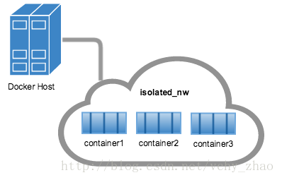
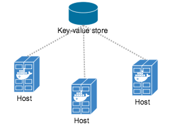

# Network

## 一.host模式

docker和宿主机共用一个Network Namespace。容器将不会虚拟出自己的网卡，配置自己的IP等，而是使用宿主机的IP和端口。同时而在用docker run运行容器时不需要指定-p参数，容器中的应用都直接绑定在宿主机的端口上。

```
docker run -d --name mynginx --network host nginx
```

## 二.container模式

在运行容器时通过--network指定另一个已经在运行的有单独Network Namespace的容器，然后与这个容器共享一个Network Namespace。在这种情况下，新建的容器没有自己的网卡，也不会给它分配IP，而是两个容器共享IP和端口空间。

```
docker run -d --name mynginx --network container:NAME_OR_ID nginx
```

## 三.none模式

none模式下，docker不会为新创建的容器的网络进行任何配置，容器也没有自己的网卡。

```
docker run -d --name mynginx --network none nginx
```

## 四.bridge模式

docker的默认模式，当docker服务启动时，docker会在宿主机上建立一个虚拟网桥docker0，宿主机上启动的容器会连接到这个虚拟网桥上。docker会在一个可用网段(一般是172.17.0.0/16这个网段)中为docker0分配一个IP地址(一般是172.17.0.1)，而每创建一个使用bridge网络模式的新的容器，docker就会在上面的网段中选择一个尚未分配的IP地址分配给容器的eth0网卡(不同容器需要用link参数通信)。

## 五.用户自定义

### 1.bridge网络

bridge网络的容器必须在同一个宿主机上，同一个网络中的容器之间可以直接通信，但不能和不同网络的容器通信。



```
#查看docker的网络
docker network ls

#查看网络的详细信息
docker network inspect bridge

#创建bridge网络
docker network create --driver bridge isolated_nw

#创建bridge网络，并指定网关
docker network create -d bridge
    --subnet=192.168.0.0/16
    --gateway=192.168.0.100
    isolated_nw

#将原有的容器连接到bridge网络
docker network connect isolated_nw container2

#将原有的容器断开bridge网络
docker network disconnect isolated_nw container2

#移除bridge网络
docker network rm isolated_nw
```

### 2.overlay网络

overlay支持在多个主机(swarm集群)之间创建网络。



```
#创建overlay网络(开启4789/udp，7946/tcp，7946/udp)
docker network create --driver overlay my-multi-network

#创建overlay网络，并指定网关
docker network create -d overlay
    --subnet=192.168.0.0/16
    --gateway=192.168.0.100
    my-multi-network
```
