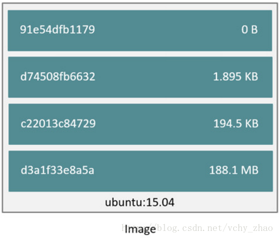
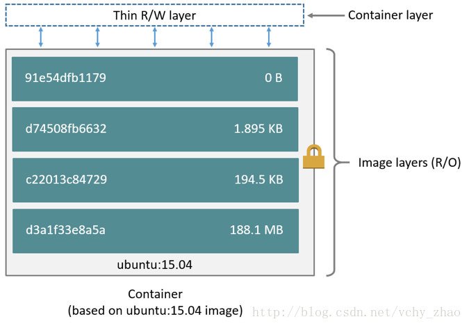

# Storage

## 一.镜像

docker的镜像是由一系列只读层组成的一个栈，上面的层依赖其下面的层，这些层从外面看起来是一个整体。栈底的镜像被称作基础镜像(base image)，所有上面的层都基于这个基础镜像。

当你在一个容器中进行了某些操作比如添加了一个文件，然后调用docker commit操作创建新的镜像时，Docker会在镜像栈的最上面创建一个新的层，这个层包含了新添加的文件。或者通过Dockerfile创建新的镜像时，通过FROM指令指定的就是基础镜像。此后的每条指令都会创建一个新的层，层中包含了这条指令对镜像的修改。

## 二.容器

docker的容器不仅包含镜像的所有层，它还在最上面添加了一个可读写层称作容器层(container layer)。

对容器的所有写操作无论是添加新内容还是修改原来的内容都会保存在这个可读层中。如果容器被删除，writable layer也会被删除，但镜像层不变。

## 三.写时复制策略

docker在镜像管理和容器中都使用了写时复制策略，这不仅缩小了镜像对磁盘空间的利用率，也加快了容器的启动速度。每个容器都有属于自己的读写层，读写层下面的层都是只读层，不能被修改。此外，只读层是可以共享的，也就是说一个镜像的各层可以被多个容器同时使用。当容器中发生写操作时，使用写时复制策略将需要被写的内容复制到读写层。