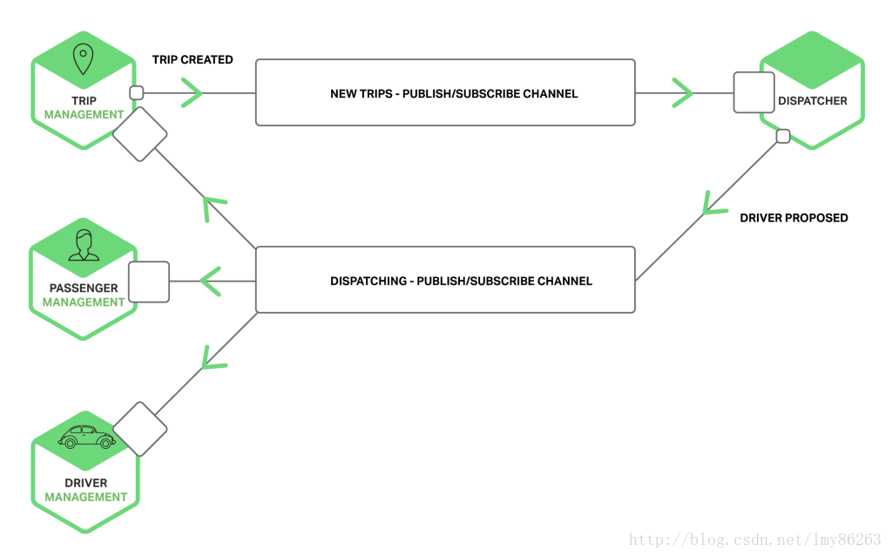

# 进程间通信


基于微服务的应用是运行在多个机器上的分布式系统。每个服务实例都是一个单独的进程。服务必须通过进程间通信机制(IPC)来进行交互

## 一.基于消息的异步通信

(1).客户端通过发送消息来请求服务。

(2).一个消息包含消息头（比如发送人等元信息）和消息体。消息通过通道进行交换。

(3).通道类型:

```
点对点:该通道只会将消息投送给通道中读取消息的消费者中的一个。是一对一的交互模式

发布-订阅:该通道投递消息给所有关联的消费者。是的一对多的交互模式
```



## 二.基于请求/响应的同步通信

(1).REST:是一个使用HTTP的IPC机制，REST使用HTTP的谓词来操作资源，这些资源由URL指定。

```
a.HTTP简单而熟悉；
b.直接支持请求-响应风格的通信；
c.HTTP是防火墙友好的；
d.不要求中间代理，简化了系统架构；
e.客户端必须知道每个服务实例的位置(URL)；
f.支持多种消息格式：JSON，XML；
```

(2).RPC:远程方法调用，屏蔽跨进程调用函数(服务)的各类复杂细节，RPC架构的吞吐量和执行速度优于REST。

```
a.支持请求-响应风格的通信；
b.支持多种消息格式：JSON、二进制和紧凑二进制；
c.可以使用原始TCP和HTTP通信；
```
