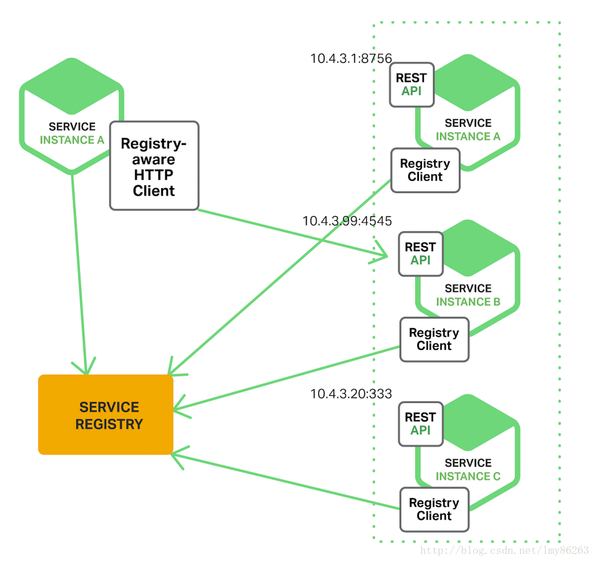
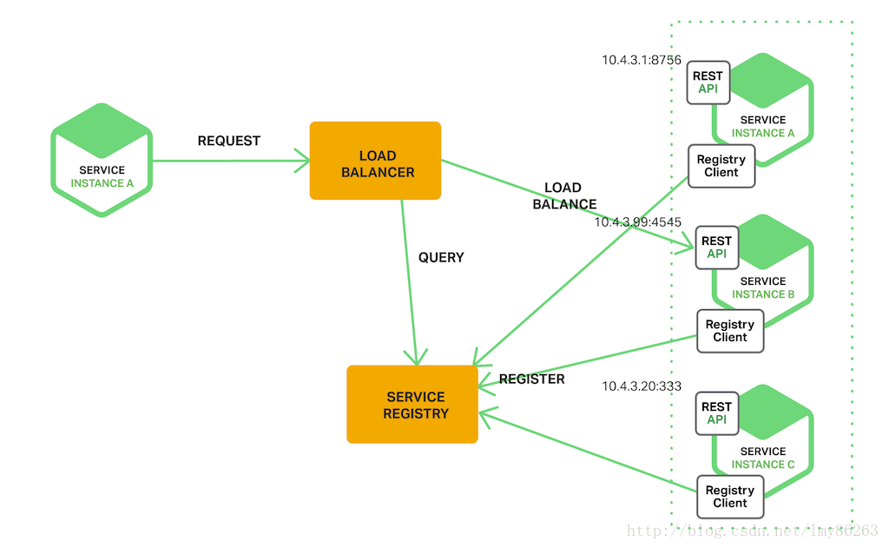
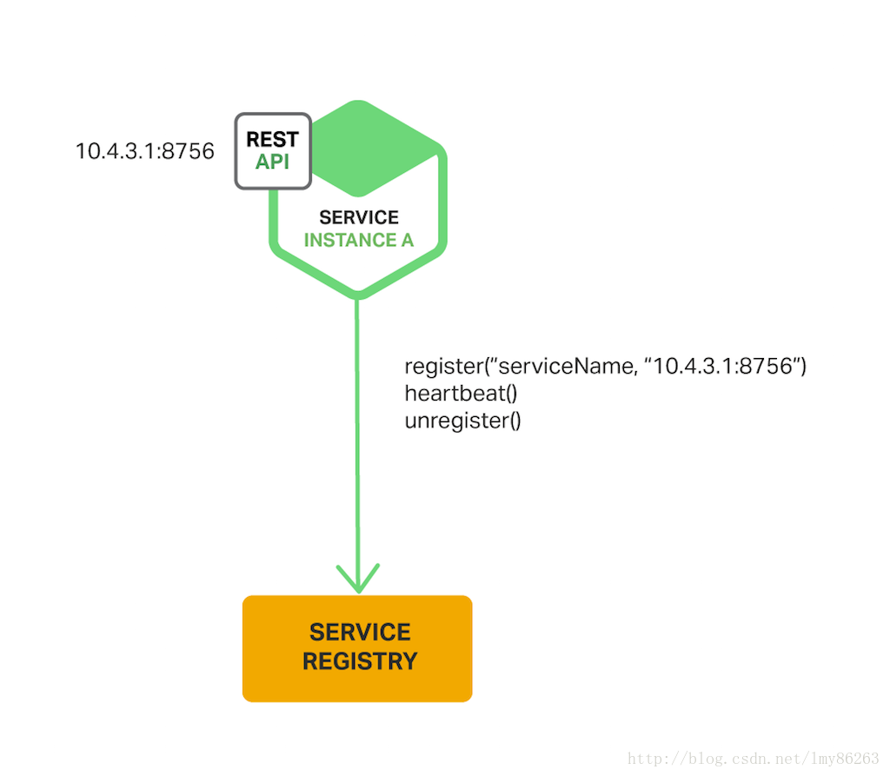
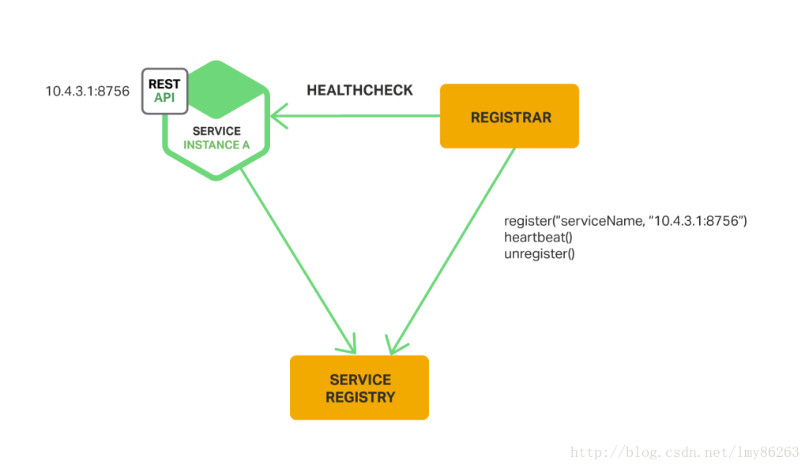

# 服务发现

>在运行在物理硬件的传统应用中，服务实例的网络位置是相对静止的。但是，在现代基于云的微服务应用中，服务实例被动态地赋予网路位置。另外，由于自动伸缩、故障和升级，服务实例集合经常会动态改变。所以客户端代码需要使用详细设计的服务发现机制。

**1.服务发现机制**

(1).客户端发现模式

当使用客户端发现模式时，客户端负责确定可用服务实例的网络位置并且对通过它们的请求进行负载均衡。客户端查询服务注册中心，服务注册中心是一个可用服务实例的数据库。客户端接着使用负载均衡算法选择可用的服务实例中的一个并把这个请求路由到该实例。



```
a.这个模式相对更直接一点，除了服务注册中心，没有要改变的地方；
b.这个模式重要的缺陷是它将客户端与服务注册中心耦合在一起；服务注册中心需要提供多种编程语言的接口；
```

(2).服务端发现模式

客户端通过负载均衡器向服务发送请求。负载均衡器查询服务注册中心并路由每个请求到可用的服务实例。



```
a.这种模式将服务注册中心从客户端抽象出来；
```

<br>

**2.服务注册选项**

>服务注册中心是服务发现机制中的核心部分。它是一个包含服务实例网络位置的数据库。服务注册中心需要高度可用并实时更新。服务实例必须从服务注册中心注册和注销。

(1).自我注册模式

当使用自我注册模式时，服务实例自己负责从服务注册中心注册和注销。并且如果必要的话，服务实例要发送心跳请求来防止注册过期。



```
a.相对简单，并且不要求额外的系统组件；
b.将服务实例和服务注册中心耦合；导致服务注册中心需要提供多种编程语言的接口；
```

(2).第三方注册模式

当使用第三方注册模式时，服务实例不负责注册自己到服务注册中心。 而是通过"服务注册组件"来处理服务注册。"服务注册组件"通过轮询部署环境或者订阅事件来追踪运行实例的集合的变化。当它注意到有新的可用的服务实例时，就会将该实例注册到服务注册中心。"服务注册组件"也可以注销终止的服务实例。



```
a.服务实例与服务注册中心解耦；
```
