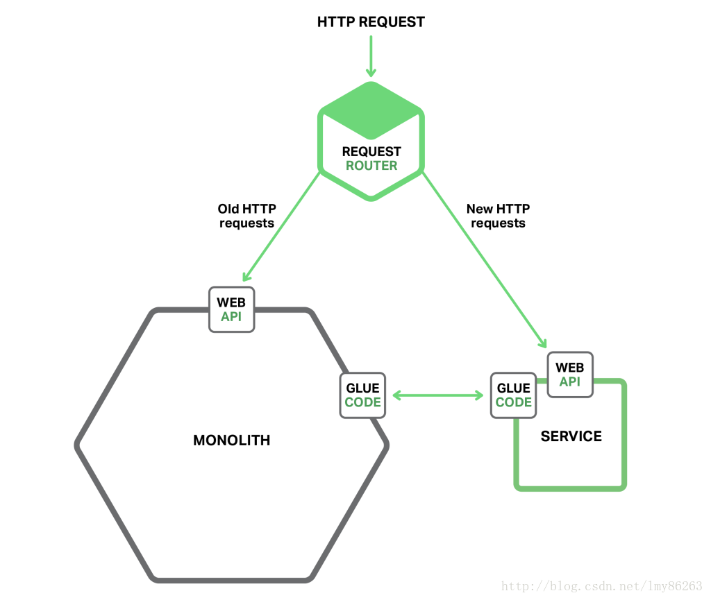
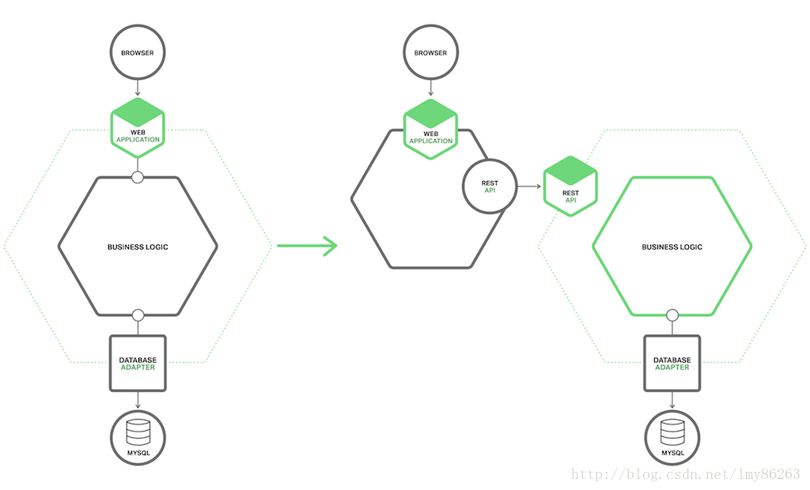
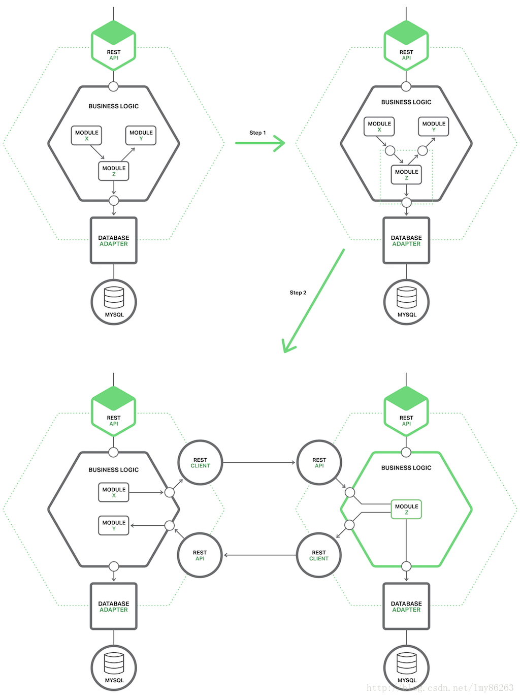

# 单体应用重构为微服务


将单体应用转变为微服务的过程是应用现代化（application modernization）

## 一.停止挖掘

阻止单体应用变得更大。这意味着当实现新功能时，不要向单体应用继续增加代码。代替的是，这种策略的核心观点是将新代码构建成一个独立的微服务



```
a.请求路由器:它处理http请求。路由器将请求发送给对应新功能的新服务，路由遗留的请求给单体应用；

b.胶水代码:它将服务和单体应用相结合。服务使用胶水代码来读写单体应用拥有的数据；单体应用使用胶水代码读写服务拥有的数据；
```

## 二.拆分成前端和后端

将表现层与业务层、数据访问层分离来缩小单体应用



```
a.表现层:该组件处理HTTP请求并且实现REST API或者基于HTML的Web UI；

b.业务逻辑层:该组件是应用的核心，来实现商业规则；

c.数据访问层:该组件来访问基础组件，比如数据库和消息代理；
```

## 三.提取服务

将单体应用中已经存在的模块转换成独立的微服务，每当提取一个模块并将它转换成服务时，单体应用就会萎缩。一旦转换了足够的模块，单体应用就不是一个问题了。它会完全消失或者变得足够小以致成为另外一个服务。



```
a.在模块和单体应用间定义粗粒度的接口。它很有可能是双向的API，因为单体应用需要服务拥有的数据，反之亦然。

b.一旦实现了粗粒度的接口，接着需要把模块转换成独立的服务。编写代码来使得单体应用和服务通过使用进程间通信机制(IPC)的API来进行交互。
```