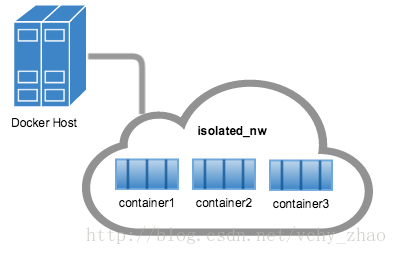
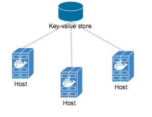

# Network

**1.host模式**

>docker和宿主机共用一个Network Namespace。容器将不会虚拟出自己的网卡，配置自己的IP等，而是使用宿主机的IP和端口。同时而在用docker run运行容器时不需要指定-p参数，容器中的应用都直接绑定在宿主机的端口上

```
docker run -d --name mynginx --network host nginx
```

<br>

**2.container模式**

>在运行容器时通过--net指定另一个已经在运行的有单独Network Namespace的容器，然后与这个容器共享一个Network Namespace。在这种情况下，新建的容器没有自己的网卡，也不会给它分配IP，而是两个容器共享IP和端口空间

```
docker run -d --name mynginx --network container:NAME_OR_ID nginx
```

<br>

**3.none模式**

>none模式下，Docker不会为新创建的容器的网络进行任何配置，容器也没有自己的网卡

```
docker run -d --name mynginx --network none nginx
```

<br>

**4.bridge模式**

>Docker的默认模式，当Docker服务启动时，Docker会在宿主机上建立一个虚拟网桥docker0，宿主机上启动的容器会连接到这个虚拟网桥上。Docker会在一个可用网段(一般是172.17.0.0/16这个网段)中为docker0分配一个IP地址(一般是172.17.0.1)，而每创建一个使用bridge网络模式的新的容器，Docker就会在上面的网段中选择一个尚未分配的IP地址分配给容器的eth0网卡(需要用link参数通信)

<br>

**5.用户自定义**

(1).bridge网络

>bridge网络的容器必须在同一个宿主机上，同一个网络中的容器之间可以直接通信，但不能和不同网络的容器通信



```
#查看docker的网络
docker network ls

#查看网络的详细信息
docker network inspect bridge

#创建bridge网络
docker network create --driver bridge isolated_nw

#创建bridge网络，并指定网关
docker network create -d bridge
    --subnet=192.168.0.0/16
    --gateway=192.168.0.100
    isolated_nw

#将原有的容器连接到bridge网络
docker network connect isolated_nw container2

#将原有的容器断开bridge网络
docker network disconnect isolated_nw container2

#移除bridge网络
docker network rm isolated_nw
```

(2).overlay网络

>overlay支持在多个主机(swarm集群)之间创建网络。



```
#创建overlay网络(开启4789/udp，7946/tcp，7946/udp)
docker network create --driver overlay my-multi-network

#创建overlay网络，并指定网关
docker network create -d overlay
    --subnet=192.168.0.0/16
    --gateway=192.168.0.100
    my-multi-network
```
