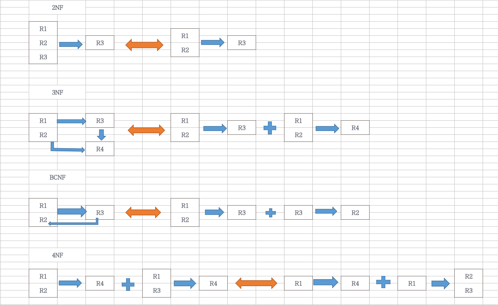

# 范式

>范式是用来解决内部关系间的数据依赖，包括函数依赖（FD，唯一确定，一对一） 与多值依赖（MVD，不能唯一确定，一对多）

```
(R1,R2)-->R3 : 非平凡函数依赖
(R1,R2)-->R2 : 平凡函数依赖
(R1,R2)-F->R3 : 完全依赖；R1与R2为候选码
(R1,R2)-->R3,R1-->R3,R2不能确定R3  ==> (R1,R2)-P->R3 : 部分依赖；R1与R2为超码
(R1,R2)-->R4,(R1,R3)-->R4 ==> R1-->-->R4 : 多值依赖
R1-->-->R2,R1+R2=U : 平凡的多值依赖
```

```
1NF:每一个分量必须是不可分的数据项
2NF:非主属性完全依赖候选码
3NF:非主属性与候选码没有传递关系
BCNF:每一个决定因素都是码
4NF:平凡的多值依赖
```
 