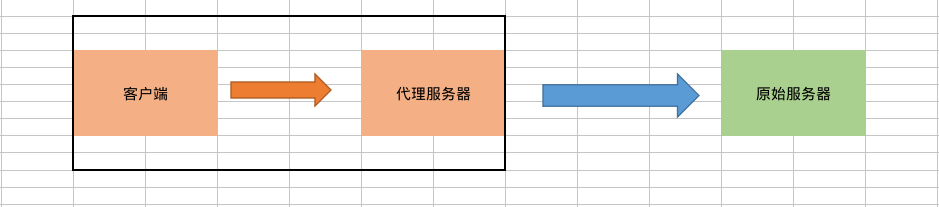
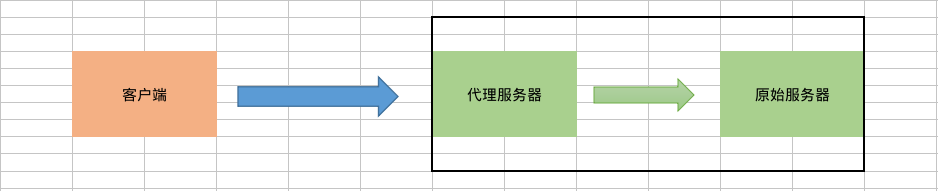

# Nginx代理


## 一.配置FastCGI

```
location ~ \.php$ {
    fastcgi_pass  unix:/run/php-fpm/php-fpm.sock;
    fastcgi_index  index.php;
    include  fastcgi.conf;
}
```

### fastcgi_pass(设置FastCGI服务器的地址,ngx_http_fastcgi_module)

```
语法: fastcgi_pass address
默认值: —
上下文: location, if in location
```

### fastcgi_index(设置FastCGI服务器索引,ngx_http_fastcgi_module)

```
语法: fastcgi_index name
默认值:	—
上下文:	http, server, location
```

### fastcgi_param(设置传递给FastCGI的参数,ngx_http_fastcgi_module)

```
语法: fastcgi_param parameter value [if_not_empty]
默认值: —
上下文: http, server, location
```

## 二.反向代理

```
location / {
    proxy_pass http://127.0.0.1:8080;
    proxy_redirect off;
	proxy_set_header X-Real-IP $remote_addr;
	proxy_set_header X-Forwarded-For $proxy_add_x_forwarded_for;
	proxy_set_header Host $host;
}
```

### proxy_pass(设置后端服务器地址,ngx_http_proxy_module)

```
语法: proxy_pass URL
默认值: —
上下文: location, if in location
```

### proxy_redirect(修改重定向Location头,ngx_http_proxy_module)

```
语法: proxy_redirect default
      proxy_redirect off
      proxy_redirect redirect replacement
默认值:	proxy_redirect default
上下文: http, server, location
```

1).default为自动转换。<br>
2).off为关闭转换。<br>
3).redirect replacement手动通过匹配redirect正则转化为replacement。

### proxy_set_header(设置后端服务器请求头,ngx_http_proxy_module)

```
语法: proxy_set_header field value
默认值: proxy_set_header Host $proxy_host
        proxy_set_header Connection close
上下文:	http, server, location
```

## 三.负载均衡

```
#设置服务器群组
upstream myapp {
    server	192.168.20.1:8080;	# 应用服务器1
    server	192.168.20.2:8080;	# 应用服务器2
}

#设置前端服务器
server{
    listen	80;
    location / {
        proxy_pass	http://myapp;
    }
}
```

### upstream(定义后端服务器群组,ngx_http_upstream_module)

```
语法: upstream name { ... }
默认值:	—
上下文:	http
```

### server(定义每台服务器,ngx_http_upstream_module)

```
语法: server address [parameters]
默认值: —
上下文: upstream
```

参数|描述
--|--
weight=1|设置权重
max_conns=1024|最大连接数
max_fails=1|每台后端服务器尝试数
fail_timeout=10|连接失败后停留指定时间后重新发起请求
backup|备份服务器，当所有主服务器宕机后启动
down|无效服务器

### ip_hash(根据客户端ip分配给固定服务器处理,ngx_http_upstream_module)

```
语法: ip_hash
默认值: —
上下文: upstream
```

### least_conn(根据最少连接数的服务器处理客户端,ngx_http_upstream_module)

```
语法: least_conn
默认值: —
上下文: upstream
```

### hash(根据key的哈希值分配给固定服务器处理,ngx_http_upstream_module)

```
语法: hash key [consistent]
默认值: —
上下文: upstream
```

1).consistent将可以保证当有机器加入或移除时，只进行少量的再哈希。

## 四.缓存服务

```
proxy_cache_path /var/log/nginx levels=1:2 keys_zone=cache:10m max_size=10g inactive=60 use_temp_path=off;

location / {
    proxy_cache cache;
    proxy_cache_valid  200 206 304 301 302 10d;
    proxy_cache_key $uri;
    proxy_set_header Host $host:$server_port;
    proxy_set_header X-Real-IP $remote_addr;
    proxy_set_header X-Forwarded-For $proxy_add_x_forwarded_for;
    proxy_passhttp://127.0.0.1:8080/cache/;
}
```

### proxy_cache_path(定义缓存路径及属性,ngx_http_proxy_module)

```
语法: proxy_cache_path path [levels=levels] [use_temp_path=on|off] keys_zone=name:size [inactive=time] [max_size=size]
默认值: —
上下文: http
```

属性|描述
--|--
path|设置缓存根目录
levels|设置缓存文件目录层次
use_temp_path|是否使用临时文件
keys_zone|设置缓存名字和共享内存大小
inactive|在指定时间内没人访问则被删除
max_size|最大缓存空间，如果缓存空间满，默认覆盖掉缓存时间最长的资源

### proxy_cache(使用缓存,ngx_http_proxy_module)

```
语法: proxy_cache zone | off
默认值: proxy_cache off
上下文: http, server, location
```

### proxy_cache_valid(缓存有效期,ngx_http_proxy_module)

```
语法: proxy_cache_valid [code ...] time
默认值: —
上下文: http, server, location
```

### proxy_cache_key(定义缓存key,ngx_http_proxy_module)

```
语法: proxy_cache_key string
默认值: proxy_cache_key $scheme$proxy_host$request_uri
上下文: http, server, location
```

### proxy_no_cache(设置不需要缓存文件,ngx_http_proxy_module)

```
语法: proxy_no_cache string ...
默认值: —
上下文: http, server, location
```

## 五.代理类型

### 正向代理

1).正向代理是一个位于客户端和原始服务器之间的服务器，为了从原始服务器取得内容，客户端向代理服务器发送一个请求并指定目标(原始服务器)，然后代理服务器向原始服务器转交请求并将获得的内容返回给客户端。客户端必须设置正向代理服务器，当然前提是要知道正向代理服务器的IP地址与端口。



2).正向代理服务器作用

```
a.访问者无法访问原始服务器
b.加速访问原始服务器
c.隐藏访问者的行踪 
```

### 反向代理

1).反向代理正好与正向代理相反，对于客户端而言代理服务器就像是原始服务器，并且客户端不需要进行任何特别的设置。客户端向反向代理服务器发送普通请求，接着反向代理服务器将判断向何处(原始服务器)转交请求，并将获得的内容返回给客户端。



2).反向代理服务器作用

```
a.保护和隐藏原始资源服务器
b.负载均衡
c.缓存服务器
d.CDN网络
```