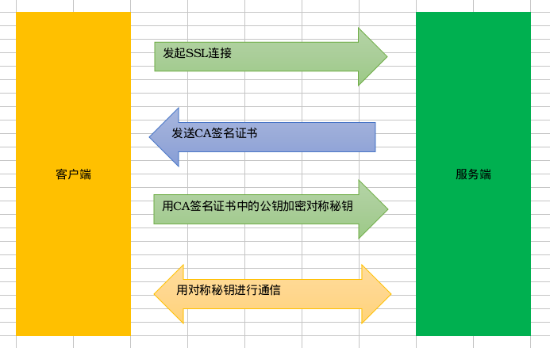

# NginxHttps配置

## 一.HTTPS工作原理



1).客户端向服务端发起SSL连接请求。<br>
2).服务端向客户端返回CA签名证书(由第三方CA认证机构颁发，CA签名证书由服务端公钥等相关信息和被CA机构私钥加密信息的散列值，即DC=PUB(Server)+encrypt(PRI(CA),hash(PUB(Server))))。<br>
3).客户端使用本地CA的公钥解密散列值，与服务端公钥的散列值比较，如果相等就将用服务端的公钥加密回话的对称秘钥发送给服务端。否则就结束通信。<br>
4).服务端用私钥解密得到回话的对称秘钥，之后使用对称秘钥进行通信。

## 二.生成CA签名证书


### (1).服务端生成私钥文件

```
#使用IDEA加密算法，生成1024位的私钥文件server.key
openssl genrsa -idea -out server.key 1024
```

### (2).生成证书签名请求文件(请求CA文件，格式为csr)

```
#根据服务端私钥文件，新建CA请求文件server.csr
openssl req -new -key server.key -out server.csr
```

### (3).生成自签名证书文件(CA签名证书，格式为crt)

```
#自签名证书server.crt，有效期为365天
openssl x509 -req -days 365 -in server.csr -signkey server.key -out server.crt
```

## 三.配置Nginx

```
server{
    listen 443;
    server_name www.baidu.com;
    ssl on;
    ssl_certificate server.crt;
    ssl_certificate_key server.key;
    location / {
        root html;
    }
}
```

### ssl(开启SSL加密,ngx_http_ssl_module)

```
语法: ssl on | off
默认值: ssl off
上下文: http, server
```

### ssl_certificate(CA签名证书路径,ngx_http_ssl_module)

```
语法: ssl_certificate file
默认值: —
上下文: http, server
```

### ssl_certificate_key(server秘钥,ngx_http_ssl_module)

```
语法: ssl_certificate_key file
默认值: —
上下文: http, server
```