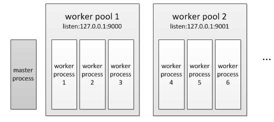

# CGI与FastCGI

>CGI:是Web Server与Web Application之间数据交换的一种协议。通过标准IO流与环境变量进行数据交换。

>FastCGI:同CGI，是一种通信协议，但比CGI在效率上做了一些优化。通过socket进行数据交换。更像一个服务端程序。

>PHP-FPM:是PHP(Web Application)对Web Server提供的FastCGI协议的接口实现程序，额外还提供了相对智能一些任务管理

#### 一.CGI工作流程

1.如果客户端请求的是index.html，那么Web Server会去文件系统中找到这个文件，发送给浏览器，这里分发的是静态数据。

2.当Web Server收到index.php这个请求后，会fork出对应的CGI处理进程，通过标准IO或者设置环境变量与CGI进程进行数据交换，CGI执行脚本完成后返回数据给Web Server，并退出，Web Server再把结果返回给浏览器。

<br>

#### 二.FastCGI工作流程

1.如果客户端请求的是index.html，那么Web Server会去文件系统中找到这个文件，发送给浏览器，这里分发的是静态数据。

2.当Web Server收到index.php这个请求后,会请求相关数据通过Socket访问FastCGI程序，FastCGI执行脚本完成后返回数据给Web Server，FastCGI程序没有退出，Web Server再把结果返回给浏览器。

<br>

#### 三.PHP-FPM多进程模型

1.PHP-FPM的实现就是创建一个master进程，在master进程中创建worker pool并让其监听socket，然后fork出多个子进程worker，这些子进程各自accept请求，子进程的处理非常简单，它在启动后阻塞在accept上，有请求到达后开始读取请求数据，读取完成后开始处理然后再返回，在这期间是不会接收其它请求的，也就是说PHP-FPM的子进程同时只能响应一个请求，只有把这个请求处理完成后才会accept下一个请求。

2.PHP-FPM可以同时监听多个端口，每个端口对应一个worker pool，而每个pool下对应多个worker进程。

3.Master进程与Worker进程利用信号与管道进行通信。



<br>

#### 四.Master工作流程

1.解析配置文件:调用fpm_conf_init_main()函数，将各个worker pool配置解析到fpm_worker_pool_s->config中。并把fpm_worker_all_pools指向第一个pool。

```
enum {
	PM_STYLE_STATIC = 1,
	PM_STYLE_DYNAMIC = 2,
	PM_STYLE_ONDEMAND = 3
};

struct fpm_worker_pool_config_s {
	int pm; //管理方式
	int pm_max_children;
	int pm_start_servers;
	int pm_min_spare_servers;
	int pm_max_spare_servers;
	int pm_process_idle_timeout;
};

struct fpm_worker_pool_s {
    struct fpm_worker_pool_s *next; //指向下一个worker pool
    struct fpm_worker_pool_config_s *config; //conf配置
    struct fpm_child_s *children; //当前pool的worker链表
    int running_children; //当前pool的worker运行总数
    struct fpm_scoreboard_s *scoreboard; //记录每个worker的信息
}

struct fpm_worker_pool_s *fpm_worker_all_pools;
```

2.分配内存:调用fpm_scoreboard_init_main()函数，分配worker pool的运行内存，按照worker pool的最大worker进程数分配，每个worker pool分配一个fpm_scoreboard_s结构，pool下对应的每个worker进程分配一个fpm_scoreboard_proc_s结构。

```
struct fpm_scoreboard_s {
	int pm; //进程管理方式
	int idle; //空闲worker数
	int active; //忙碌worker数
	struct fpm_scoreboard_proc_s *procs[]; //worker内存数组
};

enum fpm_request_stage_e {
	FPM_REQUEST_ACCEPTING =1, //等待请求阶段
	FPM_REQUEST_READING_HEADERS,//读取fastcgi请求header阶段
	FPM_REQUEST_INFO,//获取请求信息阶段，更新fpm_scoreboard_proc_s
	FPM_REQUEST_EXECUTING,//执行请求阶段
	FPM_REQUEST_END,//没有使用
	FPM_REQUEST_FINISHED//请求处理完成
};

struct fpm_scoreboard_proc_s {
    int used; //使用标识 0(未使用) 1(正在使用)
    pid_t pid; //进程id
    enum fpm_request_stage_e request_stage; //处理请求阶段
    char request_uri[128]; //请求路径
    char query_string[512]; //请求参数
    char request_method[16]; //请求方式
    size_t content_length; //请求内容长度
    size_t memory;//占用的内存大小
};
```

3.注册信号处理函数:调用fpm_signals_init_main()函数，创建UNIX域socket，设置SIGTERM、SIGINT、SIGUSR1、SIGUSR2、SIGCHLD、SIGQUIT信号处理函数sig_handler()函数，处理函数将Master进程接受的信号写入sp[1]。

4.绑定套接字:调用fpm_sockets_init_main()函数，为每个pool绑定一个套接字。

5.初始化master事件管理:调用fpm_event_init_main()函数，初始化IO事件(sp信号与IO复用)与定时器事件(fpm_pctl_heartbeat与fpm_pctl_perform_idle_server_maintenance_heartbeat)。

```
struct fpm_event_s {
    int fd;                   // 没设置,表示定时事件
    struct timeval timeout;   //timer事件触发时间点
    struct timeval frequency;　//timer事件触发事件间隔
    void (*callback)(struct fpm_event_s *, short, void *); //回调函数
    void *arg; //回调函数的参数
    int flags;
    int index;                
    short which; //事件类型(定时:FPM_EV_TIMEOUT,IO:FPM_EV_READ)
};

typedef struct fpm_event_queue_s {
	struct fpm_event_queue_s *prev; //前一个事件列队
	struct fpm_event_queue_s *next; //后一个事件列队
	struct fpm_event_s *ev; //当前事件
} fpm_event_queue;

static struct fpm_event_queue_s *fpm_event_queue_timer = NULL;
static struct fpm_event_queue_s *fpm_event_queue_fd = NULL;

struct fpm_event_module_s {
    const char *name; //IO复用的名称
    int support_edge_trigger;
    int (*init)(int max_fd); //初始化IO事件
    int (*clean)(void); //清空IO事件
    int (*wait)(struct fpm_event_queue_s *queue, unsigned long int timeout);//等待IO事件列队
    int (*add)(struct fpm_event_s *ev); //添加IO事件
    int (*remove)(struct fpm_event_s *ev); //移除IO事件
};
```

6.监听事件:调用fpm_run()函数创建子进程worker，调用fpm_event_loop()函数，master将阻塞于此。master循环监听事件；

<br>

#### 五.Worker工作流程

1.等待请求：worker进程阻塞在fcgi_accept_request()等待请求；

2.解析请求：请求到达后，开始接收并调用fpm_request_info()函数解析请求数据；此阶段是将请求的method、query stirng、request uri等信息保存到各worker进程的fpm_scoreboard_proc_s结构中，此操作需要加锁，因为master进程也会操作此结构

3.请求初始化：执行php_request_startup()，此阶段会调用每个扩展的PHP_RINIT_FUNCTION()；

4.编译、执行：由php_execute_script()完成PHP脚本的编译、执行；

5.关闭请求：请求完成后执行php_request_shutdown()，此阶段会调用每个扩展的PHP_RSHUTDOWN_FUNCTION()，然后进入步骤(1)等待下一个请求。

<br>

#### 六.Master进程管理

1.static:这种方式比较简单，在启动时master按照pm.max_children配置fork出相应数量的worker进程，即worker进程数是固定不变的

2.dynamic:动态进程管理，首先在fpm启动时按照pm.start_servers初始化一定数量的worker，运行期间如果master发现空闲worker数低于pm.min_spare_servers配置数(表示请求比较多，worker处理不过来了)则会fork worker进程，但总的worker数不能超过pm.max_children，如果master发现空闲worker数超过了pm.max_spare_servers(表示闲着的worker太多了)则会杀掉一些worker，避免占用过多资源，master通过这4个值来控制worker数

3.ondemand:这种方式一般很少用，在启动时不分配worker进程，等到有请求了后再通知master进程fork worker进程，总的worker数不超过pm.max_children，处理完成后worker进程不会立即退出，当空闲时间超过pm.process_idle_timeout后再退出

<br>

#### 七.Master事件管理

1.sp套接字:用于master处理信号的

2.fpm_pctl_perform_idle_server_maintenance_heartbeat():这是进程管理实现的主要事件，master启动了一个定时器，每隔1s触发一次，主要用于dynamic、ondemand模式下的worker管理，master会定时检查各worker pool的worker进程数，通过此定时器实现worker数量的控制

3.fpm_pctl_heartbeat():这个事件是用于限制worker处理单个请求最大耗时的，php-fpm.conf中有一个request_terminate_timeout的配置项，如果worker处理一个请求的总时长超过了这个值那么master将会向此worker进程发送kill -TERM信号杀掉worker进程，此配置单位为秒，默认值为0表示关闭此机制
