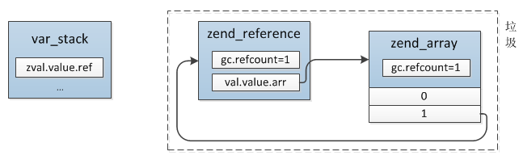

# 变量

**1.变量结构**

```
//8字节(64位)
typedef union _zend_value {
    zend_long         lval;    //int整形
    double            dval;    //浮点型
    zend_string      *str;     //string字符串
    zend_array       *arr;     //array数组
    zend_object      *obj;     //object对象
    zend_resource    *res;     //resource资源类型
    zend_reference   *ref;     //引用类型，通过&$var_name定义的
    zend_refcounted  *counted; //用于内存管理的引用计数，兼容PHP5
} zend_value;

//16字节(128位)
typedef struct _zval_struct     zval;
struct _zval_struct {
    zend_value        value; //变量实际的value
    union {
        struct {
            ZEND_ENDIAN_LOHI_4(
                zend_uchar    type,         //变量类型
                zend_uchar    type_flags,  //变量附加类型，内存管理会用到
                zend_uchar    const_flags,
                zend_uchar    reserved)
        } v;
        uint32_t type_info; //上面4个值的组合值
    } u1;
    union {
        uint32_t     var_flags;
        uint32_t     next;  //哈希表中解决哈希冲突时用到
        uint32_t     cache_slot;   
        uint32_t     lineno;    
        uint32_t     num_args;    
        uint32_t     fe_pos;  
        uint32_t     fe_iter_idx;
    } u2;
};
```

<br>

**2.变量类型**

```
#define IS_UNDEF                    0
#define IS_NULL                     1
#define IS_FALSE                    2
#define IS_TRUE                     3
#define IS_LONG                     4
#define IS_DOUBLE                   5
#define IS_STRING                   6
#define IS_ARRAY                    7
#define IS_OBJECT                   8
#define IS_RESOURCE                 9
#define IS_REFERENCE                10
```

>其中undef、true、false、null没有value，直接根据type区分，而long、double的值则直接存在value中，其他类型为指针

<br>

**3.字符串**

```
typedef struct _zend_string   zend_string;
struct _zend_string {
    zend_refcounted_h gc;  //用于内存管理的引用计数
    zend_ulong        h;   
    size_t            len;  //字符串长度
    char              val[1]; //字符串内容，变长数组
};
```

<br>

**4.数组**

```
typedef struct _zend_array HashTable;
typedef struct _zend_array zend_array;

typedef struct _Bucket {
    zval              val; //value值
    zend_ulong        h;   //哈希值
    zend_string      *key; //key值
} Bucket;

struct _zend_array {
    zend_refcounted_h gc; //用于内存管理的引用计数
    union {
        struct {
            ZEND_ENDIAN_LOHI_4(
                zend_uchar    flags,
                zend_uchar    nApplyCount,
                zend_uchar    nIteratorsCount,
                zend_uchar    reserve)
        } v;
        uint32_t flags;
    } u;
    uint32_t          nTableMask;  //用于散列表的计算nIndex，值为-nTableSize
    Bucket           *arData;     //bucket数组
    uint32_t          nNumUsed;   //已用bucket数
    uint32_t          nNumOfElements; //已有元素数，nNumOfElements <= nNumUsed，因为删除的并不是直接从arData中移除
    uint32_t          nTableSize; //数组的大小，为2^n,默认为8
    uint32_t          nInternalPointer;
    zend_long         nNextFreeElement;//下一个空闲可用位置的数字索引
    dtor_func_t       pDestructor;//析构函数,销毁时调用的函数指针
};
```

>HashTable主要依赖arData实现元素的存储、索引。插入一个元素时先将元素按先后顺序插入Bucket数组，位置是idx，再根据key的哈希值h映射到散列表中的某个位置nIndexn(Index = key->h | ht->nTableMask)，将idx存入这个位置；查找时先在散列表中映射到nIndex，得到value在Bucket数组的位置idx，再从Bucket数组中取出元素。

```
$arr["a"] = 1;
$arr["b"] = 2;
$arr["c"] = 3;
$arr["d"] = 4;

unset($arr["c"]);
```


>哈希碰撞:当出现冲突时将原value的位置保存到新value的zval.u2.next中，然后将新value代替原value的nIndex位置


>扩容:PHP散列表的大小为2^n，插入时如果容量不够则首先检查已删除元素所占比例，如果达到阈值(ht->nNumUsed - ht->nNumOfElements > (ht->nNumOfElements >> 5))，则将已删除元素移除，重建索引，如果未到阈值则进行扩容操作，扩大为当前大小的2倍，将当前Bucket数组复制到新的空间，然后重建索引。


>重建散列表:当删除元素达到一定数量或扩容后都需要重建散列表，因为value在Bucket位置移动了或哈希数组nTableSize变化了导致key与value的映射关系改变，重建过程实际就是遍历Bucket数组中的value，然后重新计算映射值更新到散列表，移除已删除的value，将后面未删除的value依次前移

<br>

**5.引用**

>引用是PHP中比较特殊的一种类型，它实际是指向另外一个PHP变量，对它的修改会直接改动实际指向的zval，可以简单的理解为C中的指针，在PHP中通过&操作符产生一个引用变量，也就是说不管以前的类型是什么，&首先会创建一个zend_reference结构，其内嵌了一个zval，这个zval的value指向原来zval的value(如果是布尔、整形、浮点则直接复制原来的值)，然后将原zval的类型修改为IS_REFERENCE，原zval的value指向新创建的zend_reference结构。

```
typedef struct _zend_reference  zend_reference;
struct _zend_reference {
    zend_refcounted_h gc;
    zval              val;
};
```


```
$a = "time:" . time();      //$a    -> zend_string_1(refcount=1)
$b = &$a;                   //$a,$b -> zend_reference_1(refcount=2) -> zend_string_1(refcount=1)
```

<br>

**6.引用计数**

```
//用于兼容PHP5
typedef struct _zend_refcounted zend_refcounted;
struct _zend_refcounted {
	zend_refcounted_h gc;
};

//PHP7
typedef struct _zend_refcounted_h {
    uint32_t         refcount;         
    union {
        struct {
            ZEND_ENDIAN_LOHI_3(
                zend_uchar    type,
                zend_uchar    flags,   
                uint16_t      gc_info)  
        } v;
        uint32_t type_info;
    } u;
} zend_refcounted_h;
```

```
$a = "time:" . time();   //$a       ->  zend_string_1(refcount=1)
$b = $a;                 //$a,$b    ->  zend_string_1(refcount=2)
$c = $b;                 //$a,$b,$c ->  zend_string_1(refcount=3)

unset($b);               //$b = IS_UNDEF  $a,$c ->  zend_string_1(refcount=2)
```

>并不是所有的数据类型都会用到引用计数，long、double直接都是硬拷贝，只有value是指针的那几种类型(除interned string（不变的字符串），immutable array)才能用到引用计数。可由zval.u1.type_flag判断（是否包含IS_TYPE_REFCOUNTED）

<br>

**7.写时复制**

```
$a = array(1,2);
$b = &$a;
$c = $a;

//发生分离
$b[] = 3;
```


>事实上只有string、array两种支持,通过zval.u1.type_flag判断（是否包含IS_TYPE_COPYABLE）

<br>

**8.变量回收与垃圾回收**

>PHP变量的回收主要有两种：主动销毁、自动销毁。主动销毁指的就是 unset ，而自动销毁就是PHP的自动管理机制，在return时减掉局部变量的refcount，即使没有显式的return，PHP也会自动给加上这个操作，另外一个就是写时复制时会断开原来value的指向，这时候也会检查断开后旧value的refcount。

```
$a = [1];
$a[] = &$a;

unset($a);
```

unset($a)之前引用关系：


unset($a)之后：



>可以看到，unset($a)之后由于数组中有子元素指向$a，所以refcount > 0，无法通过简单的gc机制回收，这种变量就是垃圾，垃圾回收器要处理的就是这种情况，目前垃圾只会出现在array、object两种类型中，所以只会针对这两种情况作特殊处理：当销毁一个变量时，如果发现减掉refcount后仍然大于0，且类型是IS_ARRAY、IS_OBJECT则将此value放入gc可能垃圾双向链表中，等这个链表达到一定数量后启动检查程序将所有变量检查一遍，如果确定是垃圾则销毁释放。


>目前只有object、array两种类型会使用这种机制，可以通过u1.type_flag判断(是否包含IS_TYPE_COLLECTABLE)

<br>

**9.静态变量**

>静态变量的保存位置：zend_op_array->static_variables，这是一个哈希表，所以PHP中的静态变量与普通局部变量不同，它们没有分配在执行空间zend_execute_data上，而是以哈希表的形式保存在zend_op_array中。静态变量只会初始化一次，注意：它的初始化发生在编译阶段而不是执行阶段,这个特性也意味着静态变量初始的值不能是变量，比如：static $count = $xxx;这样定义将会报错


>读写操作:首先根据变量名在static_variables中取出对应的zval，然后将它修改为引用类型并赋值给局部变量，也就是说static $count = 4;包含了两个操作，严格的将$count并不是真正的静态变量，它只是一个指向静态变量的局部变量，执行时实际操作是：$count = & static_variables["count"];


<br>

**10.全局变量**

>全局变量在整个请求执行期间始终存在，它们保存在EG的symbol_table中，与静态变量的存储一样，这也是一个哈希表，在zend_execute_ex执行开始之前会把当前作用域下的所有全局变量添加到EG的symbol_table中.


>读写操作:与静态变量的访问一样，全局变量也是将原来的值转换为引用，然后在global导入的作用域内创建一个局部变量指向该引用


<br>

**11.常量***

>常量存储在EG的zend_constants哈希表中，访问时也是根据常量名直接到哈希表中查找

```
typedef struct _zend_constant {
    zval value;   //常量值
    zend_string *name; //常量名
    int flags;  //常量标识位
    int module_number; //所属扩展、模块
} zend_constant;

#define CONST_CS                (1<<0)  //大小写敏感
#define CONST_PERSISTENT        (1<<1)  //持久化的
#define CONST_CT_SUBST          (1<<2)  //允许编译时替换
```
