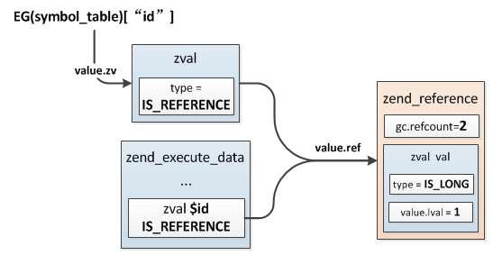

# 局部变量,全局变量,常量

**1.局部变量**

>PHP中局部变量分配在zend_execute_data结构上，每次执行zend_op_array都会生成一个新的zend_execute_data，局部变量在执行之初分配，然后在执行结束时释放，这是局部变量的生命周期。


>读写操作:局部变量通过编译时确定的编号进行读写操作

<br>

**2.静态变量**

>静态变量的保存位置：zend_op_array->static_variables，这是一个哈希表，所以PHP中的静态变量与普通局部变量不同，它们没有分配在执行空间zend_execute_data上，而是以哈希表的形式保存在zend_op_array中。静态变量只会初始化一次，注意：它的初始化发生在编译阶段而不是执行阶段,这个特性也意味着静态变量初始的值不能是变量，比如：static $count = $xxx;这样定义将会报错


>读写操作:首先根据变量名在static_variables中取出对应的zval，然后将它修改为引用类型并赋值给局部变量，也就是说static $count = 4;包含了两个操作，严格的将$count并不是真正的静态变量，它只是一个指向静态变量的局部变量，执行时实际操作是：$count = & static_variables["count"];


<br>

**3.全局变量**

>全局变量在整个请求执行期间始终存在，它们保存在EG( executor_globals，Zend执行器相关的全局变量)的symbol_table中，与静态变量的存储一样，这也是一个哈希表，在zend_execute_ex执行开始之前会把当前作用域下的所有全局变量添加到EG的symbol_table中.


>读写操作:与静态变量的访问一样，全局变量也是将原来的值转换为引用，然后在global导入的作用域内创建一个局部变量指向该引用



<br>

**4.常量**

>常量存储在EG的zend_constants哈希表中，访问时也是根据常量名直接到哈希表中查找

```
typedef struct _zend_constant {
    zval value;   //常量值
    zend_string *name; //常量名
} zend_constant;
```