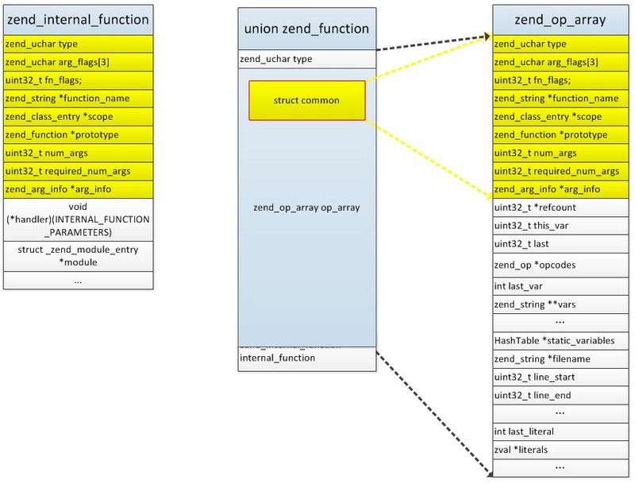
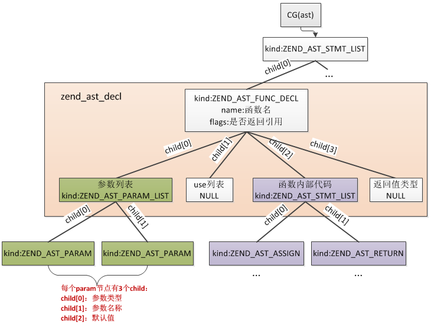

# 函数

**1.函数的存储结构**

```
typedef union  _zend_function        zend_function;

union _zend_function {
    zend_uchar type;  
    struct {
        zend_uchar type;  //被上面的type代替
        zend_uchar arg_flags[3];
        uint32_t fn_flags;
        zend_string *function_name; //函数名
        zend_class_entry *scope; //成员方法所属类
        union _zend_function *prototype;
        uint32_t num_args; //参数数量
        uint32_t required_num_args; //必传参数数量
        zend_arg_info *arg_info; //参数信息
    } common;
    zend_op_array op_array; //自定义函数
    zend_internal_function internal_function; //内部函数
};

struct _zend_op_array {
	zend_uchar type;
	zend_uchar arg_flags[3];
	uint32_t fn_flags;
	zend_string *function_name;
	zend_class_entry *scope;
	zend_function *prototype;
	uint32_t num_args;
	uint32_t required_num_args;
	zend_arg_info *arg_info;
  ...
}

typedef struct _zend_internal_function {
	zend_uchar type;
	zend_uchar arg_flags[3];
	uint32_t fn_flags;
	zend_string* function_name;
	zend_class_entry *scope;
	zend_function *prototype;
	uint32_t num_args;
	uint32_t required_num_args;
	zend_internal_arg_info *arg_info;

  //函数指针，展开：void (*handler)(zend_execute_data *execute_data, zval *return_value)
  void (*handler)(INTERNAL_FUNCTION_PARAMETERS);
	struct _zend_module_entry *module;
	void *reserved[ZEND_MAX_RESERVED_RESOURCES];
} zend_internal_function;
```

```
zend_function.common.xx快速访问到zend_function.zend_op_array.xx及zend_function.zend_internal_function.xx
zend_function.type取到zend_function.op_array.type及zend_function.internal_function.type
```



>PHP在编译阶段将用户自定义的函数编译为独立的opcodes，保存在EG(function_table)中，调用时重新分配新的zend_execute_data(相当于运行栈)，然后执行函数的opcodes，调用完再还原到旧的zend_execute_data，继续执行，EG(function_table)是一个哈希表，记录的就是PHP中所有的函数

<br>

**2.函数参数**

>函数参数在内核实现上与函数内的局部变量实际是一样的,提供一个单独的编号,参数名称也在zend_op_array.vars中，编号首先是从参数开始的，所以按照参数顺序其编号依次为0、1、2...(转化为相对内存偏移量就是96、112、128...)，然后函数调用时首先会在调用位置将参数的value复制到各参数各自的位置

```
//参数的额外信息
typedef struct _zend_arg_info {
    zend_string *name; //参数名
    zend_string *class_name;
    zend_uchar type_hint; //显式声明的参数类型，比如(array $param_1)
    zend_uchar pass_by_reference; //是否引用传参
    zend_bool allow_null; //是否允许为NULL
    zend_bool is_variadic; //是否为可变参数
} zend_arg_info;
```

>每个参数都有一个上面的结构，所有参数的结构保存在zend_op_array.arg_info数组中，这里有一个地方需要注意：zend_op_array.arg_info数组保存的并不全是输入参数，如果函数声明了返回值类型则也会为它创建一个zend_arg_info，这个结构在arg_info数组的第一个位置，这种情况下zend_op_array->arg_info指向的实际是数组的第二个位置，返回值的结构通过zend_op_array->arg_info[-1]读取

<br>

**3.函数编译**

>PHP代码->AST

```
//抽象语法树节点
typedef struct _zend_ast_decl {
    zend_ast_kind kind; //函数就是ZEND_AST_FUNC_DECL，类则是ZEND_AST_CLASS
    zend_ast_attr attr;
    uint32_t start_lineno; //函数起始行
    uint32_t end_lineno;  //函数结束行
    uint32_t flags;   //其中一个标识位用来标识返回值是否为引用
    unsigned char *lex_pos;
    zend_string *doc_comment;
    zend_string *name;  //函数名
    zend_ast *child[4]; //child有4个子节点，分别是：参数列表节点、use列表节点、函数内部表达式节点、返回值类型节点
} zend_ast_decl;
```



>AST->Opcodes

>当解析到函数时，保存当前正在编译的CG(active_op_array)到orig_op_array数组中，并添加生成一条ZEND_DECLARE_FUNCTION的opcode，接着新分配一个zend_op_array并注册到CG(active_op_array)，等到函数编译完成将orig_op_array还原到CG(active_op_array)

```
//编译总入口
void zend_compile_top_stmt(zend_ast *ast){
    if (ast->kind == ZEND_AST_STMT_LIST) {
        for (i = 0; i < list->children; ++i) {
            zend_compile_top_stmt(list->child[i]);
        }
    }

    zend_compile_stmt(ast); //编译各条语法，函数也是在这里编译完成

    //函数编译完成后需要执行
    if (ast->kind == ZEND_AST_FUNC_DECL || ast->kind == ZEND_AST_CLASS) {
        CG(zend_lineno) = ((zend_ast_decl *) ast)->end_lineno;
        zend_do_early_binding();
    }
}
```

>zend_do_early_binding()核心工作就是将function、class加到CG(function_table)、CG(class_table)中 ，加入成功了就直接把ZEND_DECLARE_FUNCTION这条opcode删除了，加入失败的话则保留，这个相当于有一部分opcode在『编译时』提前执行了，这也是为什么PHP中可以先调用函数再声明函数的原因。

<br>

**4.内部函数**

>内部函数指的是由内核、扩展提供的C语言编写的function，这类函数不需要经历opcode的编译过程，所以效率上要高于PHP用户自定义的函数，调用时与普通的C程序没有差异。
