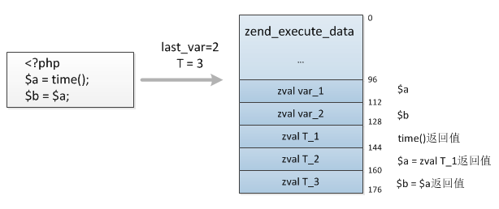
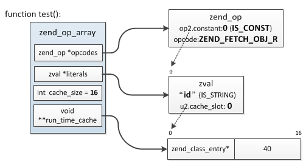

# Zend引擎执行过程

**1.EG(executor_globals/zend_executor_globals)**

>PHP整个生命周期中最主要的一个结构，是一个全局变量，在main执行前分配(非ZTS下)，直到PHP退出，它记录着当前请求全部的信息


```
typedef struct _zend_executor_globals zend_executor_globals;
#define EG(v) (executor_globals.v)

struct _zend_executor_globals {
	zend_array symbol_table; //全局变量哈希表
	HashTable *function_table;	//函数哈希表
	HashTable *class_table;		//类哈希表
	HashTable *zend_constants;	//常量哈希表
	zval          *vm_stack_top; //栈内存的栈顶
	zval          *vm_stack_end; //栈内存的栈底
	zend_vm_stack  vm_stack; //栈内存
	struct _zend_execute_data *current_execute_data;//正在执行栈
  ....
};

typedef struct _zend_vm_stack *zend_vm_stack;

struct _zend_vm_stack {
	zval *top; //当前zend_vm_stack的栈顶
	zval *end; //当前zend_vm_stack的栈底
	zend_vm_stack prev; //前一个zend_vm_stack
};
```

<br>

**2.EX(execute_data/zend_execute_data)**

>在执行过程中最核心的一个结构，每次函数的调用等都会生成一个新的结构，它表示当前的作用域、代码的执行位置以及局部变量的分配等等，等同于机器码执行过程中stack的角色

```
typedef struct _zend_execute_data   zend_execute_data;
#define EX(element)((execute_data)->element)

struct _zend_execute_data {
    const zend_op       *opline;  //指向当前执行的opcode
    zend_execute_data   *call;     //当前分配的execute_data
    zval                *return_value;  //返回值指针
    zend_function       *func;          //当前执行的函数
    zend_class_entry    *called_scope;  //当前call的类
    zend_execute_data   *prev_execute_data; //前一个分配的execute_data
    zend_array          *symbol_table; //全局变量符号表
    ....
};
```

<br>

**3.Zend的执行流程**

>在Zend VM中zend_execute_data的zend_execute_data.call,zend_execute_data.prev_execute_data，实现了call/ret，zend_execute_data.opline实现ip，zend_execute_data后面会分配额外的内存空间用于局部变量的存储，实现了栈功能。

```
step1: 为当前作用域开辟一块zend_execute_data内存充当运行栈，所有局部变量、中间变量等等都在此内存上分配

step2: 初始化全局变量符号表，然后将全局执行位置指针EG(current_execute_data)指向step1新分配的zend_execute_data，
然后将EX(opline)指向op_array的起始位置

step3: 从EX(opline)开始执行每条opcode，每执行完一条opcode将EX(opline)++继续执行下一条，直到执行完全部opcode，函数调用、
if的执行过程：

  step3.1: if语句将根据条件的成立与否决定EX(opline) + offset所加的偏移量，实现跳转

  step3.2: 如果是函数调用，则首先从EG(function_table)中根据function_name取出此function对应的编译完成的zend_op_array，
  然后像step1一样新分配一个zend_execute_data结构，将EG(current_execute_data)赋值给新结构EX(prev_execute_data)，再将
  EG(current_execute_data)指向新的zend_execute_data，最后从新的zend_execute_data.opline开始执行，切换到函数内部，函
  数执行完以后将EG(current_execute_data)重新指向EX(prev_execute_data)，释放分配的运行栈，销毁局部变量，继续从原来函数调
  用的位置执行

step4: 全部opcode执行完成后将step1分配的内存释放，这个过程会将所有的局部变量"销毁"，执行阶段结束
```


```
//1.分配stack的大小
static zend_always_inline uint32_t zend_vm_calc_used_stack(uint32_t num_args, zend_function *func){
    //普通的zend_op_array与内部函数(ZEND_CALL_FRAME_SLOT=6，nums为函数传入的参数个数)
    uint32_t used_stack = ZEND_CALL_FRAME_SLOT + num_args;
    //当为自定义函数时
    if (EXPECTED(ZEND_USER_CODE(func->type))) {
        used_stack += func->op_array.last_var + func->op_array.T - num_args;
    }
    return used_stack * sizeof(zval);
}

#define ZEND_CALL_FRAME_SLOT \
    ((int)((ZEND_MM_ALIGNED_SIZE(sizeof(zend_execute_data)) + ZEND_MM_ALIGNED_SIZE(sizeof(zval)) - 1) / ZEND_MM_ALIGNED_SIZE(sizeof(zval))))
```



>分配的内存是从EG(vm_stack)中获取的，每次从EG(vm_stack_top)处开始分配，分配完再将此指针EG(vm_stack_top) += used_stack

```
//2.初始化zend_execute_data()
static zend_always_inline void i_init_execute_data(zend_execute_data *execute_data, zend_op_array *op_array, zval *return_value){
    //设置指针:opline、call、return_value
    EX(opline) = op_array->opcodes;
    EX(call) = NULL;
    EX(return_value) = return_value;
    if (UNEXPECTED(EX(symbol_table) != NULL)) {
        ...
        zend_attach_symbol_table(execute_data);//将全局变量添加到EG(symbol_table)
    }else{
        ...
    }
}
```


>zend_attach_symbol_table()的作用是把当前作用域下的变量添加到EG(symbol_table)哈希表中，也就是全局变量，函数中通过global关键词获取，EG(symbol_table)中的值间接的指向zend_execute_data中的局部变量

```
//3.执行opcode
# define ZEND_OPCODE_HANDLER_ARGS_PASSTHRU execute_data

ZEND_API void execute_ex(zend_execute_data *ex){
    zend_execute_data *execute_data = ex;
    while(1) {
        int ret;
        //执行handler，并把execute_data传入
        if (UNEXPECTED((ret = ((opcode_handler_t)EX(opline)->handler)(execute_data)) != 0)) {
            if (EXPECTED(ret > 0)) { //函数调用时的情况
                execute_data = EG(current_execute_data);
            }else{
                return;
            }
        }
    }
}

//handler的返回值
//表示继续执行下一条opcode
#define ZEND_VM_CONTINUE()     return  0
//调用函数时的动作，execute_ex()中会将切换到新的execute_data
#define ZEND_VM_ENTER()        return  1
//函数调用完成，execute_ex()中会将切换到原来的execute_data
#define ZEND_VM_LEAVE()        return  2
//执行完成，execute_ex()将退出执行
#define ZEND_VM_RETURN()       return -1
```

```
//4.释放stack(只是改变内存池中指针即可)
zend_vm_stack p = EG(vm_stack);
zend_vm_stack prev = p->prev;
EG(vm_stack_top) = prev->top;
EG(vm_stack_end) = prev->end;
EG(vm_stack) = prev;
```

<br>

**4.运行时缓存**

>在执行期间，PHP经常需要根据名称去不同的哈希表中查找常量、函数、类、成员方法、成员属性等，因此PHP提供了一种缓存机制用于缓存根据名称查找到的结果，以便再次执行同一opcode时直接复用上次缓存的值，无需重复查找，从而提高执行效率。只有包含IS_CONST类型的操作数的opcode才有可能用到此机制


>缓存的存储格式是一个数组，用于保存缓存的数据指针，而指针在数组中的起始存储位置则保存在CONST操作数对应的zval.u2.cache_slot中


>实际上在编译阶段时，编译过程中如果发现当前操作适用缓存机制，则根据缓存数据的大小从cache_size开始分配8或16字节给那个操作数，cache_size向后移动对应大小，然后将起始位置保存于CONST操作数的zval.u2.cache_slot中，执行时直接根据这个值确定缓存位置。

```
缓存数据空间大小规则:
    8字节：常量、函数、类
    16字节：成员属性、成员方法、类常量
```

```
实例:
class my_class {
    public $id = 123;
    public function test() {
        echo $this->id;
    }
}

$obj = new my_class;
$obj->test();
$obj->test();
```



```
(1) 第一次执行echo $this->id;时首先根据$this取出zend_class_entry，然后根据"id"查找
zend_class_entry.properties_info找到属性zend_property_info，取出此结构的offset，
第一次执行后将zend_class_entry及offset保存到了test()函数的zend_op_array->run_time_cache中，
占用16字节，起始位置为0，这个值记录在"id"的zval.u2.cache_slot中；

(2) 之后再次执行echo $this->id;时直接根据opline从zend_op_literals中取出"id"的zval，得到缓存数据保存位置：0，
然后去zend_op_array->run_time_cache取出缓存的zend_class_entry、offset。
```
