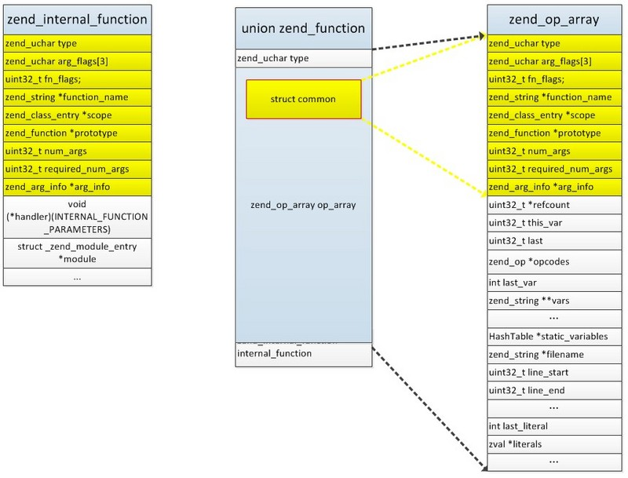

# 函数

**1.函数的存储结构**

```
typedef union  _zend_function        zend_function;

union _zend_function {
    zend_uchar type;    
    struct {
        zend_uchar type; 
        zend_uchar arg_flags[3];
        uint32_t fn_flags;
        zend_string *function_name;
        zend_class_entry *scope; //成员方法所属类，面向对象实现中用到
        union _zend_function *prototype;
        uint32_t num_args; //参数数量
        uint32_t required_num_args; //必传参数数量
        zend_arg_info *arg_info; //参数信息
    } common;
    zend_op_array op_array; //自定义函数(函数实际编译为普通的zend_op_array)
    zend_internal_function internal_function; //内部函数(通过扩展或者内核提供的C函数)
};
```

```
zend_function.common.xx快速访问到zend_function.zend_op_array.xx及zend_function.zend_internal_function.xx
zend_function.type取到zend_function.op_array.type及zend_function.internal_function.type
```



>PHP在编译阶段将用户自定义的函数编译为独立的opcodes，保存在EG(function_table)中，调用时重新分配新的zend_execute_data(相当于运行栈)，然后执行函数的opcodes，调用完再还原到旧的zend_execute_data，继续执行，EG(function_table)是一个哈希表，记录的就是PHP中所有的函数

<br>

**2.函数参数**

>函数参数在内核实现上与函数内的局部变量实际是一样的,提供一个单独的编号,参数名称也在zend_op_array.vars中，编号首先是从参数开始的，所以按照参数顺序其编号依次为0、1、2...(转化为相对内存偏移量就是96、112、128...)，然后函数调用时首先会在调用位置将参数的value复制到各参数各自的位置

```
//参数的额外信息
typedef struct _zend_arg_info {
    zend_string *name; //参数名
    zend_string *class_name;
    zend_uchar type_hint; //显式声明的参数类型，比如(array $param_1)
    zend_uchar pass_by_reference; //是否引用传参，参数前加&的这个值就是1
    zend_bool allow_null; //是否允许为NULL
    zend_bool is_variadic; //是否为可变参数，即...用法，function my_func($a, ...$b){...}
} zend_arg_info;
```

>每个参数都有一个上面的结构，所有参数的结构保存在zend_op_array.arg_info数组中，这里有一个地方需要注意：zend_op_array->arg_info数组保存的并不全是输入参数，如果函数声明了返回值类型则也会为它创建一个zend_arg_info，这个结构在arg_info数组的第一个位置，这种情况下zend_op_array->arg_info指向的实际是数组的第二个位置，返回值的结构通过zend_op_array->arg_info[-1]读取

<br>

**3.内部函数**

>内部函数指的是由内核、扩展提供的C语言编写的function，这类函数不需要经历opcode的编译过程，所以效率上要高于PHP用户自定义的函数，调用时与普通的C程序没有差异。Zend引擎中定义了很多内部函数供用户在PHP中使用，比如：define、defined、strlen、method_exists、class_exists、function_exists......等等，除了Zend引擎中定义的内部函数，PHP扩展中也提供了大量内部函数，我们也可以灵活的通过扩展自行定制。


```
//zend_internal_function头部是一个与zend_op_array完全相同的common结构
typedef struct _zend_internal_function {
    /* Common elements */
    zend_uchar type;
    zend_uchar arg_flags[3]; /* bitset of arg_info.pass_by_reference */
    uint32_t fn_flags;
    zend_string* function_name;
    zend_class_entry *scope;
    zend_function *prototype;
    uint32_t num_args;
    uint32_t required_num_args;
    zend_internal_arg_info *arg_info;
    /* END of common elements */

    void (*handler)(INTERNAL_FUNCTION_PARAMETERS); //函数指针，展开：void (*handler)(zend_execute_data *execute_data, zval *return_value)
    struct _zend_module_entry *module;
    void *reserved[ZEND_MAX_RESERVED_RESOURCES];
} zend_internal_function;
```