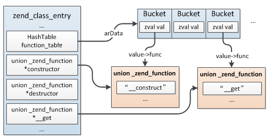

# Zend引擎执行过程

**1.EG(executor_globals/zend_executor_globals)**

>PHP整个生命周期中最主要的一个结构，是一个全局变量，在main执行前分配(非ZTS下)，直到PHP退出，它记录着当前请求全部的信息



<br>

**2.EX(execute_data/zend_execute_data)**

>在执行过程中最核心的一个结构，每次函数的调用、include/require、eval等都会生成一个新的结构，它表示当前的作用域、代码的执行位置以及局部变量的分配等等，

```
#define EX(element)             ((execute_data)->element)

struct _zend_execute_data {
    const zend_op       *opline;  //指向当前执行的opcode，初始时指向zend_op_array起始位置
    zend_execute_data   *call;             /* current call                   */
    zval                *return_value;  //返回值指针
    zend_function       *func;          //当前执行的函数（非函数调用时为空）
    zend_class_entry    *called_scope;  //当前call的类
    zend_execute_data   *prev_execute_data; //函数调用时指向调用位置作用空间
    zend_array          *symbol_table; //全局变量符号表
#if ZEND_EX_USE_RUN_TIME_CACHE
    void               **run_time_cache;   /* cache op_array->run_time_cache */
#endif
#if ZEND_EX_USE_LITERALS
    zval                *literals;  //字面量数组，与func.op_array->literals相同
#endif
};
```


<br>

**3.Zend的执行流程**

>在Zend VM中zend_execute_data的zend_execute_data.opline,zend_execute_data.prev_execute_data，实现了call/ret,后面会分配额外的内存空间用于局部变量的存储，实现了ebp/esp的作用。

```
step1: 为当前作用域分配一块内存，充当运行栈，zend_execute_data结构、所有局部变量、中间变量等等都在此内存上分配
step2: 初始化全局变量符号表，然后将全局执行位置指针EG(current_execute_data)指向step1新分配的zend_execute_data，然后将zend_execute_data.opline指向op_array的起始位置
step3: 从EX(opline)开始调用各opcode的C处理handler(即_zend_op.handler)，每执行完一条opcode将EX(opline)++继续执行下一条，直到执行完全部opcode，函数调用、if的执行过程：
step3.1: if语句将根据条件的成立与否决定EX(opline) + offset所加的偏移量，实现跳转
step3.2: 如果是函数调用，则首先从EG(function_table)中根据function_name取出此function对应的编译完成的zend_op_array，然后像step1一样新分配一个zend_execute_data结构，
将EG(current_execute_data)赋值给新结构的prev_execute_data，再将EG(current_execute_data)指向新的zend_execute_data，最后从新的zend_execute_data.opline开始执行，切换
到函数内部，函数执行完以后将EG(current_execute_data)重新指向EX(prev_execute_data)，释放分配的运行栈，销毁局部变量，继续从原来函数调用的位置执行
step4: 全部opcode执行完成后将step1分配的内存释放，这个过程会将所有的局部变量"销毁"，执行阶段结束
```


<br>

**4.运行时缓存**

>在执行期间，PHP经常需要根据名称去不同的哈希表中查找常量、函数、类、成员方法、成员属性等，因此PHP提供了一种缓存机制用于缓存根据名称查找到的结果，以便再次执行同一opcode时直接复用上次缓存的值，无需重复查找，从而提高执行效率。运行时缓存机制是在同一opcode执行多次的情况下才会生效，特别注意这里的同一opcode指的并不是opcode值相同，而是指内存里的同一份数据


>实际上运行时缓存是基于所属opcode中CONST操作数存储的，也就是说只有包含IS_CONST类型的操作数才有可能用到此机制，其它类型都不会用到，这是因为只有CONST操作数是固定不变的，其它CV、VAR等类型值都不是固定的，既然其值是不固定的那么缓存的值也就不是固定的，所以不会针对CONST以外类型的opcode操作进行缓存


>缓存的存储格式是一个数组，用于保存缓存的数据指针，而指针在数组中的起始存储位置则保存在CONST操作数对应的zval.u2.cache_slot中,实际上它是在编译阶段确定的，通过zend_op_array.cache_size记录缓存可用起始位置，编译过程中如果发现当前操作适用缓存机制，则根据缓存数据的大小从cache_size开始分配8或16字节给那个操作数，cache_size向后移动对应大小，然后将起始位置保存于CONST操作数的zval.u2.cache_slot中，执行时直接根据这个值确定缓存位置。

```
缓存数据空间大小:
    8字节：常量、函数、类
    16字节：成员属性、成员方法、类常量
```