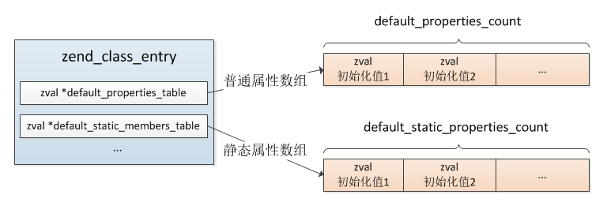
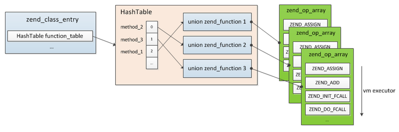

# 类

**1.类的结构**

>类是编译阶段的产物，而对象是运行时产生的，它们归属于不同阶段。编译完成后我们定义的每个类都会生成一个zend_class_entry，它保存着类的全部信息，在执行阶段所有类相关的操作都是用的这个结构，保存在EG(class_table)

```
typedef struct _zend_class_entry     zend_class_entry;
struct _zend_class_entry {
    char type;          //类的类型：内部类ZEND_INTERNAL_CLASS(1)、用户自定义类ZEND_USER_CLASS(2)
    zend_string *name;  //类名
    struct _zend_class_entry *parent; //父类
    uint32_t ce_flags;  //类掩码，如普通类、抽象类、接口，
    int default_properties_count;        //普通属性数
    int default_static_members_count;    //静态属性数
    zval *default_properties_table;      //普通属性值数组
    zval *default_static_members_table;  //静态属性值数组
    HashTable properties_info; //成员属性基本信息哈希表
    HashTable function_table;  //成员方法哈希表
    HashTable constants_table; //常量哈希表
    uint32_t num_interfaces; //实现的接口数
    uint32_t num_traits; //包含的Traits数
    zend_class_entry **interfaces; //实现的接口
    zend_class_entry **traits; //包含的Traits

    //以下是构造函授、析构函数、魔术方法的指针
    union _zend_function *constructor;
    union _zend_function *destructor;
    union _zend_function *clone;
    union _zend_function *__get;
    union _zend_function *__set;
    union _zend_function *__unset;
    union _zend_function *__isset;
    union _zend_function *__call;
    union _zend_function *__callstatic;
    union _zend_function *__tostring;
    union _zend_function *__debugInfo;
    union _zend_function *serialize_func;
    union _zend_function *unserialize_func;
}
```

<br>

**2.类常量**

>PHP中的类常量通过zend_class_entry.constants_table进行存储，这是一个哈希表，通过常量名检索常量值，类常量的替换可以发生在运行阶段，也可以发生在编译阶段

```
实例A:
class my_class {
    const A1 = "hi";
}
echo my_class::A1;

实例B:
echo my_class::A1;
class my_class {
    const A1 = "hi";
}
```

>实例A在编译阶段就进行my_class::A1常量的替换，而实例B需要在运行阶段通过EG(class_table)逐步查找zend_class_entry.constants_table进行替换。

<br>

**3.成员属性**

>成员属性又分为两类：普通属性、静态属性，与常量的存储方式不同，成员属性值并不是直接用以"属性名"作为索引的哈希表存储的，而是通过数组保存的



>实际只是成员属性值通过数组存储的，访问时仍然是根据以"属性名"为索引的散列表查找具体属性值的,而这个散列表是zend_class_entry.properties_info

```
typedef struct _zend_property_info {
    uint32_t offset; //普通成员变量的内存偏移值，静态成员变量的数组索引
    uint32_t flags;  //属性掩码
    zend_string *name; //属性名
    zend_class_entry *ce; //所属类
} zend_property_info;

//flags标识位
#define ZEND_ACC_PUBLIC     0x100
#define ZEND_ACC_PROTECTED  0x200
#define ZEND_ACC_PRIVATE    0x400
#define ZEND_ACC_STATIC     0x01
```

>成员属性在类编译阶段就已经分配了zval，静态与普通的区别在于普通属性在创建一个对象时还会重新分配zval,对象对普通属性的操作都是在其自己的空间进行的，各对象隔离，而静态属性的操作始终是在类的空间内，各对象共享。

<br>

**4.成员方法**

>每个类可以定义若干属于本类的函数(称之为成员方法)，这种函数与普通的function相同，只是以类的维度进行管理，不是全局性的，所以成员方法保存在类中zend_class_entry(function_table)而不是EG(function_table)



<br>

**5.类的编译**

```
实例:
class Human {
    public $aa = array(1,2,3);
}

class User extends Human{
    const type = 110;
    static $name = "uuu";
    public $uid = 900;
    public $sex = 'w';
    public function __construct(){}
    public function getName(){
        return $this->name;
    }
}
```

>PHP->AST

```
//抽象语法树
typedef struct _zend_ast_decl {
    zend_ast_kind kind; //函数就是ZEND_AST_FUNC_DECL，类则是ZEND_AST_CLASS
    zend_ast_attr attr;
    uint32_t start_lineno; //开始行号
    uint32_t end_lineno;   //结束行号
    uint32_t flags;
    unsigned char *lex_pos;
    zend_string *doc_comment;
    zend_string *name; //类名
    zend_ast *child[4]; //父类、接口以及类中的语句
} zend_ast_decl;
```


>编译child[2]有三类:常量(ZEND_AST_CLASS_CONST_DECL)、属性(ZEND_AST_PROP_DECL)、方法(ZEND_AST_METHOD)

>AST->Opcodes

```
//类的编译
void zend_compile_class_decl(zend_ast *ast){
    ...
    zend_class_entry *ce = zend_arena_alloc(&CG(arena), sizeof(zend_class_entry));//分配zend_class_entry空间
    ce->type = ZEND_USER_CLASS; //类型为用户自定义类
    ce->name = name; //类名
    zend_op *opline;
    ...
    if (extends_ast) {
        ...
        //有继承的父类则首先生成一条ZEND_FETCH_CLASS
        zend_compile_class_ref(&extends_node, extends_ast, 0);
    }
    //在当前父空间生成一条ZEND_AST_CLASS
    opline = get_next_op(CG(active_op_array));
    if (decl->flags & ZEND_ACC_ANON_CLASS) {
        ...
    }else{
        zend_string *key;
        if (extends_ast) {
            //有继承的类为这个opcode
            opline->opcode = ZEND_DECLARE_INHERITED_CLASS;
          } else {
           //无继承的类为这个opcode
            opline->opcode = ZEND_DECLARE_CLASS;
        }
        key = zend_build_runtime_definition_key(lcname, decl->lex_pos); //这个key并不是类名，而是：类名+file+lex_pos
        opline->op1_type = IS_CONST;
        LITERAL_STR(opline->op1, key);//将这个临时key保存到操作数1中
        //将半成品的zend_class_entry插入CG(class_table)，注意它的key不是类名
        zend_hash_update_ptr(CG(class_table), key, ce);
    }
    CG(active_class_entry) = ce;
    zend_compile_stmt(stmt_ast); //将常量、成员属性、方法编译到CG(active_class_entry)中
    ...
}
```

>上面这个过程主要操作是新分配一个zend_class_entry，如果有继承的话首先在新的zend_op_array成一条ZEND_FETCH_CLASS与ZEND_DECLARE_INHERITED_CLASS，无继承生成一条ZEND_DECLARE_CLASS，然后在原zend_op_array生成一条ZEND_AST_CLASS，接着就是将生成的zend_class_entry插入到CG(class_table)哈希表中，注意它的key并不是类名，也就是这个时候通过类名在class_table是索引不到对应类的，最后进行编译常量、属性、成员方法到新分配的zend_class_entry中

```
zend_compile_class_const_decl:常量编译
zend_compile_prop_decl:属性编译
zend_compile_func_decl:方法编译
```
```
zend_do_early_binding()

(1).在无继承的情况下注册成功将ZEND_DECLARE_CLASS删除，并把正确的类名注册到CG(class_table)

(2).在有继承下注册成功将ZEND_FETCH_CLASS与ZEND_DECLARE_INHERITED_CLASS删除，并把正确的类名注册到CG(class_table)

(3).在有继承下注册失败，可能在顺序编译中没有找到父类，则将opcode置为ZEND_DECLARE_INHERITED_CLASS_DELAYED，这种情况下当前的
正确类名是没有注册到CG(class_table)中去的，也就是这个时候这个类是无法使用的，在执行的时候会再次尝试这个过程，那个时候如果找到
父类了则再加入EG(class_table)
```


