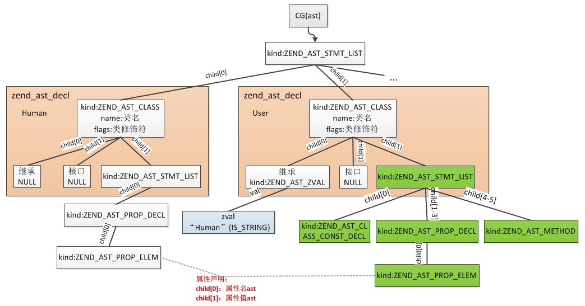
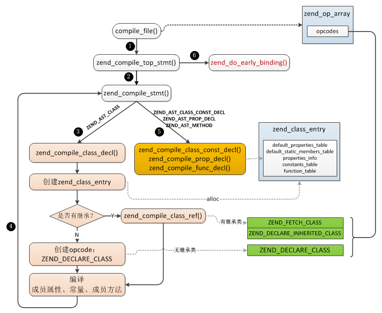
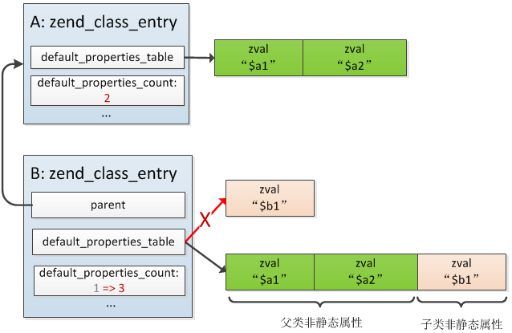

# 类

**1.类的结构**

>类是编译阶段的产物，而对象是运行时产生的，它们归属于不同阶段。编译完成后我们定义的每个类都会生成一个zend_class_entry，它保存着类的全部信息，在执行阶段所有类相关的操作都是用的这个结构，保存在EG(class_table)

```
typedef struct _zend_class_entry     zend_class_entry;
struct _zend_class_entry {
    char type;          //类的类型：内部类ZEND_INTERNAL_CLASS(1)、用户自定义类ZEND_USER_CLASS(2)
    zend_string *name;  //类名
    struct _zend_class_entry *parent; //父类
    uint32_t ce_flags;  //类掩码，如普通类、抽象类、接口，
    int default_properties_count;        //普通属性数
    int default_static_members_count;    //静态属性数
    zval *default_properties_table;      //普通属性值数组
    zval *default_static_members_table;  //静态属性值数组
    HashTable properties_info; //成员属性基本信息哈希表
    HashTable function_table;  //成员方法哈希表
    HashTable constants_table; //常量哈希表
    uint32_t num_interfaces; //实现的接口数
    uint32_t num_traits; //包含的Traits数
    zend_class_entry **interfaces; //实现的接口
    zend_class_entry **traits; //包含的Traits

    //以下是构造函授、析构函数、魔术方法的指针
    union _zend_function *constructor;
    union _zend_function *destructor;
    union _zend_function *clone;
    union _zend_function *__get;
    union _zend_function *__set;
    union _zend_function *__unset;
    union _zend_function *__isset;
    union _zend_function *__call;
    union _zend_function *__callstatic;
    union _zend_function *__tostring;
    union _zend_function *__debugInfo;
}
```

<br>

**2.类常量**

>PHP中的类常量通过zend_class_entry.constants_table进行存储，这是一个哈希表，通过常量名检索常量值，类常量的替换可以发生在运行阶段，也可以发生在编译阶段

```
实例A:
class my_class {
    const A1 = "hi";
}
echo my_class::A1;

实例B:
echo my_class::A1;
class my_class {
    const A1 = "hi";
}
```

>实例A在编译阶段就进行my_class::A1常量的替换，而实例B需要在运行阶段通过EG(class_table)逐步查找zend_class_entry.constants_table进行替换。

<br>

**3.成员属性**

>成员属性又分为两类：普通属性、静态属性，与常量的存储方式不同，成员属性值并不是直接用以"属性名"作为索引的哈希表存储的，而是通过数组保存的


>实际只是成员属性值通过数组存储的，访问时仍然是根据以"属性名"为索引的散列表查找具体属性值的,而这个散列表是zend_class_entry.properties_info

```
typedef struct _zend_property_info {
    uint32_t offset; //普通成员变量的内存偏移值，静态成员变量的数组索引
    uint32_t flags;  //属性掩码
    zend_string *name; //属性名
    zend_class_entry *ce; //所属类
} zend_property_info;

//flags标识位
#define ZEND_ACC_PUBLIC     0x100
#define ZEND_ACC_PROTECTED  0x200
#define ZEND_ACC_PRIVATE    0x400
#define ZEND_ACC_STATIC     0x01
```

>成员属性在类编译阶段就已经分配了zval，静态与普通的区别在于普通属性在创建一个对象时还会重新分配zval,对象对普通属性的操作都是在其自己的空间进行的，各对象隔离，而静态属性的操作始终是在类的空间内，各对象共享。

<br>

**4.成员方法**

>每个类可以定义若干属于本类的函数(称之为成员方法)，这种函数与普通的function相同，只是以类的维度进行管理，不是全局性的，所以成员方法保存在类中zend_class_entry(function_table)而不是EG(function_table)


<br>

**5.类的编译**

```
实例:
class Human {
    public $aa = array(1,2,3);
}

class User extends Human{
    const type = 110;
    static $name = "uuu";
    public $uid = 900;
    public $sex = 'w';
    public function __construct(){}
    public function getName(){
        return $this->name;
    }
}
```

>PHP->AST

```
//抽象语法树
typedef struct _zend_ast_decl {
    zend_ast_kind kind; //函数就是ZEND_AST_FUNC_DECL，类则是ZEND_AST_CLASS
    zend_ast_attr attr;
    uint32_t start_lineno; //开始行号
    uint32_t end_lineno;   //结束行号
    uint32_t flags;
    unsigned char *lex_pos;
    zend_string *doc_comment;
    zend_string *name; //类名
    zend_ast *child[4]; //父类、接口以及类中的语句
} zend_ast_decl;
```



>编译child[2]有三类:常量(ZEND_AST_CLASS_CONST_DECL)、属性(ZEND_AST_PROP_DECL)、方法(ZEND_AST_METHOD)

>AST->Opcodes

```
//类的编译
void zend_compile_class_decl(zend_ast *ast){
    ...
    zend_class_entry *ce = zend_arena_alloc(&CG(arena), sizeof(zend_class_entry));//分配zend_class_entry空间
    ce->type = ZEND_USER_CLASS; //类型为用户自定义类
    ce->name = name; //类名
    zend_op *opline;
    ...
    if (extends_ast) {
        ...
        //有继承的父类则首先生成一条ZEND_FETCH_CLASS
        zend_compile_class_ref(&extends_node, extends_ast, 0);
    }
    //在当前父空间生成一条ZEND_AST_CLASS
    opline = get_next_op(CG(active_op_array));
    if (decl->flags & ZEND_ACC_ANON_CLASS) {
        ...
    }else{
        zend_string *key;
        if (extends_ast) {
            //有继承的类为这个opcode
            opline->opcode = ZEND_DECLARE_INHERITED_CLASS;
          } else {
           //无继承的类为这个opcode
            opline->opcode = ZEND_DECLARE_CLASS;
        }
        key = zend_build_runtime_definition_key(lcname, decl->lex_pos); //这个key并不是类名，而是：类名+file+lex_pos
        opline->op1_type = IS_CONST;
        LITERAL_STR(opline->op1, key);//将这个临时key保存到操作数1中
        //将半成品的zend_class_entry插入CG(class_table)，注意它的key不是类名
        zend_hash_update_ptr(CG(class_table), key, ce);
    }
    CG(active_class_entry) = ce;
    zend_compile_stmt(stmt_ast); //将常量、成员属性、方法编译到CG(active_class_entry)中
    ...
}
```

>上面这个过程主要操作是新分配一个zend_class_entry，如果有继承的话首先在新的zend_op_array成一条ZEND_FETCH_CLASS与ZEND_DECLARE_INHERITED_CLASS，无继承生成一条ZEND_DECLARE_CLASS，然后在原zend_op_array生成一条ZEND_AST_CLASS，接着就是将生成的zend_class_entry插入到CG(class_table)哈希表中，注意它的key并不是类名，也就是这个时候通过类名在class_table是索引不到对应类的，最后进行编译常量、属性、成员方法到新分配的zend_class_entry中

```
zend_compile_class_const_decl:常量编译
zend_compile_prop_decl:属性编译
zend_compile_func_decl:方法编译
```
```
zend_do_early_binding()

(1).在无继承的情况下注册成功将ZEND_DECLARE_CLASS删除，并把正确的类名注册到CG(class_table)

(2).在有继承下注册成功将ZEND_FETCH_CLASS与ZEND_DECLARE_INHERITED_CLASS删除，并把正确的类名注册到CG(class_table)

(3).在有继承下注册失败，可能在顺序编译中没有找到父类，则将opcode置为ZEND_DECLARE_INHERITED_CLASS_DELAYED，这种情况下当前的
正确类名是没有注册到CG(class_table)中去的，也就是这个时候这个类是无法使用的，在执行的时候会再次尝试这个过程，那个时候如果找到
父类了则再加入EG(class_table)
```



<br>

**6.继承**

(a).继承属性



>1.合并非静态属性default_properties_table

```
if (parent_ce->default_properties_count) {
    zval *src, *dst, *end;
    ...
    //申请一块大小为父类+子类非静态属性大小的内存空间
    zval *table = pemalloc(sizeof(zval) * (ce->default_properties_count + parent_ce->default_properties_count));
    //子类default_properties_table指向新的内存空间
    ce->default_properties_table = table;
    //依次复制父类、子类default_properties_table
    do {
        ...
    }while(dst != end);
    //更新default_properties_count为合并后的大小
    ce->default_properties_count += parent_ce->default_properties_count;
}
```

>2.合并静态属性default_static_members_table: 与非静态属性相同，新申请一个父类+子类静态属性大小的数组，依次将父类、子类静态属性复制到新数组，然后更新子类default_static_members_table指向新数组。


>3.更新子类属性zend_property_info的offset

```
if (property_info->flags & ZEND_ACC_STATIC) {
    //静态属性offset为数组下标，直接加上父类default_static_members_count即可
    property_info->offset += parent_ce->default_static_members_count;
} else {
    //非静态属性offset为内存偏移值，按zval大小递增
    property_info->offset += parent_ce->default_properties_count * sizeof(zval);
}
```

>4.合并zend_property_info哈希表

```
static void do_inherit_property(zend_property_info *parent_info, zend_string *key, zend_class_entry *ce){
	if (UNEXPECTED(child)) {
		 //1.父类属性与子类冲突且父类属性为私有：不继承父类属性，但子类属性flag添加ZEND_ACC_CHANGED
		if (UNEXPECTED(parent_info->flags & (ZEND_ACC_PRIVATE|ZEND_ACC_SHADOW))) {
			child_info->flags |= ZEND_ACC_CHANGED;
		} else {
      //2.1父类属性与子类冲突且父类属性为非私有，父子类属性一个是静态一个是非静态: 编译错误
			if (UNEXPECTED((parent_info->flags & ZEND_ACC_STATIC) != (child_info->flags & ZEND_ACC_STATIC))) {
				      zend_error_noreturn();
			}
      //2.2父类属性与子类冲突且父类属性为非私有，父子类属性都是静态: 不继承父类属性，但子类属性flag添加ZEND_ACC_CHANGED
      if (parent_info->flags & ZEND_ACC_CHANGED) {
				child_info->flags |= ZEND_ACC_CHANGED;
			}
      //2.3父类属性与子类冲突且父类属性为非私有，父子类属性都是非静态: 用父类的offset，但是值用子类的，删除原来子类offset的值
	    if ((child_info->flags & ZEND_ACC_STATIC) == 0) {
				int parent_num = OBJ_PROP_TO_NUM(parent_info->offset);
				int child_num = OBJ_PROP_TO_NUM(child_info->offset);
				ce->default_properties_table[parent_num] = ce->default_properties_table[child_num];
				ZVAL_UNDEF(&ce->default_properties_table[child_num]);
				child_info->offset = parent_info->offset;
			}
		}
	} else {
    //3.父类属性不与子类冲突且父类属性是私有：继承父类属性，但需要更改flag为ZEND_ACC_SHADOW
		if (UNEXPECTED(parent_info->flags & (ZEND_ACC_PRIVATE|ZEND_ACC_SHADOW))) {
			child_info = zend_duplicate_property_info(parent_info);
			child_info->flags &= ~ZEND_ACC_PRIVATE;
			child_info->flags |= ZEND_ACC_SHADOW;
		} else {
    //4.父类属性不与子类冲突且父类属性是公有：直接继承父类属性
		  child_info = parent_info;
		}
    //追加继承属性到子类
		_zend_hash_append_ptr(&ce->properties_info, key, child_info);
	}
}
```


(b).继承常量

>常量的合并策略比较简单，如果父类与子类冲突时用子类的，不冲突时则将父类的常量合并到子类。

```
static void do_inherit_class_constant(zend_string *name, zval *zv, zend_class_entry *ce, zend_class_entry *parent_ce){
    //父类定义的常量在子类中没有定义
    if (!zend_hash_exists(&ce->constants_table, name)) {
        //追加到子类的常量哈希表
        _zend_hash_append(&ce->constants_table, name, zv);
    }
}
```

(c).继承方法

>1.扩大子类function_table哈希表

```
if (zend_hash_num_elements(&parent_ce->function_table)) {
    //扩展子类的function_table哈希表大小（子类=子类+父类）
    zend_hash_extend(&ce->function_table,
      zend_hash_num_elements(&ce->function_table) +
      zend_hash_num_elements(&parent_ce->function_table), 0);
    //遍历父类function_table，检查是否可被子类继承
    ZEND_HASH_FOREACH_STR_KEY_PTR(&parent_ce->function_table, key, func) {
        zend_function *new_func = do_inherit_method(key, func, ce);
        if (new_func) {
            //如果可以继承，添加到子类
            _zend_hash_append_ptr(&ce->function_table, key, new_func);
        }
    } ZEND_HASH_FOREACH_END();
}
```

>2.拷贝非冲突方法到子类(do_inherit_method->zend_duplicate_function)

```
static zend_function *zend_duplicate_function(zend_function *func, zend_class_entry *ce){
    zend_function *new_function;
    if (UNEXPECTED(func->type == ZEND_INTERNAL_FUNCTION)) {
        //内部函数：执行硬拷贝
    }else{
        //非内部类：父类方法引用+1
        if (func->op_array.refcount) {
            (*func->op_array.refcount)++;
        }
        //非内部类且不是静态方法：直接返回（浅拷贝）
        if (EXPECTED(!func->op_array.static_variables)) {
            return func;
        }
        //非内部类且是静态方法：硬拷贝
        new_function = zend_arena_alloc(&CG(arena), sizeof(zend_op_array));
        memcpy(new_function, func, sizeof(zend_op_array));
    }
}
```

>3.拷贝冲突方法到子类(do_inherit_method->do_inheritance_check_on_method)

```
static void do_inheritance_check_on_method(zend_function *child, zend_function *parent){
  //1.抽象子类的抽象方法与抽象父类的抽象方法冲突: 无法重写，Fatal错误
	if ((parent->common.scope->ce_flags & ZEND_ACC_INTERFACE) == 0
		&& parent->common.fn_flags & ZEND_ACC_ABSTRACT
		&& parent->common.scope != (child->common.prototype ? child->common.prototype->common.scope : child->common.scope)
		&& child->common.fn_flags & (ZEND_ACC_ABSTRACT|ZEND_ACC_IMPLEMENTED_ABSTRACT)) {
		zend_error_noreturn();
	}
  //2.父类方法为final: Fatal错误，final成员方法不得被重写
	if (UNEXPECTED(parent_flags & ZEND_ACC_FINAL)) {
		zend_error_noreturn();
	}  
  //3.父子类方法静态属性不一致: 父类方法为非静态而子类的是静态(或相反)，Fatal错误
	if (UNEXPECTED((child_flags & ZEND_ACC_STATIC) != (parent_flags & ZEND_ACC_STATIC))) {
		if (child->common.fn_flags & ZEND_ACC_STATIC) {
			zend_error_noreturn();
		} else {
			zend_error_noreturn();
		}
	}
  //4.抽象子类的抽象方法覆盖父类非抽象方法: Fatal错误
	if (UNEXPECTED((child_flags & ZEND_ACC_ABSTRACT) > (parent_flags & ZEND_ACC_ABSTRACT))) {
		zend_error_noreturn();
	}
  //5.子类方法限制父类方法访问权限: Fatal错误，不允许派生类限制父类方法的访问权限，如父类方法为public，而子类试图重写为protected/private。
  if (UNEXPECTED((child_flags & ZEND_ACC_PPP_MASK) > (parent_flags & ZEND_ACC_PPP_MASK))) {
			zend_error_noreturn();
	} else if (((child_flags & ZEND_ACC_PPP_MASK) < (parent_flags & ZEND_ACC_PPP_MASK))
        && ((parent_flags & ZEND_ACC_PPP_MASK) & ZEND_ACC_PRIVATE)) {
      child->common.fn_flags |= ZEND_ACC_CHANGED;
  }
  ....
}
```

<br>

**7.魔术方法**

>魔术方法与普通成员方法一样保存在zend_class_entry.function_table中，在编译成员方法时如果发现与这些魔术方法名称一致，则除了插入zend_class_entry.function_table哈希表以外，还会设置zend_class_entry中对应魔术方法的指针

```
void zend_begin_method_decl(zend_op_array *op_array, zend_string *name, zend_bool has_body){
    ...
    //插入zend_class_entry(function_table)
    if (zend_hash_add_ptr(&ce->function_table, lcname, op_array) == NULL) {
        zend_error_noreturn();
    }
    //改变魔术函数的指针
    if (zend_string_equals_literal(lcname, ZEND_CONSTRUCTOR_FUNC_NAME)) {
        ce->constructor = (zend_function *) op_array;
    } else if (zend_string_equals_literal(lcname, ZEND_DESTRUCTOR_FUNC_NAME)) {
        ce->destructor = (zend_function *) op_array;
    } else if (zend_string_equals_literal(lcname, ZEND_CLONE_FUNC_NAME)) {
        ce->clone = (zend_function *) op_array;
    } else if (zend_string_equals_literal(lcname, ZEND_CALL_FUNC_NAME)) {
        ce->__call = (zend_function *) op_array;
    } else if (zend_string_equals_literal(lcname, ZEND_CALLSTATIC_FUNC_NAME)) {
        ce->__callstatic = (zend_function *) op_array;
    } else if (zend_string_equals_literal(lcname, ZEND_GET_FUNC_NAME)) {
			  ce->__get = (zend_function *) op_array;
	  } else if (zend_string_equals_literal(lcname, ZEND_SET_FUNC_NAME)) {
			  ce->__set = (zend_function *) op_array;
		} else if (zend_string_equals_literal(lcname, ZEND_UNSET_FUNC_NAME)) {
			  ce->__unset = (zend_function *) op_array;
		} else if (zend_string_equals_literal(lcname, ZEND_ISSET_FUNC_NAME)) {
			  ce->__isset = (zend_function *) op_array;
		} else if (zend_string_equals_literal(lcname, ZEND_TOSTRING_FUNC_NAME)) {
			  ce->__tostring = (zend_function *) op_array;
		} else if (zend_string_equals_literal(lcname, ZEND_DEBUGINFO_FUNC_NAME)) {
			  ce->__debugInfo = (zend_function *) op_array;
		}
    ...
}
```


>注意：有几个魔术方法没有显示定义接口，但在某些函数中被回调，比如：sleep()、wakeup()

<br>

**8.类的自动加载**

>实例化类时如果在EG(class_table)中没有找到对应的类则会逐个调用EG(autoload_func)中钩子函数，调用完以后再重新查找一次。是否该类注册到EG(class_table)中，EG(autoload_func)可以通过spl_autoload_register()注册

>内核查找类过程

```
ZEND_API zend_class_entry *zend_lookup_class_ex(zend_string *name, const zval *key, int use_autoload){
    //1.从EG(class_table)符号表找类的zend_class_entry，如果找到说明类已经编译，直接返回
    ce = zend_hash_find_ptr(EG(class_table), lc_name);
    if (ce) {
        return ce;
    }
    //2.当EG(autoload_func)为空时，检查是否定义__autoload()方法，若定义则注册到EG(autoload_func)中
    if (!EG(autoload_func)) {
        zend_function *func = zend_hash_str_find_ptr(EG(function_table), "__autoload", sizeof("__autoload") - 1);
        if (func) {
            EG(autoload_func) = func;
        } else {
            return NULL;
        }
    }
    //3.调用EG(autoload_func)函数，然后再查一次EG(class_table)
    if ((zend_call_function(&fcall_info, &fcall_cache) == SUCCESS) && !EG(exception)) {
        ce = zend_hash_find_ptr(EG(class_table), lc_name);
    }
}
```
