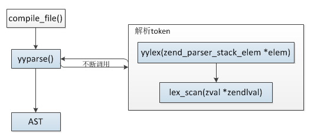
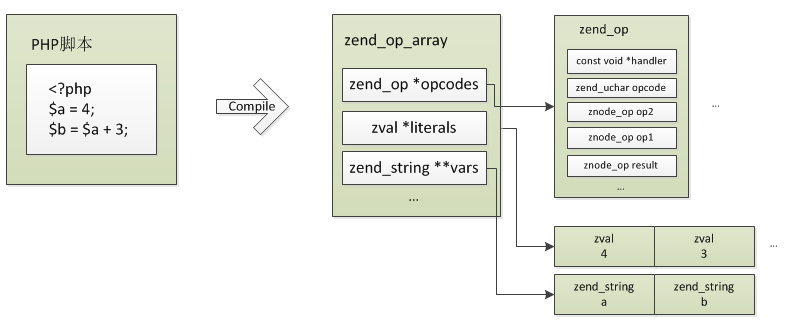
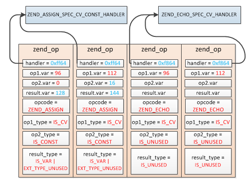

# PHP代码的编译

**1.PHP代码的编译**

>PHP的解析过程任务就是将PHP代码转化为opcode数组，代码里的所有信息都保存在opcode数组中，然后将opcode数组交给zend引擎执行，opcode就是内核具体执行的命令，比如赋值、加减操作、函数调用等，每一条opcode都对应一个处理handle，这些handler是提前定义好的C函数。


<br>

**2.PHP代码->抽象语法树(AST)**

```
PHP使用re2c、bison完成这个阶段的工作:
    re2c: 词法分析器，将输入分割为一个个有意义的词块，称为token
    bison: 语法分析器，确定词法分析器分割出的token是如何彼此关联的
```



```
词法、语法解析过程

1.yyparse(zendparse)调用yylex(zendlex)，当读取到一个合法的token时，返回值为token类型
2.yylex调用lex_scan读取合法的token值
3.yyparse将token类型与token值构造抽象语法树,最后将根节点保存到CG(compiler_globals ，Zend编译器相关的全局变量)的ast中
```

<br>

**3.AST节点结构**

```
typedef struct _zend_ast   zend_ast;

//普通节点类型
struct _zend_ast {
    zend_ast_kind kind;  //节点类型
    zend_ast_attr attr;  //节点附加属性
    uint32_t lineno;    //行号
    zend_ast *child[1];  //子节点数组
};

//普通节点类型，但有子节点的个数
typedef struct _zend_ast_list {
    zend_ast_kind kind; //节点类型
    zend_ast_attr attr; //节点附加属性
    uint32_t lineno; //行号
    uint32_t children; //子节点数量
    zend_ast *child[1];//子节点数组
} zend_ast_list;

//函数、类的ast节点结构
typedef struct _zend_ast_decl {
    zend_ast_kind kind; //节点类型
    zend_ast_attr attr; //节点附加属性
    uint32_t start_lineno; //开始行号
    uint32_t end_lineno;   //结束行号
    uint32_t flags;
    unsigned char *lex_pos;
    zend_string *doc_comment;
    zend_string *name;
    zend_ast *child[4]; //类中会将继承的父类、实现的接口以及类中的语句解析保存在child中
} zend_ast_decl;
```

```
实例:
$a = 123;
$b = "hi~";

echo $a,$b;
```


<br>

**4.zend_op_array**



```
struct _zend_op_array {
    zend_op *opcodes; //opcode指令数组
    int last_var; //编译前此值为0，然后发现一个新变量这个值就加1(op_type为IS_CV的变量)
    uint32_t T;//临时变量数:op_type为IS_TMP_VAR、IS_VAR的变量
    int last_literal;  //字面量数量
    zval *literals; //字面量(常量)数组，这些都是在PHP代码定义的一些值
    zend_string **vars; //PHP变量名数组,这个数组在ast编译期间配合last_var用来确定各个变量的编号
    HashTable *static_variables;//静态变量符号表:通过static声明的
    int  cache_size; //运行时缓存数组大小
    void **run_time_cache; //运行时缓存，主要用于缓存一些znode_op以便于快速获取数据
};
```

```
//opcode指令结构
struct _zend_op {
    const void *handler; //指令执行handler
    znode_op op1;   //操作数1
    znode_op op2;   //操作数2
    znode_op result; //返回值
    uint32_t extended_value; 
    uint32_t lineno; 
    zend_uchar opcode;  //opcode指令
    zend_uchar op1_type; //操作数1类型
    zend_uchar op2_type; //操作数2类型
    zend_uchar result_type; //返回值类型
};

//操作数类型
#define IS_CONST    (1<<0)  //1:字面量，编译时就可确定且不会改变的值，比如:$a = "hello~"，其中字符串"hello~"就是常量
#define IS_TMP_VAR  (1<<1)  //2:临时变量，比如：$a = "hello~" . time()，其中"hello~" . time()的值类型就是IS_TMP_VAR
#define IS_VAR      (1<<2)  //4:PHP变量是没有显式的在PHP脚本中定义的，不是直接在代码通过$var_name定义的。这个类型最常见的例子是PHP函数的返回值
#define IS_UNUSED   (1<<3)  //8:表示操作数没有用
#define IS_CV       (1<<4)  //16:PHP脚本变量，即脚本里通过$var_name定义的变量，这些变量是编译阶段确定的
```

<br>

**5.handler处理函数**

>handler为每条opcode对应的C语言编写的处理过程,所有opcode对应的处理过程定义在zend_vm_def.h中,opcode的处理过程有三种不同的提供形式：CALL、SWITCH、GOTO，默认方式为CALL

```
CALL:把每种opcode负责的工作封装成不同的function，然后执行器循环调用执行
SWITCH:把所有的处理方式写到一个switch下，然后通过case不同的opcode执行具体的操作
GOTO:把所有opcode的处理方式通过C语言里面的label标签区分开，然后执行器执行的时候goto到相应的位置处理
```

<br>

**6.抽象语法树->Opcodes**

```
void zend_compile_top_stmt(zend_ast *ast){
    ....
    if (ast->kind == ZEND_AST_STMT_LIST) { //第一次进来一定是这种类型
        zend_ast_list *list = zend_ast_get_list(ast);
        uint32_t i;
        for (i = 0; i < list->children; ++i) {
            zend_compile_top_stmt(list->child[i]);//list各child语句相互独立，递归编译
        }
        return;
    }
    //各语句编译入口
    zend_compile_stmt(ast);
    ....
}

1.zend_compile_top_stmt接收语法树，首先判断节点类型是否为ZEND_AST_STMT_LIST(表示当前节点下
有多个独立的节点),若是则进行递归
2.当递归结束后，调用zend_compile_stmt进行编译成opcodes
```

```
实例:
$a = 123;
$b = "hi~";

echo $a,$b;
```

>注意：这里变量的编号从0、1、2、3...依次递增的，但是实际使用中并不是直接用的这个下标，而是转化成了内存偏移量offset，这个是ZEND_CALL_VAR_NUM宏处理的，所以变量偏移量实际是96、112、128...递增的


```
pass_two()主要有两个重要操作：

1.将IS_CONST、IS_VAR、IS_TMP_VAR类型的操作数、返回值转化为内存偏移量
2.另外一个重要操作就是设置各指令的处理handler
```

