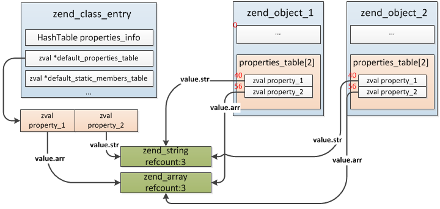

# 对象

**1.对象的数据结构**

```
typedef struct _zend_object     zend_object;

struct _zend_object {
    zend_refcounted_h gc;  //引用计数
    uint32_t          handle; //对象编号
    zend_class_entry *ce; //所属类
    const zend_object_handlers *handlers; //对象操作处理函数
    HashTable   *properties; //普通成员属性哈希表，用于动态属性
    zval      properties_table[1]; // 成员属性数组，即类中的普通属性数组
};

typedef struct _zend_object_handlers zend_object_handlers;
struct _zend_object_handlers {
  int offset;
  zend_object_free_obj_t      free_obj; //释放对象
  zend_object_dtor_obj_t      dtor_obj; //销毁对象
  zend_object_clone_obj_t     clone_obj;//复制对象
  zend_object_read_property_t   read_property; //读取成员属性
  zend_object_write_property_t  write_property;//修改成员属性
  ...
};

//默认值处理handler
ZEND_API zend_object_handlers std_object_handlers = {
    0,
    zend_object_std_dtor,
    zend_objects_destroy_object,
    zend_objects_clone_obj,
    zend_std_read_property,
    zend_std_write_property,
    zend_std_read_dimension,
    ....
}
```

<br>

**2.对象的创建**

```
static int ZEND_NEW_SPEC_CONST_HANDLER(zend_execute_data *execute_data){
    ...
    //第1步：根据类名查找zend_class_entry
    ce = zend_fetch_class_by_name(Z_STR_P(EX_CONSTANT(opline->op1)), ...);
    ...
    //第2步：创建并初始化一个这个类的对象
    if (UNEXPECTED(object_init_ex(&object_zval, ce) != SUCCESS)) {
        HANDLE_EXCEPTION();
    }
    //第3步：获取构造方法
    Z_OBJ_HT(object_zval)->get_constructor(Z_OBJ(object_zval));
    //第4步：调用构造方法
    if (constructor == NULL) {
        //如果没有定义构造方法则直接跳过这些操作
        ZEND_VM_JMP(OP_JMP_ADDR(opline, opline->op2));
    }else{
        //如果定义了构造方法则进行调用操作
        zend_execute_data *call = zend_vm_stack_push_call_frame(...);
        call->prev_execute_data = EX(call);
        EX(call) = call;
    }
}
```

>a.分配对象结构zend_object(object_init_ex->object_and_properties_init->zend_objects_new)

```
ZEND_API zend_object *zend_objects_new(zend_class_entry *ce){
    //分配zend_object(zend_object+非静态属性数+zval[若有定义了魔术方法])
    zend_object *object = emalloc(sizeof(zend_object) + zend_object_properties_size(ce));
    //注册对象到EG(objects_store)
    zend_object_std_init(object, ce);
    //设置对象的操作handler为std_object_handlers
    object->handlers = &std_object_handlers;
    return object;
}
```

>b.注册EG(objects_store)(zend_object_std_init->zend_objects_store_put)

```
typedef struct _zend_objects_store {
	zend_object **object_buckets;  //zend_object数组
	uint32_t top; //zend_object数组的实际大小
	uint32_t size; //zend_object数组大小
	int free_list_head; //指向了第一个可用的zend_object
} zend_objects_store;

ZEND_API void zend_objects_store_put(zend_object *object){
    int handle;
    if (EG(objects_store).free_list_head != -1) {
        handle = EG(objects_store).free_list_head;
        EG(objects_store).free_list_head = GET_OBJ_BUCKET_NUMBER(EG(objects_store).object_buckets[handle]);
    }
    //object的handler属性为数组的下标
    object->handle = handle;
    //存入object_buckets数组
    EG(objects_store).object_buckets[handle] = object;
}
```

>c.初始化成员属性(object_init_ex->object_and_properties_init->object_properties_init)

```
ZEND_API void object_properties_init(zend_object *object, zend_class_entry *class_type){
    if (class_type->default_properties_count) {
        zval *src = class_type->default_properties_table;
        zval *dst = object->properties_table;
        zval *end = src + class_type->default_properties_count;
        //复制填充object(properties_table)
        do {
            ZVAL_COPY(dst, src);
            src++;
            dst++;
        } while (src != end);
        object->properties = NULL;
    }
}
```

>ZVAL_COPY实现的是浅复制，两者当前指向的value还是同一份，除非对象试图改写指向的属性值，那时将触发写时复制机制重新拷贝一份。



<br>

**3.对象的操作**

>1.读取属性(zend_object.handlers->zend_std_read_property)

```
首先是从zend_class的属性信息哈希表中找到zend_property_info，并判断其可见性(public、private、protected)，
如果可以访问则直接根据属性的offset在zend_object.properties_table数组中取到属性值，如果没有在属性哈希表中
找到且定义了__get()魔术方法则会调用__get()方法处理。
```

>2.设置属性(zend_object.handlers->zend_std_write_property)

```
首先与读取属性的操作相同：先找到zend_property_info，判断其可见性，然后根据offset取到具体的属性值，最后对其
进行赋值修改。
```

>3.对象的复制

```
ZEND_API zend_object *zend_objects_clone_obj(zval *zobject){
    zend_object *old_object;
    zend_object *new_object;
    old_object = Z_OBJ_P(zobject);
    //重新分配一个zend_object
    new_object = zend_objects_new(old_object->ce);
    //浅复制properties_table、properties，如果定义了__clone()则调用此方法
    zend_objects_clone_members(new_object, old_object);
    return new_object;
}
```

>4.对象的销毁

```
ZEND_API void zend_objects_store_del(zend_object *object){
    if (GC_REFCOUNT(object) > 0) {
        GC_REFCOUNT(object)--;
        return;
    }
    ...
    //调用dtor_obj，默认zend_objects_destroy_object()
    object->handlers->dtor_obj(object);
    //接着调用free_obj，默认zend_object_std_dtor()
    object->handlers->free_obj(object);
    ...
    ptr = ((char*)object) - object->handlers->offset;
    efree(ptr);
}
```

>销毁的过程主要是清理成员属性、从EG(objects_store).object_buckets中删除、释放zend_object内存等等。

<br>

**4. 动态属性**

>动态属性查找:动态创建的属性保存在zend_object->properties哈希表中，查找的时候首先按照普通属性在zend_class_entry.properties_info找，没有找到再去zend_object->properties继续查找


>动态属性创建

```
ZEND_API void rebuild_object_properties(zend_object *zobj) {
	if (!zobj->properties) {
		zend_property_info *prop_info;
		zend_class_entry *ce = zobj->ce;
    //1.初始化zend_object(properties)
		ALLOC_HASHTABLE(zobj->properties);
    //2.当zend_class_entry有普通属性时，zend_object(properties)添加非静态属性
	  if (ce->default_properties_count) {
			ZEND_HASH_FOREACH_PTR(&ce->properties_info, prop_info) {
				if ((prop_info->flags & ZEND_ACC_STATIC) == 0) {
					_zend_hash_append_ind(zobj->properties, prop_info->name,
						OBJ_PROP(zobj, prop_info->offset));
				}
			} ZEND_HASH_FOREACH_END();
      //3.当zend_class_entry有父类时，zend_object(properties)添加指向父类非静态私有属性的指针
			while (ce->parent && ce->parent->default_properties_count) {
				ce = ce->parent;
				ZEND_HASH_FOREACH_PTR(&ce->properties_info, prop_info) {
					if (prop_info->ce == ce &&
					    (prop_info->flags & ZEND_ACC_STATIC) == 0 &&
					    (prop_info->flags & ZEND_ACC_PRIVATE) != 0) {
						zval zv;
						ZVAL_INDIRECT(&zv, OBJ_PROP(zobj, prop_info->offset));
						zend_hash_add(zobj->properties, prop_info->name, &zv);
					}
				} ZEND_HASH_FOREACH_END();
			}
		}
	}
}
```
