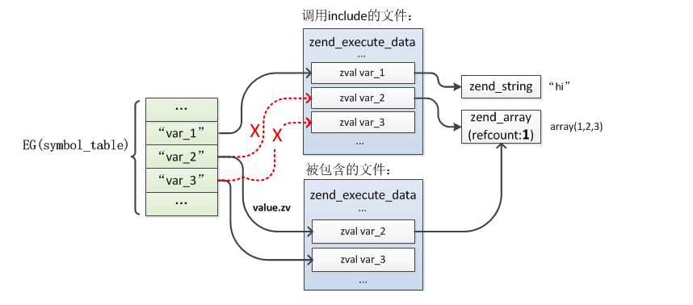
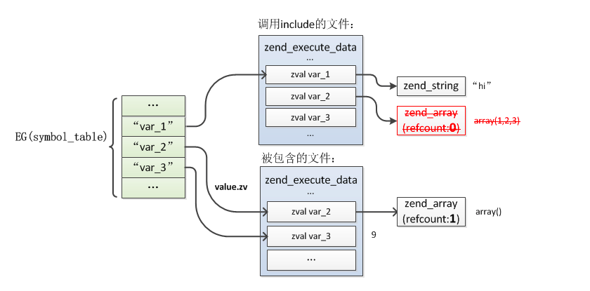
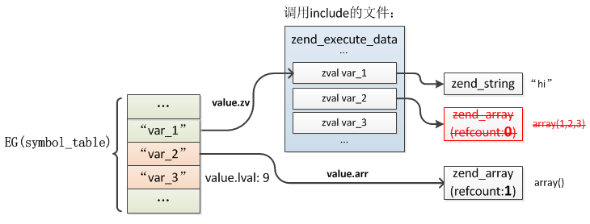
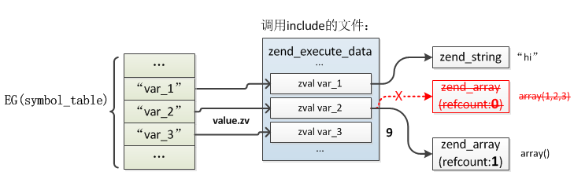

# PHP基础语法实现

**1.类型转换**

(1).转换为NULL

>这种转换比较简单，任意类型都可以转为NULL，转换时直接将新的zval类型设置为IS_NULL即可。

(2).转换为布尔型

```
static zend_always_inline int i_zend_is_true(zval *op){
    int result = 0;
again:
    switch (Z_TYPE_P(op)) {
        case IS_TRUE:
            result = 1;
            break;
        case IS_LONG: //1.非0即true
            if (Z_LVAL_P(op)) result = 1;
            break;
        case IS_DOUBLE: //2.非0.0即true
            if (Z_DVAL_P(op)) result = 1;
            break;
        case IS_STRING: //3.非空字符串及"0"外都为true
            if (Z_STRLEN_P(op) > 1 || (Z_STRLEN_P(op) && Z_STRVAL_P(op)[0] != '0')) result = 1;
            break;
        case IS_ARRAY:  //4.非空数组为true
            if (zend_hash_num_elements(Z_ARRVAL_P(op))) result = 1;
            break;
        case IS_OBJECT://5.默认情况下始终返回true
            result = zend_object_is_true(op);
            break;
        case IS_RESOURCE://6.合法资源就是true
            if (EXPECTED(Z_RES_HANDLE_P(op))) result = 1;
        case IS_REFERENCE: //7.获取被引用的实际zval重新判断
            op = Z_REFVAL_P(op);
            goto again;
            break;
        default: //8.其他都为false
            break;
    }
    return result;
}
```

(3).转换为整型

```
ZEND_API zend_long ZEND_FASTCALL _zval_get_long_func(zval *op){
try_again:
    switch (Z_TYPE_P(op)) {
        case IS_NULL:
        case IS_FALSE: //1.null，false为0
            return 0;
        case IS_TRUE: //2.true为1
            return 1;
        case IS_RESOURCE: //3.资源将转为zend_resource->handler
            return Z_RES_HANDLE_P(op);
        case IS_LONG:
            return Z_LVAL_P(op);
        case IS_DOUBLE:
            return zend_dval_to_lval(Z_DVAL_P(op));
        case IS_STRING://4.字符串的转换调用C语言的strtoll()处理
            return ZEND_STRTOL(Z_STRVAL_P(op), NULL, 10);
        case IS_ARRAY://5.根据数组是否为空转为0或1
            return zend_hash_num_elements(Z_ARRVAL_P(op)) ? 1 : 0;
        case IS_OBJECT: //6.对象默认情况就是1
            {   
                zval dst;
                convert_object_to_type(op, &dst, IS_LONG, convert_to_long);
                if (Z_TYPE(dst) == IS_LONG) {
                    return Z_LVAL(dst);
                } else {
                    return 1;
                }
            }
        case IS_REFERENCE: //7.获取被引用的实际zval重新判断
            op = Z_REFVAL_P(op);
            goto try_again;
            EMPTY_SWITCH_DEFAULT_CASE()
    }
    return 0;
}
```

(4).转换为浮点型

>除字符串类型外，其它类型转换规则与整形基本一致，就是整形转换结果加了一位小数

(5).转换为字符串

```
ZEND_API zend_string* ZEND_FASTCALL _zval_get_string_func(zval *op){
try_again:
    switch (Z_TYPE_P(op)) {
        case IS_UNDEF:
        case IS_NULL:
        case IS_FALSE://1.undef，null，false转为空字符串""
            return ZSTR_EMPTY_ALLOC();
        case IS_TRUE://2.true转为"1"
            return zend_string_init("1", 1, 0);
        case IS_RESOURCE: { //3.Resource转为"Resource id #xxx"
            len = snprintf(buf, sizeof(buf), "Resource id #" ZEND_LONG_FMT, (zend_long)Z_RES_HANDLE_P(op));
            return zend_string_init(buf, len, 0);
        }
        case IS_LONG: {
            return zend_long_to_str(Z_LVAL_P(op));
        }
        case IS_DOUBLE: {
            return zend_strpprintf(0, "%.*G", (int) EG(precision), Z_DVAL_P(op));
        }
        case IS_ARRAY://4.array转为"Array"，但是报Notice
            zend_error(E_NOTICE, "Array to string conversion");
            return zend_string_init("Array", sizeof("Array")-1, 0);
        case IS_OBJECT: {//5.对象报Error错误
            zend_error();
            return ZSTR_EMPTY_ALLOC();
        }
        case IS_REFERENCE: //6.获取被引用的实际zval重新判断
            op = Z_REFVAL_P(op);
            goto try_again;
        case IS_STRING: //7.string实现硬拷贝
            return zend_string_copy(Z_STR_P(op));
    }
    return NULL;
}
```
(6).转换为数组

>如果将一个null、integer、float、string、boolean 和 resource 类型的值转换为数组，将得到一个仅有一个元素的数组，其下标为 0，该元素即为此标量的值。如果一个 object 类型转换为 array，则结果为一个数组，数组元素为该对象的全部属性

```
实例:
class test {
	private $a = 123;
	public $b = "bbb";
	protected $c = "ccc";
}
$obj = new test;
print_r((array)$obj);
======================
Array
(
    [testa] => 123
    [b] => bbb
    [*c] => ccc
)
```

(7).转换为对象

>如果任何类型的值被转换成对象，将会创建一个内置类 stdClass 的实例：如果该值为 NULL，则新的实例为空；array转换成object将以键名成为属性名并具有相对应的值，数值索引的元素也将转为属性

(8). 转换为资源

>无法将其他类型转为资源

<br>

**2.include/require**

>include/require是在运行时加载文件并执行的，而不是在编译时期。

```
实例:
//a.php
$var_1 = "hi";
$var_2 = array(1,2,3);
include 'b.php';
var_dump($var_2);
var_dump($var_3);

//b.php
$var_2 = array();
$var_3 = 9;
```

>include的编译

```
//1.进入include文件
static ZEND_OPCODE_HANDLER_RET ZEND_FASTCALL ZEND_INCLUDE_OR_EVAL_SPEC_CONST_HANDLER(ZEND_OPCODE_HANDLER_ARGS){
    switch (opline->extended_value) {
        ...
        case ZEND_INCLUDE:
        case ZEND_REQUIRE:
            //1.编译include的文件
            new_op_array = compile_filename(opline->extended_value, inc_filename);
            break;
        ...
    }
    //2.分配运行时的zend_execute_data
    zend_execute_data *call;
    call = zend_vm_stack_push_call_frame(ZEND_CALL_NESTED_CODE,
            (zend_function*)new_op_array, 0, EX(called_scope), Z_OBJ(EX(This)));
    //3.继承调用文件的全局变量符号表
    if (EX(symbol_table)) {
        call->symbol_table = EX(symbol_table);
    } else {
        call->symbol_table = zend_rebuild_symbol_table();
    }
    //4.保存当前zend_execute_data
    call->prev_execute_data = execute_data;
    //5.执行前初始化
    i_init_code_execute_data(call, new_op_array, return_value);
    //6.执行include文件
    if (EXPECTED(zend_execute_ex == execute_ex)) {
        ZEND_VM_ENTER();
    }
}

//离开include文件
static ZEND_OPCODE_HANDLER_RET ZEND_FASTCALL zend_leave_helper_SPEC(ZEND_OPCODE_HANDLER_ARGS){
    if (EXPECTED((ZEND_CALL_KIND_EX(call_info) & ZEND_CALL_TOP) == 0)) {
        //1.将include文件中定义的变量移到EG(symbol_table)
        zend_detach_symbol_table(execute_data);
        //2.释放zend_op_array
        destroy_op_array(&EX(func)->op_array);
        //3.切回调用文件的zend_execute_data
        execute_data = EG(current_execute_data) = EX(prev_execute_data);
        //4.释放include文件的zend_execute_data
        zend_vm_stack_free_call_frame_ex(call_info, old_execute_data);
        //5.重新attach
        zend_attach_symbol_table(execute_data);
        LOAD_NEXT_OPLINE();
        ZEND_VM_LEAVE();
    }
}
```

>a.如果zend_execute_data发现本地局部变量已经在EG(symbol_table)存在，则会并将本地局部变量指向原来的变量值，并改变EG(symbol_table)指向本地局部变量



>b.如果本地局部变量的值发生改变，则释放原来的变量值的空间，新建一个新的空间



>c.被包含文件执行完后，会把被包含文件中的全局变量合移动到EG(symbol_table)中

```
//以EG(symbol_table)为标准
ZEND_API void zend_detach_symbol_table(zend_execute_data *execute_data){   
    zend_op_array *op_array = &execute_data->func->op_array;
    HashTable *ht = execute_data->symbol_table;
    if (EXPECTED(op_array->last_var)) {
        zend_string **str = op_array->vars;
        zend_string **end = str + op_array->last_var;
        zval *var = EX_VAR_NUM(0);
        do {
            //1.当EG(symbol_table)没有则删除此局部变量
            if (Z_TYPE_P(var) == IS_UNDEF) {
                zend_hash_del(ht, *str);
            } else {
            //2.当EG(symbol_table)含有，则直接添加此局部变量
                zend_hash_update(ht, *str, var);
                ZVAL_UNDEF(var);
            }
            str++;
            var++;
        } while (str != end);
    }
}
```



>d.接着是还原调用文件的zend_execute_data，切回调用文件的include位置，执行zend_attach_symbol_table()，这时就会将原调用文件的变量重新插入全局变量符号表，插入$var_2、$var_3时发现已经存在了，则将局部变量区的$var_2、$var_3的value修改为这个值

```
//以局部变量为标准
ZEND_API void zend_attach_symbol_table(zend_execute_data *execute_data){
	zend_op_array *op_array = &execute_data->func->op_array;
	HashTable *ht = execute_data->symbol_table;
	if (EXPECTED(op_array->last_var)) {
		zend_string **str = op_array->vars;
		zend_string **end = str + op_array->last_var;
		zval *var = EX_VAR_NUM(0);
		do {
			zval *zv = zend_hash_find(ht, *str);
			if (zv) {
        //1.当EG(symbol_table)含有，则直接添加指向局部变量的指针
				if (Z_TYPE_P(zv) == IS_INDIRECT) {
					zval *val = Z_INDIRECT_P(zv);
					ZVAL_COPY_VALUE(var, val);
				} else {
					ZVAL_COPY_VALUE(var, zv);
				}
			} else {
        //2.当EG(symbol_table)没有则直接添加此局部变量
				ZVAL_UNDEF(var);
				zv = zend_hash_add_new(ht, *str, var);
			}
			ZVAL_INDIRECT(zv, var);
			str++;
			var++;
		} while (str != end);
	}
}
```


