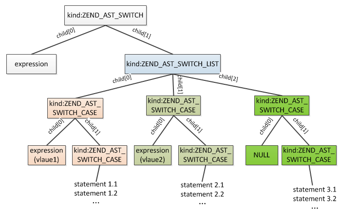
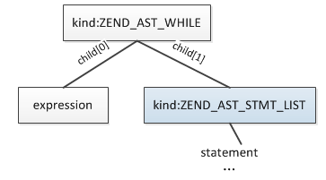
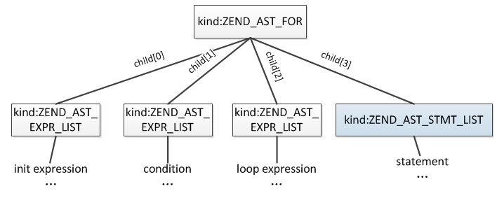

# PHP控制流程

**1.选择结构**

(1).if选择结构

```
实例:
if(Condition1){
    Statement1;
}elseif(Condition2){
    Statement2;
}else{
    Statement3;
}
```


```
void zend_compile_if(zend_ast *ast){
    zend_ast_list *list = zend_ast_get_list(ast);
    uint32_t i;
    uint32_t *jmp_opnums = NULL;
    //1.初始化所有分支的opcode总空间
    if (list->children > 1) {
        jmp_opnums = safe_emalloc(sizeof(uint32_t), list->children - 1, 0);
    }
    //2.依次编译各个分支
    for (i = 0; i < list->children; ++i) {
        zend_ast *elem_ast = list->child[i];
        zend_ast *cond_ast = elem_ast->child[0]; //condition节点
        zend_ast *stmt_ast = elem_ast->child[1]; //statement节点
        znode cond_node;
        uint32_t opnum_jmpz;
        //2.1.编译condition节点
        if (cond_ast) {
            zend_compile_expr(&cond_node, cond_ast);
            opnum_jmpz = zend_emit_cond_jump(ZEND_JMPZ, &cond_node, 0);
        }
        //2.2.编译statement节点
        zend_compile_stmt(stmt_ast);
        //2.3.在statement最后添加一条跳出整个if的opcode，最后一个分支无需这条opcode
        if (i != list->children - 1) {
            jmp_opnums[i] = zend_emit_jump(0);
        }
        //2.4.设置condition为false时跳过opcode数
        if (cond_ast) {
            zend_update_jump_target_to_next(opnum_jmpz);
        }
    }
}
```

(2).switch选择结构

```
实例:
switch(expression){
    case value1:
        statement1;
    case value2:
        statement2;
    default:
        statementn;
}
```



```
void zend_compile_switch(zend_ast *ast) {
  //1.编译expression节点
	zend_compile_expr(&expr_node, expr_ast);
  //2.初始化所有case的opcode空间
	jmpnz_opnums = safe_emalloc(sizeof(uint32_t), cases->children, 0);
  //3.依次编译各个case的value节点
	for (i = 0; i < cases->children; ++i) {
    //3.1.编译value节点
		zend_compile_expr(&cond_node, cond_ast);
    jmpnz_opnums[i] = zend_emit_cond_jump(ZEND_JMPNZ, &case_node, 0);
		}
	}
  opnum_default_jmp = zend_emit_jump(0);
  //4.依次编译各个case的statement节点
	for (i = 0; i < cases->children; ++i) {
	  //4.1.更新value为true时跳过的opcode数
    if (cond_ast) {
      //4.1.1.普通节点
			zend_update_jump_target_to_next(jmpnz_opnums[i]);
		} else {
      //4.1.2.default节点
			zend_update_jump_target_to_next(opnum_default_jmp);
		}
    //4.2.编译statement节点
		zend_compile_stmt(stmt_ast);
	}
}
```

<br>

**2.循环结构**

(1).while循环结构

```
实例:
while(expression)
{
    statement;
}
```



```
void zend_compile_while(zend_ast *ast){   
    //1.编译跳转到expression的opcode
    opnum_jmp = zend_emit_jump(0);
    //2.编译循环体statement
    zend_compile_stmt(stmt_ast);
    //3.设置(1)中opcode的跳转值
    zend_update_jump_target(opnum_jmp, opnum_cond);
    //4.编译循环条件expression
    zend_compile_expr(&cond_node, cond_ast);
    //5.expression为true时跳回循环体开始位置，否则退出
    zend_emit_cond_jump(ZEND_JMPNZ, &cond_node, opnum_start);
}
```

(2).do-while循环结构

```
实例:
do{
    statement;
}while(expression)
```


```
void zend_compile_do_while(zend_ast *ast){
    //1.编译循环体statement
    zend_compile_stmt(stmt_ast);
    //2.编译循环判断条件expression
    zend_compile_expr(&cond_node, cond_ast);
    //3.expression为true时跳回循环体开始位置，否则退出
    zend_emit_cond_jump(ZEND_JMPNZ, &cond_node, opnum_start);
}
```

(3).for循环结构

```
实例:
for (init expr; condition expr; loop expr){
    statement
}
```



```
void zend_compile_for(zend_ast *ast){
    //1.编译init expression
    zend_compile_expr_list(&result, init_ast);
    //2.编译跳转到condition的opcode
    opnum_jmp = zend_emit_jump(0);
    //3.编译循环体statement
    zend_compile_stmt(stmt_ast);
    //4.编译loop expression
    zend_compile_expr_list(&result, loop_ast);
    //5.设置(2)中opcode的跳转值
    zend_update_jump_target_to_next(opnum_jmp);
    //6.编译循环条件condition
    zend_compile_expr_list(&result, cond_ast);
    //7.condition为true时跳回循环体开始位置，否则退出
    zend_emit_cond_jump(ZEND_JMPNZ, &result, opnum_start);
}
```

(4).foreach循环结构

```
实例:
foreach (array_expression as $key => $value){
    statement
}
```


```
void zend_compile_foreach(zend_ast *ast) {
  //1.编译array_expression
	zend_compile_expr(&expr_node, expr_ast);
  //2.拷贝array_expression，当不是array或对象时编译跳出循环(含结束循环地址)
  opnum_reset = get_next_op_number(CG(active_op_array));
  opline = zend_emit_op(&reset_node, by_ref ? ZEND_FE_RESET_RW : ZEND_FE_RESET_R, &expr_node, NULL);
  //3.编译array_expression每个元素到key、value局部变量(含结束循环地址)
  opnum_fetch = get_next_op_number(CG(active_op_array));
	opline = zend_emit_op(NULL, by_ref ? ZEND_FE_FETCH_RW : ZEND_FE_FETCH_R, &reset_node, NULL);
  //4.对value进行赋值
	if (value_ast->kind == ZEND_AST_VAR &&
	    zend_try_compile_cv(&value_node, value_ast) == SUCCESS) {
		SET_NODE(opline->op2, &value_node);
	}
  //5.对key进行赋值
	if (key_ast) {
		opline = &CG(active_op_array)->opcodes[opnum_fetch];
		zend_make_tmp_result(&key_node, opline);
		zend_emit_assign_znode(key_ast, &key_node);
	}
  //6.编译循环体
	zend_compile_stmt(stmt_ast);
  //7.跳回循环体开始
	zend_emit_jump(opnum_fetch);
  //8.设置步骤(2)、(3)两条opcode跳过的opcode数
  opline = &CG(active_op_array)->opcodes[opnum_reset];
	opline->op2.opline_num = get_next_op_number(CG(active_op_array));
	opline = &CG(active_op_array)->opcodes[opnum_fetch];
	opline->extended_value = get_next_op_number(CG(active_op_array));
  //9.释放"拷贝"的数组
	zend_emit_op(NULL, ZEND_FE_FREE, &reset_node, NULL);
}
```


>当遍历一个数组时，将数组拷贝一份用于遍历(只拷贝zval，value还是指向同一份)，从arData第一个元素开始，把Bucket.value值赋值给$value，把Bucket.key赋值给$key，然后更新迭代位置，将下一个元素的位置记录在zval.u2.fe_iter_idx中，这样下一轮遍历时直接从这个位置开始，如果发现zval.u2.fe_iter_idx已经到达arData末尾了则结束遍历，销毁一开始拷贝的zval

<br>

**3.中断及跳转**

(1).break与continue

>a.循环结构:CG(context).current_brk_cont记录当前的循环

```
//循环结构
typedef struct _zend_brk_cont_element {
    int start;
    int cont; //循环判断条件的起始位置
    int brk;  //当前循环结束的位置
    int parent; //父层循环zend_brk_cont_element结构的存储位置
} zend_brk_cont_element;

//创建循环结构
zend_brk_cont_element *get_next_brk_cont_element(zend_op_array *op_array){
    op_array->last_brk_cont++;
    op_array->brk_cont_array = erealloc(op_array->brk_cont_array, sizeof(zend_brk_cont_element)*op_array->last_brk_cont);
    return &op_array->brk_cont_array[op_array->last_brk_cont-1];
}
```

>b.编译成opcodes

```
//生成初始opcode(ZEND_BRK或ZEND_CONT)
void zend_compile_break_continue(zend_ast *ast){
    ...    
    //生成opcode(ZEND_BRK:break；ZEND_CONT:continue)
    opline = zend_emit_op(NULL, ast->kind == ZEND_AST_BREAK ? ZEND_BRK : ZEND_CONT, NULL, NULL);
    opline->op1.num = CG(context).current_brk_cont; //break、continue所在循环层
    opline->op2.num = depth;  //要跳出的层数，如果break/continue没有加数字，则默认为1
}

//生成最终opcode(ZEND_JMP)
ZEND_API int pass_two(zend_op_array *op_array){
    switch (opline->opcode) {
        case ZEND_BRK:
        case ZEND_CONT:
        //计算跳转位置
        uint32_t jmp_target = zend_get_brk_cont_target(op_array, opline);
        //将opcode修改为ZEND_JMP
        opline->opcode = ZEND_JMP;
        opline->op1.opline_num = jmp_target;
        opline->op2.num = 0;
        //将绝对跳转opcode位置修改为相对当前opcode的位置
        ZEND_PASS_TWO_UPDATE_JMP_TARGET(op_array, opline, opline->op1);
        break;
       }
}
```

(2).goto

>PHP中的goto有一定限制，目标位置只能位于同一个文件和作用域，也就是说无法跳出一个函数，也无法跳入到另一个函数，可以跳出循环但无法跳入循环

```
语法结构:
goto LABEL;

LABEL:
    statement;
```

>a.lable结构:CG(context).labels记录所有的label

```
typedef struct _zend_label {
    int brk_cont; //当前label所在循环
    uint32_t opline_num; //下一条opcode位置
} zend_label;
```

>b.编译label

```
//编译label
void zend_compile_label(zend_ast *ast){           
    //1.编译时会将label插入CG(context).labels哈希表
    if (!CG(context).labels) {
        ALLOC_HASHTABLE(CG(context).labels);
        zend_hash_init(CG(context).labels, 8, NULL, label_ptr_dtor, 0);
    }       
    //2.设置label信息：当前所在循环、下一条opcode编号
    dest.brk_cont = CG(context).current_brk_cont;
    dest.opline_num = get_next_op_number(CG(active_op_array));
}
```

>c.编译goto

```
//编译初始opcode(GOTO)
void zend_compile_goto(zend_ast *ast){
    //编译一条临时opcode：ZEND_GOTO
    opline = zend_emit_op(NULL, ZEND_GOTO, NULL, &label_node);
    //op1保存需要跳跃的opcode数
    opline->op1.num = get_next_op_number(CG(active_op_array)) - opnum_start - 1;
    //extended_value保存当前循环
    opline->extended_value = CG(context).current_brk_cont;
}

//编译最终opcode(ZEND_JMP)
pass_two();
```
