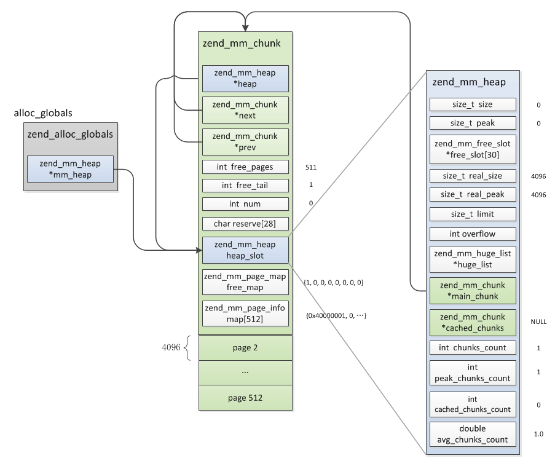
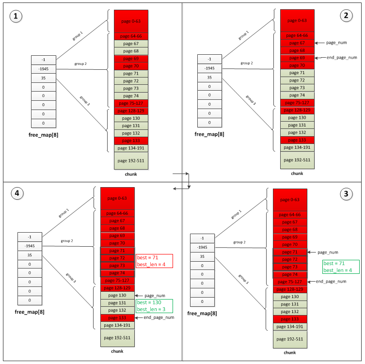
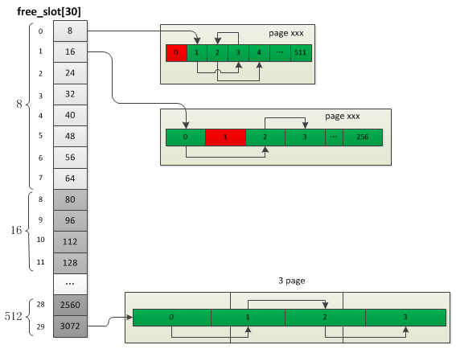

# 内存管理

**1.zend内存池**

>内存池是内核中最底层的内存操作，zend定义了三种粒度的内存块：chunk、page、slot，每个chunk的大小为2M，page大小为4K，一个chunk被切割为512个page，而一个或若干个page被切割为多个slot，所以申请内存时按照不同的申请大小决定具体的分配策略：

```
Huge(chunk): 申请内存大于2M，直接调用系统分配，分配若干个chunk
Large(page): 申请内存大于3092B(3/4 page_size)，小于2044K(511 page_size)，分配若干个page
Small(slot): 申请内存小于等于3092B(3/4 page_size)，分配若干个slot
```

<br>

**2.基本数据结构**


```
typedef uint32_t   zend_mm_page_info;

typedef struct  _zend_mm_chunk     zend_mm_chunk;
struct _zend_mm_chunk {
    zend_mm_heap      *heap; //指向zend_mm_heap
    zend_mm_chunk     *next; //指向下一个chunk
    zend_mm_chunk     *prev; //指向上一个chunk
    int                free_pages; //当前chunk的剩余page数
    zend_mm_heap       heap_slot; //heap结构，只有主chunk会用到
    int num; //chunk号
    int free_tail; //最后一个空闲的page位置
    //标识各page是否已分配的bitmap数组，总大小512bit，对应page总数，每个page占一个bit位
    zend_mm_page_map   free_map;
    zend_mm_page_info  map[ZEND_MM_PAGES]; //各page的信息,ZEND_MM_PAGES等于512
    ...
};

typedef struct _zend_mm_heap zend_mm_heap;
struct _zend_mm_heap {
    //slot内存分配的可用位置链表，ZEND_MM_BINS等于30，即此数组表示的是各种大小内存对应的链表头部
    zend_mm_free_slot *free_slot[ZEND_MM_BINS];
    zend_mm_huge_list *huge_list;      //huge内存链表
    int                chunks_count;   //已分配chunk数
    zend_mm_chunk    *main_chunk;     //指向chunk链表头部
    int              cached_chunks_count; //缓存的chunk数     
    zend_mm_chunk    *cached_chunks;  //缓存的chunk链表，用于存放删除的chunk
    ...
}

typedef struct  _zend_mm_free_slot zend_mm_free_slot;
struct _zend_mm_free_slot {
    zend_mm_free_slot *next_free_slot; //下一个slot
};

typedef struct  _zend_mm_huge_list zend_mm_huge_list;
struct _zend_mm_huge_list {
	void              *ptr; //指向新的chunk
	size_t             size; //chunk的大小
	zend_mm_huge_list *next;//下一个zend_mm_huge_list
};
```

>chunk由512个page组成，其中第一个page用于保存chunk结构，剩下的511个page用于内存分配，page主要用于Large、Small两种内存的分配；heap是表示内存池的一个结构，它是最主要的一个结构，用于管理上面三种内存的分配，Zend中只有一个heap结构。但在多线程模式下(ZTS)会有多个heap，也就是说每个线程都有一个独立的内存池

<br>

**3.内存池初始化**

>start_memory_manager->alloc_globals_ctor->zend_mm_init

```
typedef struct _zend_alloc_globals {
	zend_mm_heap *mm_heap;
} zend_alloc_globals;
#define AG(v) (alloc_globals.v)

static zend_mm_heap *zend_mm_init(void){
    //向系统申请2M大小的chunk
    zend_mm_chunk *chunk = (zend_mm_chunk*)zend_mm_chunk_alloc_int(ZEND_MM_CHUNK_SIZE, ZEND_MM_CHUNK_SIZE);
    zend_mm_heap *heap;
    //heap结构实际是主chunk嵌入的一个结构，后面再分配chunk的heap_slot不再使用
    heap = &chunk->heap_slot;
    chunk->heap = heap;
    chunk->next = chunk;
    chunk->prev = chunk;
    chunk->num = 0;
    chunk->free_tail=1;
    //剩余可用page数
    chunk->free_pages = ZEND_MM_PAGES - ZEND_MM_FIRST_PAGE;
    //将第一个page的bit分配标识位设置为1
    chunk->free_map[0] = (Z_L(1) << ZEND_MM_FIRST_PAGE) - 1;
    //第一个page的类型为ZEND_MM_IS_LRUN，即large内存
    chunk->map[0] = ZEND_MM_LRUN(ZEND_MM_FIRST_PAGE);
    heap->cached_chunks_count = 0; //缓存chunk数目
    heap->cached_chunks = NULL; //缓存chunk链表
    heap->chunks_count = 1; //已分配chunk数
    heap->main_chunk = chunk; //指向主chunk
    heap->huge_list = NULL; //huge内存链表
    ...
    return heap;
}
```

>AG(alloc_globals)是一个全局变量，它只有一个成员:zend_mm_heap，保存着整个内存池的信息，所有内存的分配都是基于这个值



<br>

**4.内存分配**

(1)Huge分配

```
static void *zend_mm_alloc_huge(zend_mm_heap *heap, size_t size ZEND_FILE_LINE_DC ZEND_FILE_LINE_ORIG_DC){
    //1.按页大小重置实际要分配的内存
    size_t new_size = ZEND_MM_ALIGNED_SIZE_EX(size, REAL_PAGE_SIZE);
    //2.分配chunk
    ptr = zend_mm_chunk_alloc(heap, new_size, ZEND_MM_CHUNK_SIZE);
    if (UNEXPECTED(ptr == NULL)) {
        //2.1申请失败后，清理内存后再尝试分配一次
        if (zend_mm_gc(heap) &&
            (ptr = zend_mm_chunk_alloc(heap, new_size, ZEND_MM_CHUNK_SIZE)) != NULL) {
            //2.1.1申请成功，返回ptr
        } else {
            //2.1.2申请失败，报错
            zend_mm_safe_error(heap, "Out of memory");
            return NULL;
        }
    }
    //3.将申请的内存通过zend_mm_huge_list插入到链表中
    zend_mm_add_huge_block(heap, ptr, new_size, ...);
    return ptr;
}
```

>字节对齐(zend_mm_chunk_alloc->zend_mm_chunk_alloc_int)

```
#define ZEND_MM_ALIGNED_OFFSET(size, alignment) \
    (((size_t)(size)) & ((alignment) - 1))

//size为申请内存的大小，alignment为内存对齐值，一般为ZEND_MM_CHUNK_SIZE(2M)
static void *zend_mm_chunk_alloc_int(size_t size, size_t alignment){
    //1.向系统申请size大小的内存
    void *ptr = zend_mm_mmap(size);
    if (ptr == NULL) {
        return NULL;
    } else if (ZEND_MM_ALIGNED_OFFSET(ptr, alignment) == 0) {
      //2.1.申请的内存为alignment的整数倍，直接返回
        return ptr;
    }else{
      //2.2.申请的内存不为alignment的整数倍
        size_t offset;
      //2.2.1.将申请的内存释放掉重新申请
        zend_mm_munmap(ptr, size);
      //2.2.2.重新申请一块内存，这里会多申请一块内存，用于截取到alignment的整数倍
        ptr = zend_mm_mmap(size + alignment);
      //2.2.3.offset为ptr距离上一个alignment对齐内存位置的大小
        offset = ZEND_MM_ALIGNED_OFFSET(ptr, alignment);
        if (offset != 0) {
            offset = alignment - offset;
            zend_mm_munmap(ptr, offset);
            //2.2.4.偏移ptr，对齐到alignment
            ptr = (char*)ptr + offset;
            alignment -= offset;
        }
        //2.2.4.返回ptr
        return ptr;
    }
}
```

>chunk的分配也是large、small内存分配的基础，是ZendMM向系统申请内存的唯一粒度。在申请chunk内存时有一个关键操作，那就是将内存地址对齐到ZEND_MM_CHUNK_SIZE，也就是说申请的chunk地址都是ZEND_MM_CHUNK_SIZE的整数倍

(2).Large分配

```
static zend_always_inline void *zend_mm_alloc_large(zend_mm_heap *heap, size_t size ZEND_FILE_LINE_DC ZEND_FILE_LINE_ORIG_DC){
    //1.根据size大小计算需要分配多少个page
    int pages_count = (int)ZEND_MM_SIZE_TO_NUM(size, ZEND_MM_PAGE_SIZE);
    //2.分配pages_count个page
    void *ptr = zend_mm_alloc_pages(heap, pages_count, ...);
    ...
    return ptr;
}
```

>寻找最优page

```
static void *zend_mm_alloc_pages(zend_mm_heap *heap, int pages_count ZEND_FILE_LINE_DC ZEND_FILE_LINE_ORIG_DC){
    zend_mm_chunk *chunk = heap->main_chunk;
    int page_num, len;
    while (1) {
        if (UNEXPECTED(chunk->free_pages < pages_count)) {
          //1.1当前chunk剩余page总数已不够
            goto not_found;
        }else{
          //1.2当前chunk剩余page总数已够
            int best = -1; //最优page起始页
            int best_len = ZEND_MM_PAGES; //最优page个数
            int free_tail = chunk->free_tail; //指向最后一个空闲的num
            zend_mm_bitset *bitset = chunk->free_map;
            zend_mm_bitset tmp = *(bitset++);
            int i = 0;
            //下面就是查找最优page的过程
        }
not_found:
        if (chunk->next == heap->main_chunk) {
        //1.1.1已到最后一个chunk
get_chunk:
          //分配一个chunk
        }else{
        //1.1.2不是最后一个chunk
          chunk = chunk->next;
        }
   }

found:
    //2.找到可用连续的page，减去对应chunk的free_page
    chunk->free_pages -= pages_count;
    //3.将连续的page的bit标识位设置为已分配
    zend_mm_bitset_set_range(chunk->free_map, page_num, pages_count);
    //4.设置page属性值
    chunk->map[page_num] = ZEND_MM_LRUN(pages_count);
    //5.改变free_tail值
    if (page_num == chunk->free_tail) {
        chunk->free_tail = page_num + pages_count;
    }
    return ZEND_MM_PAGE_ADDR(chunk, page_num);
}
```



```
a.首先会直接跳过group1，直接到group2检索
b.在group2中找到第一个可用page位置：67，然后向下找第一个不可用page位置：69，找到的可用内存块长度为2，小于3，表示此内存块不
可用
c.接着再次在group2中查找到第一个可用page位置：71,然后向下找到第一个不可用page位置：75,内存块长度为4，大于3，表示找到一个符
合的位置，虽然已经找到可用内存块但并不"完美"，先将这个并不完美的page_num及len保存到best、best_len，如果后面没有比它更完美
的就用它了
d.再次检索，发现group2已无可用page，进入group3，找到可用内存位置：page 130-132，大小比c中找到的合适，所以最终返回的page就
是130-132
e.page分配完成后会将free_map对应整数的bit位从page_num至(page_num+page_count)置为1
```

(3).Small分配

>small内存总共有30种固定大小的规格，最小的slot大小为8byte，前8个slot依次递增8byte，后面每隔4个递增值乘以2，即slot0-7递增8byte、8-11递增16byte、12-15递增32byte、16-19递增32byte、20-23递增128byte、24-27递增256byte、28-29递增512byte，每种大小的slot占用的page数分别是：slot 0-15各占1个page、slot 16-29依次占5, 3, 1, 1, 5, 3, 2, 2, 5, 3, 7, 4, 5, 3个page



```
step1: 首先根据申请内存的大小在heap->free_slot中找到对应的slot规格bin_num，如果当前slot为空则首先分配对
应的page，free_slot[bin_num]始终指向第一个可用的slot
step2: 如果申请内存大小对应的的slot链表不为空则直接返回free_slot[bin_num]，然后将free_slot[bin_num]指向
下一个空闲位置
step3: 释放内存时先将此内存的next_free_slot指向free_slot[bin_num]，然后将free_slot[bin_num]指向释放的内存，
也就是将释放的内存插到链表头部
```

<br>

**5.系统内存分配**

```
static void *zend_mm_mmap(size_t size){
//1.hugepage模式（增大默认虚拟内存页大小）
#ifdef MAP_HUGETLB
        if (zend_mm_use_huge_pages && size == ZEND_MM_CHUNK_SIZE) {
            ptr = mmap(NULL, size, PROT_READ | PROT_WRITE, MAP_PRIVATE | MAP_ANON | MAP_HUGETLB, -1, 0);
            if (ptr != MAP_FAILED) {
                return ptr;
            }
        }
#endif
//2.普通模式
    ptr = mmap(NULL, size, PROT_READ | PROT_WRITE, MAP_PRIVATE | MAP_ANON, -1, 0);
    if (ptr == MAP_FAILED) {
#if ZEND_MM_ERROR
        fprintf(stderr, "\nmmap() failed: [%d] %s\n", errno, strerror(errno));
#endif  
        return NULL;
    }
    return ptr;
}
```

<br>

**6.内存释放**

```
#define efree(ptr)                          _efree((ptr) ZEND_FILE_LINE_CC ZEND_FILE_LINE_EMPTY_CC)
#define efree_large(ptr)                    _efree_large((ptr) ZEND_FILE_LINE_CC ZEND_FILE_LINE_EMPTY_CC)
#define efree_huge(ptr)                     _efree_huge((ptr) ZEND_FILE_LINE_CC ZEND_FILE_LINE_EMPTY_CC)

ZEND_API void ZEND_FASTCALL _efree(void *ptr ZEND_FILE_LINE_DC ZEND_FILE_LINE_ORIG_DC){
    zend_mm_free_heap(AG(mm_heap), ptr ZEND_FILE_LINE_RELAY_CC ZEND_FILE_LINE_ORIG_RELAY_CC);
}

static zend_always_inline void zend_mm_free_heap(zend_mm_heap *heap, void *ptr ZEND_FILE_LINE_DC ZEND_FILE_LINE_ORIG_DC){
    //1.offset就是ptr距离当前chunk起始位置的偏移量(huge=0；slot与page>0)
    size_t page_offset = ZEND_MM_ALIGNED_OFFSET(ptr, ZEND_MM_CHUNK_SIZE);
    if (UNEXPECTED(page_offset == 0)) {
    //2.1.释放huge内存
        if (ptr != NULL) {
            zend_mm_free_huge(heap, ptr ZEND_FILE_LINE_RELAY_CC ZEND_FILE_LINE_ORIG_RELAY_CC);
        }
    } else {
    //2.2.释放page或slot内存
        //2.2.1.根据ptr获取chunk的起始位置
        zend_mm_chunk *chunk = (zend_mm_chunk*)ZEND_MM_ALIGNED_BASE(ptr, ZEND_MM_CHUNK_SIZE);
        int page_num = (int)(page_offset / ZEND_MM_PAGE_SIZE);
        zend_mm_page_info info = chunk->map[page_num];
        ZEND_MM_CHECK(chunk->heap == heap, "zend_mm_heap corrupted");
        if (EXPECTED(info & ZEND_MM_IS_SRUN)) {
            //2.2.1.slot的释放
            zend_mm_free_small(heap, ptr, ZEND_MM_SRUN_BIN_NUM(info));
        } else {
            //2.2.2.page的释放
            int pages_count = ZEND_MM_LRUN_PAGES(info);
            ZEND_MM_CHECK(ZEND_MM_ALIGNED_OFFSET(page_offset, ZEND_MM_PAGE_SIZE) == 0, "zend_mm_heap corrupted");
            zend_mm_free_large(heap, chunk, page_num, pages_count);
        }
    }
}
```

>释放chunk时，内存池会维持一定的chunk数，每次释放并不会直接销毁而是加入到cached_chunks中，这样下次申请chunk时直接就用了，同时为了防止占用过多内存，cached_chunks会根据每次request请求计算的chunk使用均值保证其维持在一定范围内。

<br>

**7.垃圾回收**

>如果当变量的refcount减少后大于0，PHP并不会立即进行对这个变量进行垃圾鉴定，而是放入一个缓冲buffer中，等这个buffer满了以后(10000个值)再统一进行处理，加入buffer的是指向变量zend_value的zend_refcounted_h的指针

```
typedef struct _zend_refcounted_h {
    uint32_t         refcount; //记录zend_value的引用数
    union {
        struct {
            zend_uchar    type,  //与zval.u1.type一致
            zend_uchar    flags,
            uint16_t      gc_info //GC信息(GC_PURPLE等)
        } v;
        uint32_t type_info;
    } u;
} zend_refcounted_h;

#define GC_BLACK  0x0000 //普通变量
#define GC_WHITE  0x8000 //垃圾变量
#define GC_GREY   0x4000 //判断中
#define GC_PURPLE 0xc000 //已加入buffer队列
```

>垃圾回收内部结构

```
#define GC_G(v) (gc_globals.v)

typedef struct _zend_gc_globals {
    zend_bool         gc_enabled; //是否启用gc
    zend_bool         gc_active;  //是否在垃圾检查过程中
    zend_bool         gc_full;    //缓存区是否已满
    gc_root_buffer   *buf;   //启动时分配的用于保存可能垃圾的缓存区
    gc_root_buffer    roots; //指向buf中最新加入的一个可能垃圾
    gc_root_buffer   *unused;//指向buf中没有使用的buffer，首先分配
    gc_root_buffer   *first_unused; //指向buf中第一个没有使用的buffer，其次分配
    gc_root_buffer   *last_unused; //指向buf尾部
    gc_root_buffer    to_free;  //待释放的垃圾
    gc_root_buffer   *next_to_free;
    uint32_t gc_runs;   //统计gc运行次数
    uint32_t collected; //统计已回收的垃圾数
} zend_gc_globals;

typedef struct _gc_root_buffer {
    zend_refcounted          *ref; //指向每个zend_value的gc信息
    struct _gc_root_buffer   *next; //下一个垃圾
    struct _gc_root_buffer   *prev; //上一个垃圾
    uint32_t                 refcount;
} gc_root_buffer;
```

>1.GC初始化

```
ZEND_API void gc_init(void){
    if (GC_G(buf) == NULL && GC_G(gc_enabled)) {
        //1.分配buf缓存区内存，大小为GC_ROOT_BUFFER_MAX_ENTRIES(10001)
        GC_G(buf) = (gc_root_buffer*) malloc(sizeof(gc_root_buffer) * GC_ROOT_BUFFER_MAX_ENTRIES);
        GC_G(last_unused) = &GC_G(buf)[GC_ROOT_BUFFER_MAX_ENTRIES];
        //2.进行GC_G的初始化，GC_G(first_unused) = GC_G(buf) + 1;从第2个开始的，第1个保留
        gc_reset();
    }
}
```

>2.垃圾加入buffer

```
ZEND_API void ZEND_FASTCALL gc_possible_root(zend_refcounted *ref){
    gc_root_buffer *newRoot;
    //1.插入的节点必须是GC_BLACK，防止重复插入
    ZEND_ASSERT(EXPECTED(GC_REF_GET_COLOR(ref) == GC_BLACK));
    //2.先看下unused中有没有可用的
    newRoot = GC_G(unused);
    if (newRoot) {
        //2.1.有的话先用unused的，然后将GC_G(unused)指向单链表的下一个
        GC_G(unused) = newRoot->prev;
    } else if (GC_G(first_unused) != GC_G(last_unused)) {
        //2.2.unused没有可用的，且buf中还有可用的
        newRoot = GC_G(first_unused);
        GC_G(first_unused)++;
    } else {
        //2.3.buf缓存区已满，触发垃圾回收的动作
        if (!GC_G(gc_enabled)) {
            return;
        }
        ...
        //启动垃圾回收过程
        gc_collect_cycles();
        ...
    }

    //3.将插入的ref标为紫色，防止重复插入
    GC_TRACE_SET_COLOR(ref, GC_PURPLE);
    GC_INFO(ref) = (newRoot - GC_G(buf)) | GC_PURPLE;
    newRoot->ref = ref;
    //4.GC_G(roots).next指向新插入的元素
    newRoot->next = GC_G(roots).next;
    newRoot->prev = &GC_G(roots);
    GC_G(roots).next->prev = newRoot;
    GC_G(roots).next = newRoot;
}
```

>3.垃圾回收

```
ZEND_API int zend_gc_collect_cycles(void){
    ...
    //1.遍历roots链表，对当前节点value的所有成员进行深度优先遍历把成员refcount减1
    gc_mark_roots();
    //2.再次遍历roots链表，检查各节点当前refcount是否为0，是的话标为白色，表示是垃圾，不是的话需要对还原(1)，把refcount再加回去
    gc_scan_roots();
    //3.将roots链表中的非白色节点删除，之后roots链表中全部是真正的垃圾，将垃圾链表转到to_free等待释放
    count = gc_collect_roots(&gc_flags, &additional_buffer);
    ...
    //4.释放垃圾
    current = to_free.next;
    while (current != &to_free) {
        p = current->ref;
        GC_G(next_to_free) = current->next;
        if ((GC_TYPE(p) & GC_TYPE_MASK) == IS_OBJECT) {
            //4.1.释放对象
            obj->handlers->free_obj(obj);
        } else if ((GC_TYPE(p) & GC_TYPE_MASK) == IS_ARRAY) {
            //4.2.释放数组
            zend_array *arr = (zend_array*)p;
            GC_TYPE(arr) = IS_NULL;
            zend_hash_destroy(arr);
        }
        current = GC_G(next_to_free);
    }
    ...
}
```
