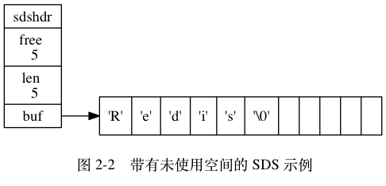
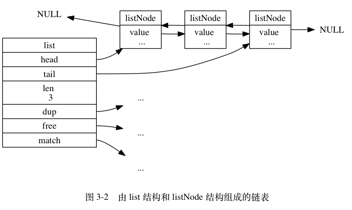
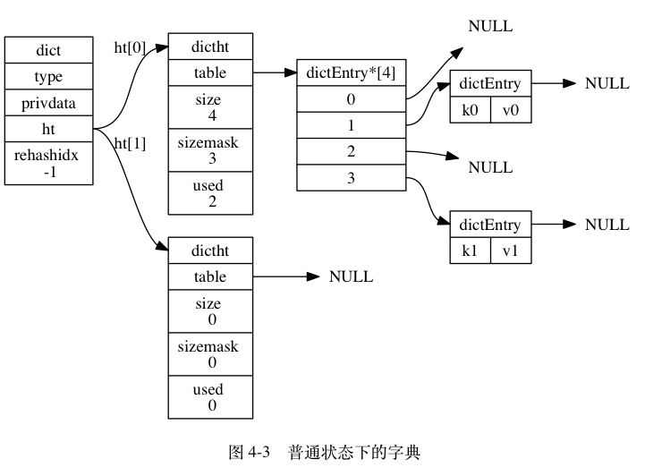
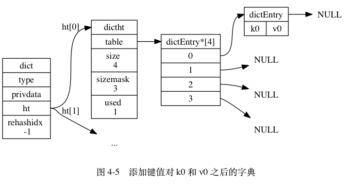
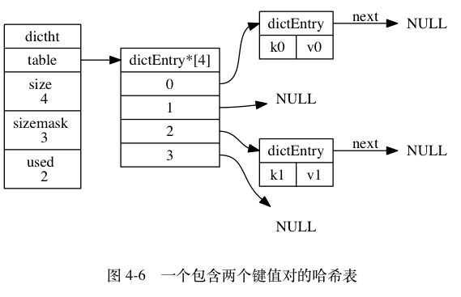
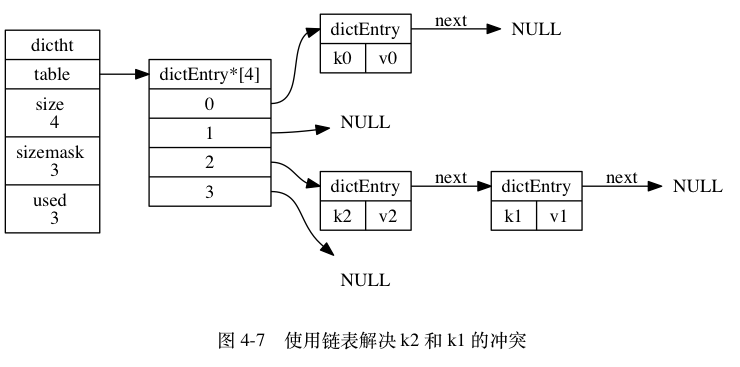
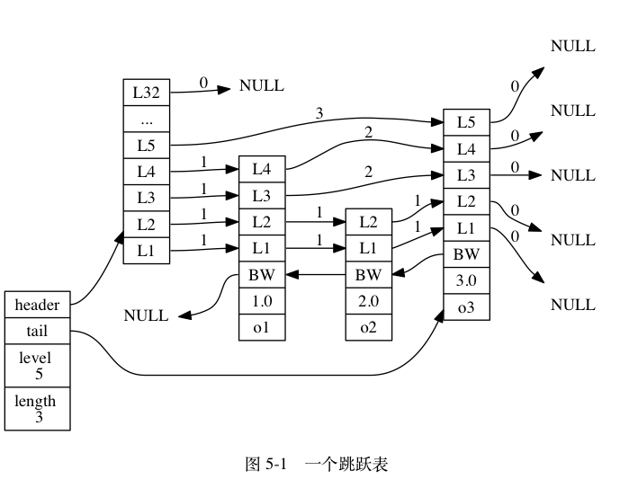
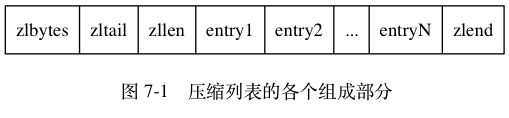
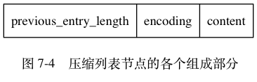
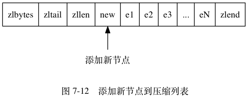

# 数据结构

**一.简单动态字符串**

>Redis没有直接使用C语言传统的字符串表示（以空字符结尾的字符数组）， 而是自己构建了一种名为简单动态字符串（simple dynamic string，SDS）的抽象类型， 并将 SDS 用作 Redis 的默认字符串表示。

```
struct sdshdr {
    int len;   //记录buf数组中已使用字节的数量
    int free;  //记录buf数组中未使用字节的数量
    char buf[];  //字节数组，用于保存字符串
};
```



```
a.free属性的值为5,表示这个SDS有5个未使用空间。

b.len属性的值为5,表示这个 SDS 保存了一个五字节长的字符串。

c.buf属性是一个char类型的数组， 数组的前五个字节分别保存了 'R' 、 'e' 、 'd' 、 'i' 、 's' 五个字符，而
最后一个字节则保存了空字符 '\0' 。使得SDS可以直接重用一部分C字符串函数库里面的函数。
```

(1).SDS的空间分配策略

>空间预分配：空间预分配用于优化SDS的字符串增长操作：当SDS的API对一个SDS进行修改，并且需要对SDS进行空间扩展的时候，程序不仅会为SDS分配修改所必须要的空间，还会为 SDS 分配额外的未使用空间。

```
a.如果对SDS进行修改之后，SDS的长度（也即是 len 属性的值）将小于1MB，那么程序分配和len属性同样大小的未使
用空间，这时 SDS len 属性的值将和 free 属性的值相同。

b.如果对SDS进行修改之后，SDS的长度将大于等于1MB， 那么程序会分配1 MB的未使用空间。
```

>惰性空间释放：惰性空间释放用于优化SDS的字符串缩短操作：当SDS的API需要缩短SDS保存的字符串时，程序并不立即使用内存重分配来回收缩短后多出来的字节，而是使用free属性将这些字节的数量记录起来，并等待将来使用。

(2).二进制安全

>因为在C中，除了字符串的末尾之外，字符串里面不能包含空字符，否则最先被程序读入的空字符将被误认为是字符串结尾，这些限制使得C字符串只能保存文本数据， 而不能保存二进制数据。而所有SDS API 都会以处理二进制的方式来处理SDS存放在buf数组里的数据，程序不会对其中的数据做任何限制、过滤。这也是我们将SDS的buf属性称为字节数组的原因（Redis 不是用这个数组来保存字符， 而是用它来保存一系列二进制数据）。

<br>

**二.链表**

>Redis中的每个链表使用一个list结构来表示，这个结构带有表头节点指针、表尾节点指针、以及链表长度等信息。每个链表节点由一个listNode结构来表示，每个节点都有一个指向前置节点和后置节点的指针，所以Redis的链表实现是双端链表。

```
//链表
typedef struct list {
    listNode *head; // 表头节点
    listNode *tail; // 表尾节点
    unsigned long len; // 链表所包含的节点数量
    void *(*dup)(void *ptr);  // 节点复制函数
    void (*free)(void *ptr); // 节点释放函数
    int (*match)(void *ptr, void *key);// 节点对比函数
} list;


//链表节点
typedef struct listNode {
    struct listNode *prev;// 前置节点
    struct listNode *next; // 后置节点
    void *value;// 节点的值
} listNode;
```



<br>

**三.字典**

>字典，又称符号表（symbol table）， 是一种用于保存键值对（key-value pair）的抽象数据结构。字典中的每个键都是独一无二的，程序可以在字典中根据键查找与之关联的值，或者通过键来更新值，又或者根据键来删除整个键值对，等等。

```
//字典
typedef struct dict {
    dictType *type;// 指定特定类型函数
    void *privdata;// 保存了需要传给那些特定类型函数的可选参数
    dictht ht[2]; // 哈希表,一般情况下,字典只使用ht[0]哈希表,ht[1]哈希表只会在对ht[0]哈希表进行rehash时使用。
    int rehashidx;//它记录了rehash目前的进度，当rehash不在进行时，值为 -1
} dict;


//哈希表
typedef struct dictht {
    dictEntry **table; // 哈希表数组
    unsigned long size; // 哈希表大小
    unsigned long sizemask;// 哈希表大小掩码，用于计算索引值，总是等于 size - 1
    unsigned long used; // 该哈希表已有节点的数量
} dictht;


//哈希节点
typedef struct dictEntry {
    void *key;// 键
    union {
        void *val;
        uint64_t u64;
        int64_t s64;
    } v;   // 值
    struct dictEntry *next;// 用于解决冲突
} dictEntry;


//类型函数
typedef struct dictType {
    unsigned int (*hashFunction)(const void *key);// 计算哈希值的函数
    void *(*keyDup)(void *privdata, const void *key);// 复制键的函数
    void *(*valDup)(void *privdata, const void *obj); // 复制值的函数
    int (*keyCompare)(void *privdata, const void *key1, const void *key2);// 对比键的函数
    void (*keyDestructor)(void *privdata, void *key);// 销毁键的函数
    void (*valDestructor)(void *privdata, void *obj);// 销毁值的函数
} dictType;
```



(1).哈希算法

```
#使用字典设置的哈希函数，计算键 key 的哈希值
hash = dict->type->hashFunction(key);

#使用哈希表的sizemask属性和哈希值，计算出索引值
index = hash & dict->ht[x].sizemask;

#根据索引值，将包含新键值对的哈希表节点放到哈希表数组的指定索引上面
```



```
#计算键 k0 的哈希值
hash = dict->type->hashFunction(k0);

#假设计算得出的哈希值为8 ，计算出索引值
index = hash & dict->ht[0].sizemask = 8 & 3 = 0;
```

(2).解决键冲突

>Redis的哈希表使用链地址法（separate chaining）来解决键冲突：每个哈希表节点都有一个next指针，多个哈希表节点可以用next指针构成一个单向链表，被分配到同一个索引上的多个节点可以用这个单向链表连接起来,因为 dictEntry节点组成的链表没有指向链表表尾的指针，所以为了速度考虑，程序总是将新节点添加到链表的表头位置（复杂度为 O(1)），排在其他已有节点的前面。





(3).rehash

>随着操作的不断执行，哈希表保存的键值对会逐渐地增多或者减少，为了让哈希表的负载因子（load factor）维持在一个合理的范围之内，当哈希表保存的键值对数量太多或者太少时，程序需要对哈希表的大小进行相应的扩展或者收缩。这个过程叫做rehash

```
步骤:

a.为字典的ht[1]哈希表分配空间,这个哈希表的空间大小取决于要执行的操作，以及ht[0]当前包含的键值对数量(也即
是ht[0].used 属性的值)：
    如果执行的是扩展操作，那么 ht[1] 的大小为第一个大于等于 ht[0].used * 2 的 2^n；
    如果执行的是收缩操作，那么 ht[1] 的大小为第一个大于等于 ht[0].used 的 2^n 。

b.将保存在ht[0]中的所有键值对rehash到ht[1]上面：rehash 指的是重新计算键的哈希值和索引值，然后将键值对放
置到ht[1]哈希表的指定位置上。

c.当ht[0]包含的所有键值对都迁移到了ht[1]之后（ht[0] 变为空表），释放 ht[0] ，将ht[1]设置为ht[0] ，并在 
ht[1]新创建一个空白哈希表，为下一次rehash做准备。
```

```
哈希表的扩展发生时机:
a.服务器目前没有在执行 BGSAVE 命令或者 BGREWRITEAOF 命令， 并且哈希表的负载因子大于等于 1 ；
b.服务器目前正在执行 BGSAVE 命令或者 BGREWRITEAOF 命令， 并且哈希表的负载因子大于等于 5 ；

哈希表的收缩发生时机:
a.当哈希表的负载因子小于 0.1 时， 程序自动开始对哈希表执行收缩操作。


#负载因子 = 哈希表已保存节点数量 / 哈希表大小
load_factor = ht[0].used / ht[0].size
```

(4).渐进式 rehash

>为了避免rehash对服务器性能造成影响，服务器不是一次性将ht[0]里面的所有键值对全部rehash到ht[1] ，而是分多次、渐进式地将ht[0]里面的键值对慢慢地rehash到ht[1] 。

```
步骤:

a.为 ht[1] 分配空间，让字典同时持有ht[0]和ht[1]两个哈希表。

b.在字典中维持一个索引计数器变量rehashidx,并将它的值设置为 0 ，表示rehash工作正式开始。

c.在rehash进行期间，程序除了执行指定的操作以外，还会顺带将ht[0]哈希表在rehashidx索引上的所有键值对rehash
到ht[1]，当rehash工作完成之后，程序将rehashidx属性的值增一。

d.随着字典操作的不断执行，最终在某个时间点上，ht[0]的所有键值对都会被rehash至ht[1]，这时程序将rehashidx 
属性的值设为 -1 ，表示 rehash 操作已完成。
```

```
渐进式rehash执行期间的哈希表操作:

a.在进行渐进式rehash的过程中，字典会同时使用ht[0]和ht[1]两个哈希表，所以在渐进式rehash进行期间，字典的删
除（delete）、查找（find）、更新（update）等操作会在两个哈希表上进行，程序会先在ht[0]里面进行查找，如果
没找到的话，就会继续到ht[1]里面进行查找。

b.在渐进式rehash执行期间，新添加到字典的键值对一律会被保存到ht[1]里面，而 ht[0] 则不再进行任何添加操作,
这一措施保证了 ht[0] 包含的键值对数量会只减不增， 并随着 rehash 操作的执行而最终变成空表。
```

<br>

**四.跳跃表**

>跳跃表（skiplist）是一种有序数据结构，它通过在每个节点中维持多个指向其他节点的指针，从而达到快速访问节点的目的。

```
//跳跃表
typedef struct zskiplist {
    struct zskiplistNode *header, *tail; // 表头节点和表尾节点
    unsigned long length; // 表中节点的数量(表头节点不计算在内)
    int level;// 表中层数最大的节点的层数(表头节点的层数不计算在内)
} zskiplist;


//跳跃表节点
typedef struct zskiplistNode {
    struct zskiplistNode *backward; // 后退指针
    double score;  // 节点的分值,跳跃表中的所有节点都按分值从小到大来排序
    robj *obj; // 所保存的成员对象,每个节点的成员对象必须是唯一的
    struct zskiplistLevel {
        struct zskiplistNode *forward;// 前进指针
       unsigned int span; //跨度,记录了前进指针所指向节点和当前节点的距离
    } level[];// 层
} zskiplistNode;
```



>注意表头节点和其他节点的构造是一样的：表头节点也有后退指针、分值和成员对象，不过表头节点的这些属性都不会被用到，所以图中省略了这些部分， 只显示了表头节点的各个层。


>每次创建一个新跳跃表节点的时候， 程序都根据幂次定律 （power law，越大的数出现的概率越小） 随机生成一个介于 1 和 32 之间的值作为 level 数组的大小， 这个大小就是层的“高度”。 一般来说，层的数量越多，访问其他节点的速度就越快

<br>

**五.整数集合**

>整数集合（intset）是Redis 用于保存整数值的集合抽象数据结构，它可以保存类型为int16_t 、int32_t 或者 int64_t的整数值，并且保证集合中不会出现重复元素。

```
typedef struct intset {
    uint32_t encoding;  // 编码方式
    uint32_t length;// 集合包含的元素数量
    int8_t contents[]; // 保存元素的数组,各个项从小到大有序地排列， 并且不包含任何重复项。
} intset;
```

```
编码方式:

a.如果 encoding 属性的值为 INTSET_ENC_INT16 ， 那么 contents 就是一个 int16_t 类型的数组， 数组里的每个
项都是一个 int16_t 类型的整数值

b.如果 encoding 属性的值为 INTSET_ENC_INT32 ， 那么 contents 就是一个 int32_t 类型的数组， 数组里的每个
项都是一个 int32_t 类型的整数值

c.如果 encoding 属性的值为 INTSET_ENC_INT64 ， 那么 contents 就是一个 int64_t 类型的数组， 数组里的每个
项都是一个 int64_t 类型的整数值
```

(1).升级

>每当我们要将一个新元素添加到整数集合里面，并且新元素的类型比整数集合现有所有元素的类型都要长时，整数集合需要先进行升级（upgrade），然后才能将新元素添加到整数集合里面。

```
步骤:

a.根据新元素的类型，扩展整数集合底层数组的空间大小，并为新元素分配空间。

b.将底层数组现有的所有元素都转换成与新元素相同的类型，并将类型转换后的元素放置到正确的位上，而且在放置元
素的过程中，需要继续维持底层数组的有序性质不变。

c.将新元素添加到底层数组里面。
```

(2).降级

>整数集合不支持降级操作， 一旦对数组进行了升级， 编码就会一直保持升级后的状态。

<br>

**六.压缩列表**

>压缩列表是 Redis 为了节约内存而开发的， 由一系列特殊编码的连续内存块组成的顺序型（sequential）数据结构。一个压缩列表可以包含任意多个节点（entry）， 每个节点可以保存一个字节数组或者一个整数值。



属性|类型|长度|用途
--|--|--|--
zlbytes|uint32_t|4 字节|记录整个压缩列表占用的内存字节数
zltail|uint32_t|4 字节|记录压缩列表表尾节点距离压缩列表的起始地址有多少字节
zllen|uint16_t|2 字节|记录了压缩列表包含的节点数量
entryX|列表节点|不定|压缩列表包含的各个节点，节点的长度由节点保存的内容决定。
zlend|uint8_t|1 字节|特殊值 0xFF （十进制 255 ），用于标记压缩列表的末端。

(1).压缩列表节点



属性|长度|用途
--|--|--
previous_entry_length|1字节或5字节|记录了压缩列表中前一个节点的长度。压缩列表的从表尾向表头遍历操作会使用
encoding|1字节或2字节或5字节|记录了节点的content属性所保存数据的类型以及长度
content|encoding 属性决定|负责保存节点的值， 节点值可以是一个字节数组或者整数

```
previous_entry_length:

a.如果前一节点的长度小于254字节，那么previous_entry_length属性的长度为1字节：前一节点的长度就保存在这一
个字节里面。

b.如果前一节点的长度大于等于254字节，那么previous_entry_length属性的长度为5字节：其中属性的第一字节会被
设置为 0xFE（十进制值 254）， 而之后的四个字节则用于保存前一节点的长度。
```

```
encoding:

a.1字节、2字节或者5字节长，值的最高位为 00 、 01 或者 10 的是字节数组编码：这种编码表示节点的content属性
保存着字节数组，数组的长度由编码除去最高两位之后的其他位记录；

b.1字节，值的最高位以 11 开头的是整数编码：这种编码表示节点的content属性保存着整数值，整数值的类型和长度
由编码除去最高两位之后的其他位记录；
```

(2).连锁更新



```
a.当e1至eN的所有节点的长度都小于254 字节，所以记录这些节点的长度只需要1字节长的 previous_entry_length属
性。

b.如果我们将一个长度大于等于254字节的新节点new设置为压缩列表的表头节点，那么new将成为e1的前置节点，因为
 e1的previous_entry_length属性仅长1字节，它没办法保存新节点new的长度，所以程序将对压缩列表执行空间重分配
操作，并将e1 节点的 previous_entry_length 属性从原来的 1 字节长扩展为 5 字节长，e1长度的改变导致后续节点
连锁更新
```

>连锁更新不可避免， 但它真正造成性能问题的几率是很低的，因为压缩列表只在包含少量列表项场景下使用