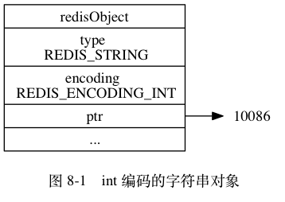
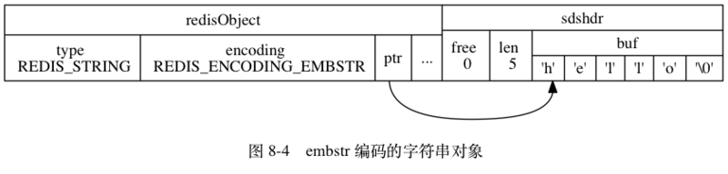
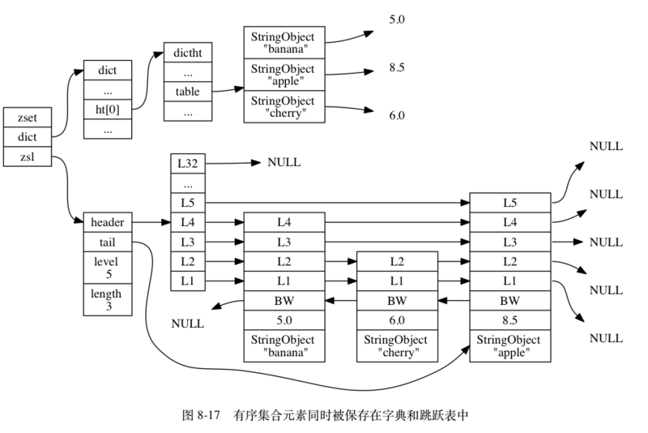

# 对象

>Redis并没有直接使用内部的基本数据结构来实现键值对数据库，而是基于这些数据结构创建了一个对象系统，这个系统包含字符串对象、列表对象、哈希对象、集合对象和有序集合对象这五种类型的对象， 每种对象都用到了至少一种内部的基本数据结构。

**一.对象的结构**

```
typedef struct redisObject {
    unsigned type;// 类型
    unsigned encoding;// 编码
    void *ptr;// 指向底层实现数据结构的指针
    int refcount; // 引用计数
    unsigned lru; //该属性记录了对象最后一次被命令程序访问的时间
} robj;
```

(1).type属性

类型常量|对象的名称
--|--
REDIS_STRING|字符串对象
REDIS_LIST|列表对象
REDIS_HASH|哈希对象
REDIS_SET|集合对象
REDIS_ZSET|有序集合对象

(2).encoding属性

编码常量|编码所对应的底层数据结构
--|--
REDIS_ENCODING_INT|long 类型的整数
REDIS_ENCODING_EMBSTR|embstr 编码的简单动态字符串
REDIS_ENCODING_RAW|简单动态字符串
REDIS_ENCODING_HT|字典
REDIS_ENCODING_LINKEDLIST|链表
REDIS_ENCODING_ZIPLIST|压缩列表
REDIS_ENCODING_INTSET|整数集合
REDIS_ENCODING_SKIPLIST|跳跃表

(3).refcount

>内存回收:因为C语言并不具备自动的内存回收功能，所以Redis在自己的对象系统中构建了一个引用计数（reference counting）技术实现的内存回收机制，通过这一机制，程序可以通过跟踪对象的引用计数信息，在适当的时候自动释放对象并进行内存回收。

```
a.在创建一个新对象时， 引用计数的值会被初始化为 1 ；
b.当对象被一个新程序使用时， 它的引用计数值会被增一；
c.当对象不再被一个程序使用时， 它的引用计数值会被减一；
d.当对象的引用计数值变为 0 时， 对象所占用的内存会被释放。
```

>对象共享:通过引用技术无需对相同对象重新分配内存，而是直接通过对象共享相同的内存块，共享对象机制对于节约内存非常有帮助， 数据库中保存的相同值对象越多， 对象共享机制就能节约越多的内存。


>目前来说，Redis会在初始化服务器时，创建一万个字符串对象，这些对象包含了从0到9999的所有整数值，当服务器需要用到值为0到9999的字符串对象时，服务器就会使用这些共享对象，而不是新创建对象。

```
a.将数据库键的值指针指向一个现有的值对象；
b.将被共享的值对象的引用计数增一。
```

>Redis只对包含整数值的字符串对象进行共享。

(3).lru

>空转时长就是通过将当前时间减去键的值对象的 lru 时间计算得出;可以用于回收内存（当开启maxmemory选项时），空转时长较高的那部分键会优先被服务器释放

```
volatile-lru：从已设置过期时间的数据集中挑选最近最少使用的数据淘汰
volatile-ttl：从已设置过期时间的数据集中挑选将要过期的数据淘汰
volatile-random：从已设置过期时间的数据集中任意选择数据淘汰
allkeys-lru：从数据集中挑选最近最少使用的数据淘汰
allkeys-random：从数据集中任意选择数据淘汰
no-enviction（驱逐）：禁止驱逐数据，只是发出警告
```

<br>

**二.字符串对象(REDIS_STRING)**






```
a.如果一个字符串对象保存的是整数值，并且这个整数值可以用long类型来表示，那么字符串对象会将整数值保存在字
符串对象结构的 ptr属性里面（将 void* 转换成 long ），并将字符串对象的编码设置为 int

b.如果字符串对象保存的是一个字符串值，并且这个字符串值的长度大于39字节，那么字符串对象将使用一个简单动态
字符串（SDS）来保存这个字符串值，并将对象的编码设置为 raw 

c.如果字符串对象保存的是一个字符串值，并且这个字符串值的长度小于等于39字节，那么字符串对象将使用 embstr 
编码的方式来保存这个字符串值。(embstr可以连续分配内存)
```

(1).编码的转换

```
a.对于int编码的字符串对象来说，如果我们向对象执行了一些命令，使得这个对象保存的不再是整数值，而是一个字
符串值，那么字符串对象的编码将从int变为raw 

b.因为Redis没有为embstr编码的字符串对象编写任何相应的修改程序 （只有 int 编码的字符串对象和 raw 编码的字
符串对象有这些程序），所以 embstr 编码的字符串对象实际上是只读的：当我们对 embstr 编码的字符串对象执行任
何修改命令时，程序会先将对象的编码从 embstr 转换成 raw ，然后再执行修改命令； 因为这个原因，embstr 编码
的字符串对象在执行修改命令之后，总会变成一个 raw 编码的字符串对象。
```

<br>

**三.列表对象(REDIS_LIST)**


```
a.当一个列表对象只包含少量列表项，并且每个列表项要么就是小整数值，要么就是长度比较短的字符串，那么Redis 
就会使用压缩列表来做列表键的底层实现。

b.当一个列表对象包含较多的列表项，那么Redis就会使用链表结构作为底层实现， 每个双端链表节点（node）都保存
了一个字符串对象， 而每个字符串对象都保存了一个列表元素。
```

(1).编码转换

```
a.当列表对象可以同时满足以下两个条件时， 列表对象使用 ziplist 编码：
    列表对象保存的所有字符串元素的长度都小于 64 字节；
    列表对象保存的元素数量小于 512 个；

b.不能满足这两个条件的列表对象需要使用 linkedlist 编码。
```

<br>

**四.哈希对象(REDIS_HASH)**


```
a.当一个哈希对象只包含少量键值对，并且每个键值对的键和值要么就是小整数值，要么就是长度比较短的字符串，那
么 Redis 就会使用压缩列表来做哈希键的底层实现。

b.当一个哈希对象包含较多键值对，哈希对象使用字典作为底层实现
```

(1).编码转换

```
a.当哈希对象可以同时满足以下两个条件时， 哈希对象使用 ziplist 编码：
    哈希对象保存的所有键值对的键和值的字符串长度都小于 64 字节；
    哈希对象保存的键值对数量小于 512 个；
    
b.不能满足这两个条件的哈希对象需要使用 hashtable 编码。
```

<br>

**五.集合对象(REDIS_SET)**


```
a.当一个集合对象只包含整数值元素， 并且这个集合对象的元素数量不多时， Redis就会使用整数集合作为集合对象
的底层实现。

b.当一个集合对象包含非整数值元素，或者元素数量较多时，Redis就会使用字典作为底层实现
```

(1).编码的转换

```
a.当集合对象可以同时满足以下两个条件时， 对象使用 intset 编码：
    集合对象保存的所有元素都是整数值；
    集合对象保存的元素数量不超过 512 个；

b.不能满足这两个条件的集合对象需要使用 hashtable 编码。
```

<br>

**六.有序集合对象(REDIS_ZSET)**




```
a.当一个有序集合对象只包含少量列表项，并且每个列表项要么就是小整数值，要么就是长度比较短的字符串，那么
Redis就会使用压缩列表来做有序集合的底层实现，压缩列表内的集合元素按分值从小到大进行排序， 分值较小的元素
被放置在靠近表头的方向， 而分值较大的元素则被放置在靠近表尾的方向。

b.当一个集合对象包含较多元素，Redis就会使用跳跃表与字典作为底层实现。dict字典为有序集合创建了一个从成员
到分值的映射，通过这个字典， 程序可以用 O(1) 复杂度查找给定成员的分值。zsl跳跃表按分值从小到大保存了所有
集合元素，跳跃表节点的 object 属性保存了元素的成员， 而跳跃表节点的 score 属性则保存了元素的分值。 通过
这个跳跃表， 程序可以对有序集合进行范围型操作，
```

(1).编码的转换

```
a.当有序集合对象可以同时满足以下两个条件时， 对象使用 ziplist 编码：
    有序集合保存的元素数量小于 128 个；
    有序集合保存的所有元素成员的长度都小于 64 字节；
    
b.不能满足以上两个条件的有序集合对象将使用 skiplist 编码。
```