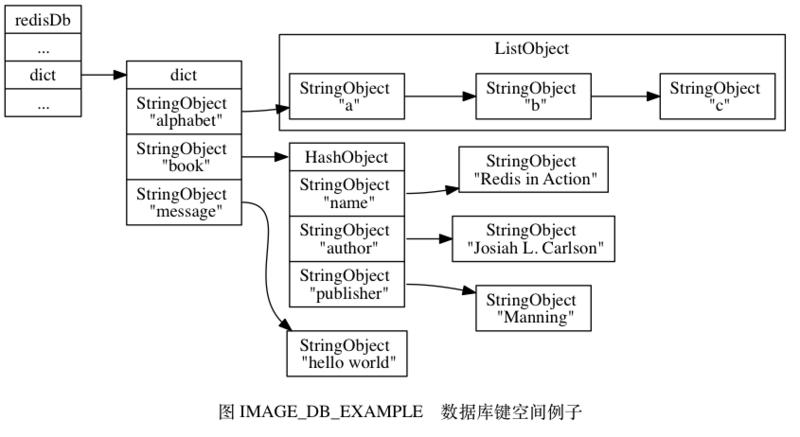
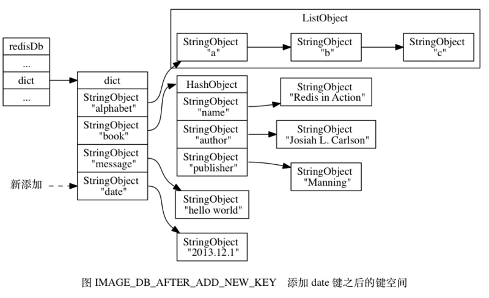
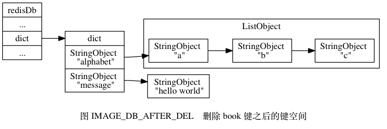
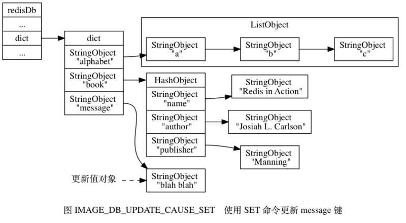
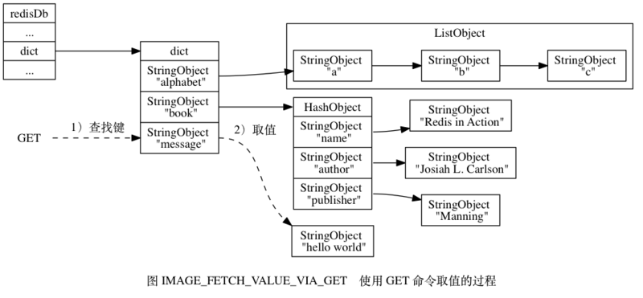

# 数据库

**一.数据库键空间**



```
typedef struct redisDb {
    dict *dict;//数据库键空间，保存着数据库中的所有键值对
    dict *expires;//保存 key 的过期时间,其中的键和dict一样，但是它的value是标识过期时间的值；用于内存回收
    int id;  //数据库的号码  
} redisDb;
```

<br>

**二.操作数据库**

(1).添加新键

>添加一个新键值对到数据库， 实际上就是将一个新键值对添加到键空间字典里面， 其中键为字符串对象， 而值则为任意一种类型的 Redis 对象。



(2).删除键

>删除数据库中的一个键， 实际上就是在键空间里面删除键所对应的键值对对象。



(3).更新键

>对一个数据库键进行更新， 实际上就是对键空间里面键所对应的值对象进行更新， 根据值对象的类型不同， 更新的具体方法也会有所不同。



(4).对键取值

>对一个数据库键进行取值， 实际上就是在键空间中取出键所对应的值对象， 根据值对象的类型不同， 具体的取值方法也会有所不同。

