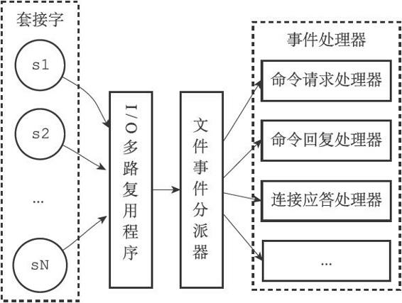

# 事件

>redis使用单线程架构和I/O多路复用模型来实现高性能的内存数据库服务。一条命令从客户端到服务端不会立刻被执行，所有命令都会进入一个队列中，然后逐个被执行。

**一.文件事件**

>Redis服务器通过套接字与客户端进行连接，文件事件就是服务器对套接字操作的抽象。文件事件处理器使用I/O多路复用程序来同时监听多个套接字，并根据套接字目前执行的任务来为套接字关联不同的事务处理器。当被监听的套接字准备好执行连接应答、读取、写入、关闭等操作时，与操作相对应的文件事件就会产生，这时文件事件处理器就会调用套接字之前关联好的事件处理器来处理这些事件。



>文件事件处理器 由四个部分组成：套接字、I/O多路复用程序、文件事件分派器以及事件处理器

```
I/O多路复用程序总是会将所有产生事件的套接字放到一个队列里面，然后通过这个队列以有序、同步、每次一个套接
字的方式向文件事件分派器传送套接字。当上一个套接字产生的事件被处理完毕之后，I/O多路复用程序才会继续向文
件事件分派器传送下一个套接字。
```

<br>

**二.时间事件**

>服务器对定时操作的抽象。事件分为:定时事件(指定时间执行一次);周期性事件(每隔一段时间执行一次)。目前Redis只使用周期性事件，而没有使用定时事件。

```
服务器将所有时间事件都放在一个无序链表中，每当时间事件执行器运行时，遍历整个链表，查找所有已到达的时间事
件，并调用相应的事件处理器
```