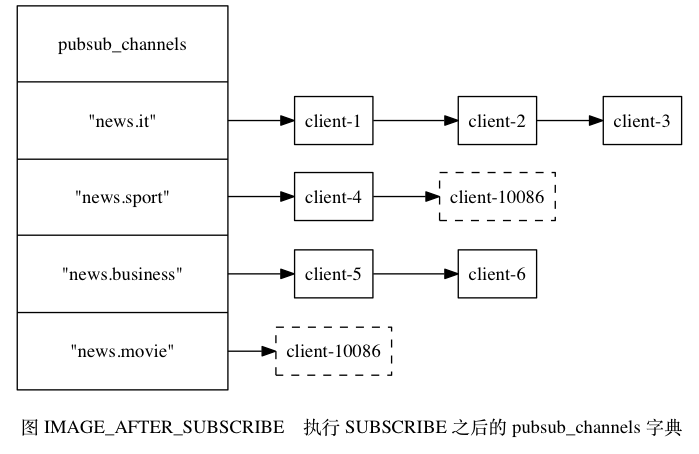
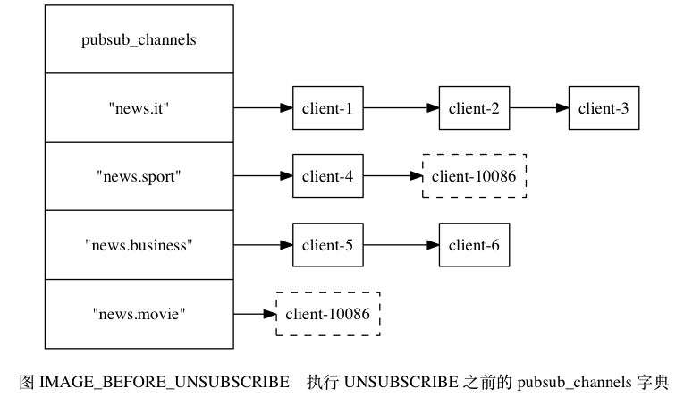
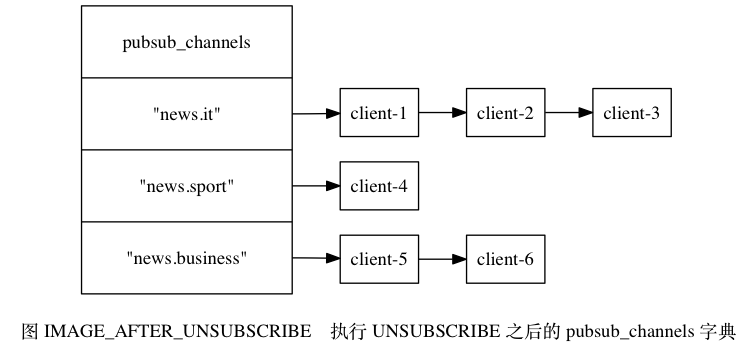

# 频道的订阅与退订

**一.订阅频道**

>每当客户端执行 SUBSCRIBE 命令，订阅某个或某些频道的时候，服务器都会将客户端与被订阅的频道在 redisServer.pubsub_channels 字典中进行关联。



```
a.如果频道已经有其他订阅者， 那么它在 pubsub_channels 字典中必然有相应的订阅者链表， 程序唯一要做的就是将
客户端添加到订阅者链表的末尾。

b.如果频道还未有任何订阅者， 那么它必然不存在于 pubsub_channels 字典， 程序首先要在 pubsub_channels 字典中
为频道创建一个键， 并将这个键的值设置为空链表， 然后再将客户端添加到链表， 成为链表的第一个元素。
```

<br>

**二.退订频道**

>UNSUBSCRIBE 命令的行为和 SUBSCRIBE 命令的行为正好相反，当一个客户端退订某个或某些频道的时候，服务器将从 redisServer.pubsub_channels 中解除客户端与被退订频道之间的关联





```
a.程序会根据被退订频道的名字，在 pubsub_channels 字典中找到频道对应的订阅者链表，然后从订阅者链表中删除
退订客户端的信息。

b.如果删除退订客户端之后，频道的订阅者链表变成了空链表，那么说明这个频道已经没有任何订阅者了，程序将从 
pubsub_channels 字典中删除频道对应的键。
```