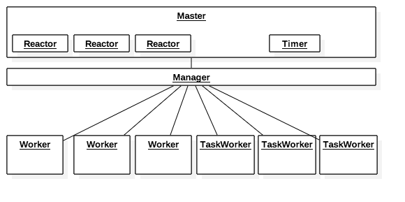

# Swoole进程模型

>Swoole是一个多进程模式的框架（可以类比Nginx的进程模型），当启动一个Swoole应用时，一共会创建2 + n + m个进程，其中n为Worker进程数，m为TaskWorker进程数，2为一个Master进程和一个Manager进程.



```
Master进程为主进程，该进程会创建Manager进程、Reactor线程等工作进/线程。
Reactor线程实际运行epoll实例，用于accept客户端连接以及接收客户端数据。所以每个reactor可以处理无数个连接请求。
Manager进程为管理进程，该进程的作用是创建、管理所有的Worker进程和TaskWorker进程。
Worker进程作为Swoole的工作进程，所有的业务逻辑代码均在此进程上运行。
Task Worker是Swoole中一种特殊的工作进程，该进程的作用是处理一些耗时较长的任务，以达到释放Worker进程的目的。
```